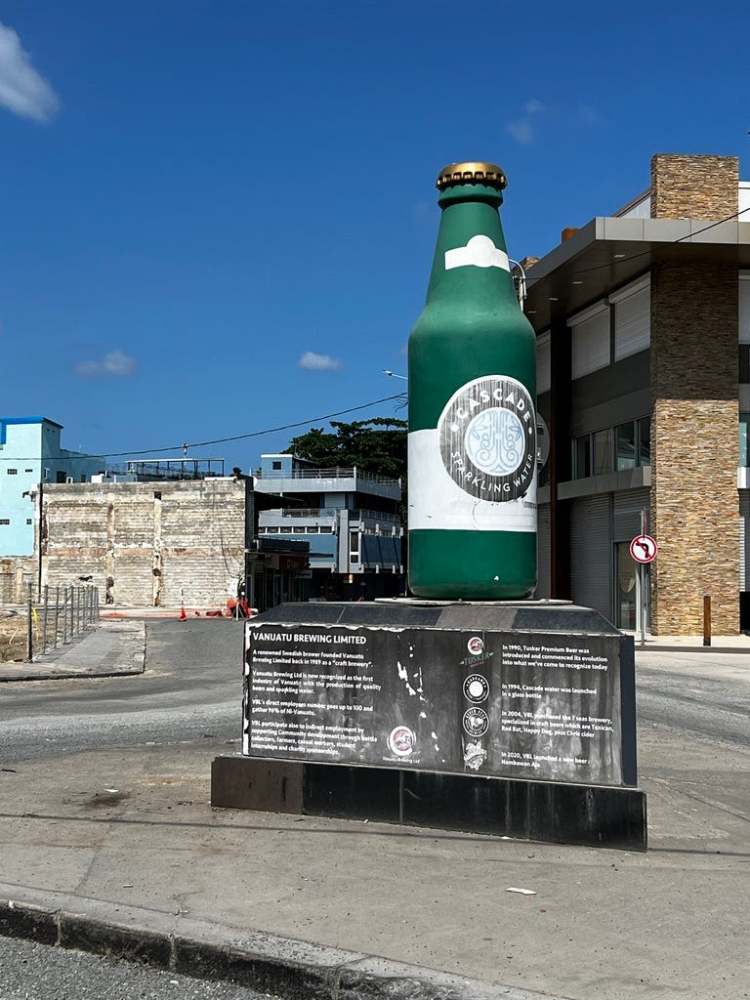Port Vila 市區

昨天入住時奶奶跟我說7–7:30會供應免費早餐，結果我遲遲等不到。

到了8:30我想說乾脆起床好了，結果我一打開陽台門，奶奶就跟我打招呼說早餐快好了。

事後我跟奶奶聊天，奶奶說早餐的確是7–7:30供應，但她今天睡過頭了🤣🤣🤣

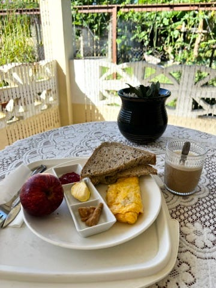坐在陽台吃早餐，其實也是滿愜意的

然後我跟她反應了沒熱水的事，她說應該是沒瓦斯了，她今天會處理。

結果毫不意外，我今天回來還是洗了個冷水澡😆😆😆 我非常有信心明天也一定是冷水澡哈哈。

### 神奇的萬那杜公車

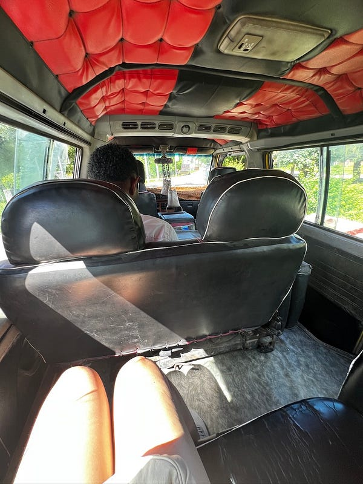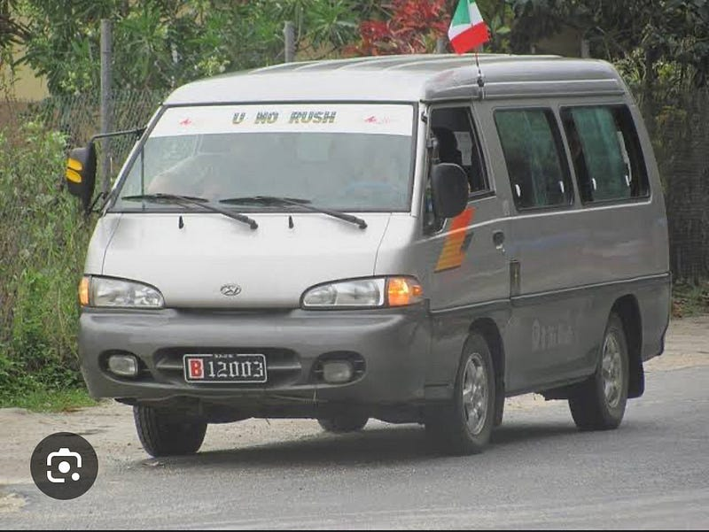萬那杜巴士

萬那杜的公車沒有固定形式，只能靠車牌前面的B來辨認，感覺很像私營小巴，因為真的每台車都不一樣，多數巴士的內裝也都非常老舊、各有各的風格，我試著跟其中一個巴士司機聊了一下，他似乎沒辦法跟我解釋其中奧祕，只跟我說反正就是認車牌。

巴士沒有任何時刻表或路線，基本上全靠運氣😆 看到巴士後招手並告知目的地，如果他們願意載你就會請你上車（要自己手動開門)，有幾台我根本拉不開🤣

上車前記得確認價錢是150vt，不然就會像我一樣被宰🤣

其實訣竅就是上車前要問價錢，而且如果你知道市區內都是150的話，就要直接說「我想要去xxx，請問車資是$150嗎？」。但有時候真的還是很為難，因為有的司機會在你上車後改口，有些報價比較高，但因為妳也不知道錯過這班車下班車在哪裡？所以就自行斟酌吧😆

### Port Vila 市區

早上出門特地跟奶奶聊了一下週日可以幹嘛（我一開始排週日 day tour 的原因就是知道這裡週日什麼都不開🤣）。一開始她推薦我去一個海邊，但那個地方是我週五打算去的景點，於是她就推薦了我去市區附近的 Banyan bar。

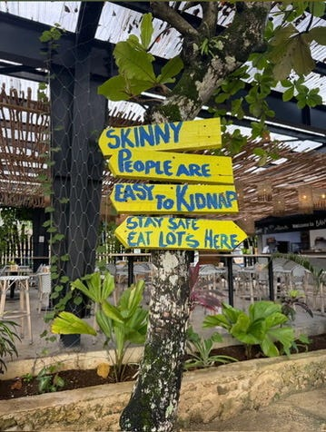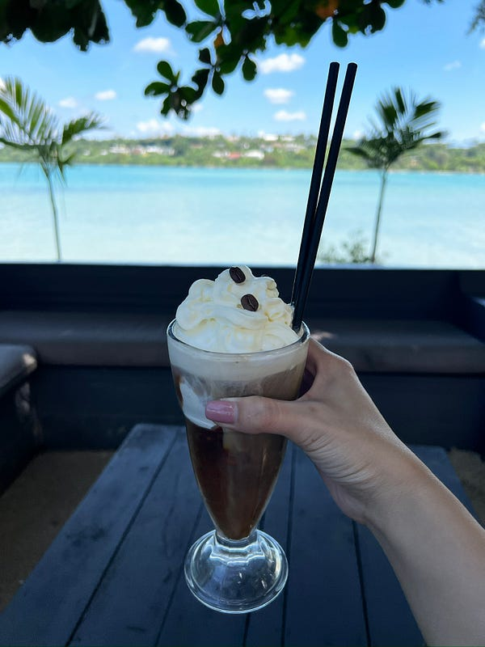

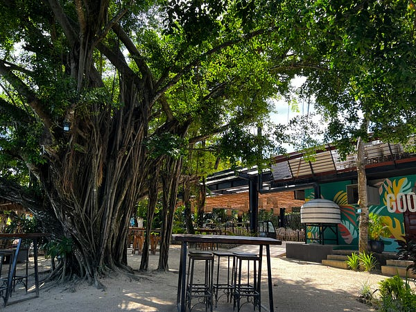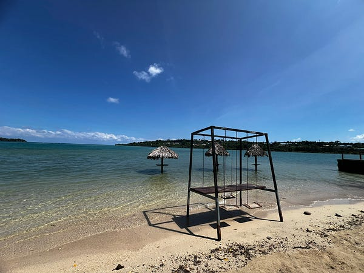Banyan Bar

出門後我在外面等了一下公車，但週日真的沒什麼車子。想說不如走去機場可能比較有機會（後來發現走去機場真的超近！只是黃土路，沒鋪柏油，拖著行李箱其實也不好走）。

一到機場發現一片死寂，才驚覺原來沒有航班的時候，機場其實也沒人、換匯、sim card、咖啡廳都不開。外面的公車站也沒有排班公車🤣

好險往外走了一陣子之後就成功攔了巴士。目前為止在 Port Vila 搭了四趟巴士，成功把被宰率下降到50%😆 感謝兩位誠實用原價載我的司機🙏

萬那杜在2024.12月經歷了一場大地震，從那之後市區就是死城一片，只有少數店家會開。不過今天是週日，所以就連那幾間店都不會開🤣

唯一會開的地方就是餐廳、咖啡廳，這裡很常稱呼為 beach bar。

外食後發現這裡的消費真的不便宜，大概跟澳洲差不多，甚至比澳洲貴一點。例如 Banyan bar 的冰咖啡要澳幣7.8，Rossi’s 的午餐特惠還是要澳幣$20。

但我還是很推薦 Rossi’s 這間餐廳，風景悠美就在海邊、服務好（居然先上了一杯免費的萊姆水、食物好吃，而且海風徐徐很涼爽！（萬那杜 99% 的地方都沒有冷氣，包含機場、旅館、餐廳、超市🤣）

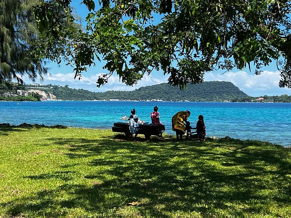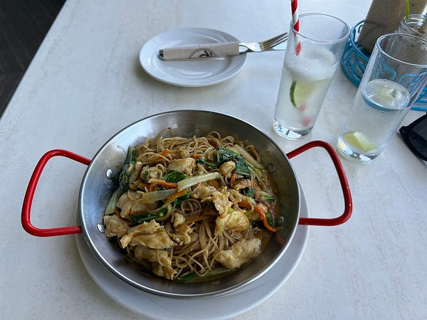市區一角與 Rossi 的餐點

而且 Port Vila 真的是滿漂亮的，市區附近走路10分鐘就可以看到美到不行的海邊，海水清澈到我還看到小魚了😆

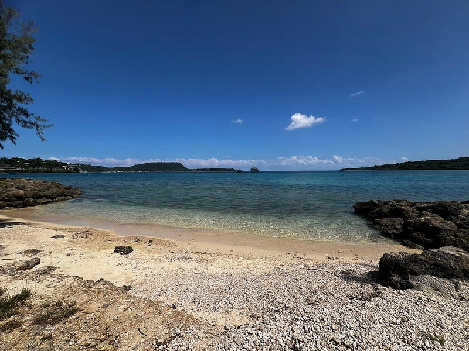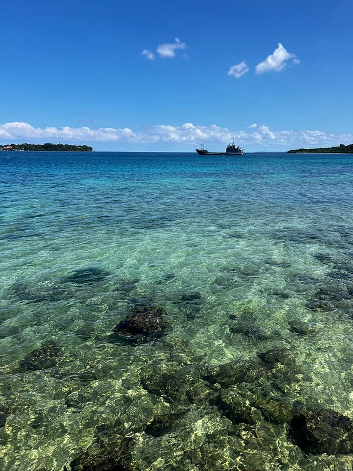市區就有很美的海景

### 超市初體驗

後來吃完午餐後真的沒事做，只好搭公車去超市（沒錯，市區的超市也還在整修中😂)。

一下車發現旁邊居然有當地市集，於是就小逛了一下。我是裡面唯一兩個外國人，而且顧客也不多，每個攤位都在跟我大眼瞪小眼，所以只拍了一張照片。基本上蔬菜跟芭蕉都是vt 150–250之間，價錢會用馬克筆寫在紙板上或是直接寫在水果上，很有趣😆

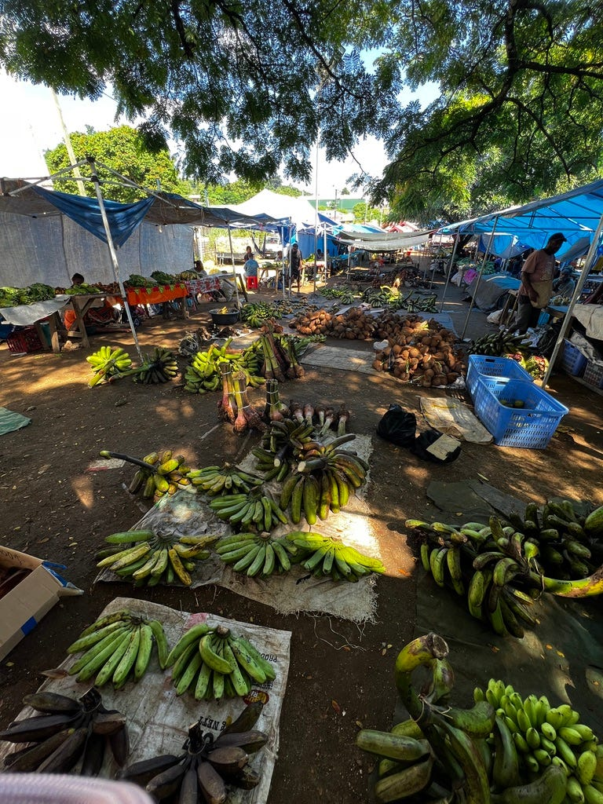當地市集

Au Bon Marche 是當地的連鎖超市，我去逛的這間分店其實滿大的，但沒有冷氣我真心逛到汗流浹背🤣

本來想買一些當地零食，結果一看幾乎所有食品都是澳洲、紐西蘭、斐濟，甚至馬來西亞進口的😂 唯一萬那杜製造的只有汽水，所以我拿了三瓶，非常期待 American cola 的味道😆

逛著逛著看到一條特別的走道，一開始還以為這一個走道是賣布的🤣 後來才發現是萬那杜從週六中午開始到週一中午不能賣酒，所以就直接用布蓋起來😆

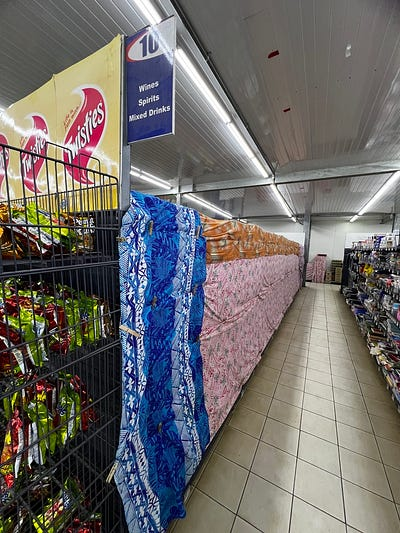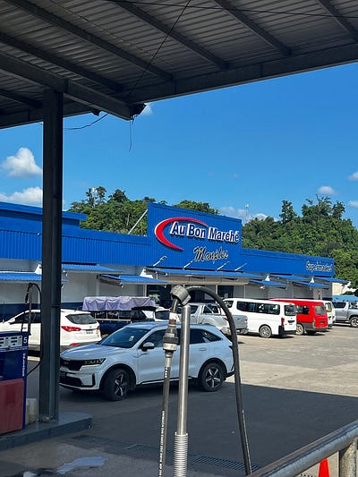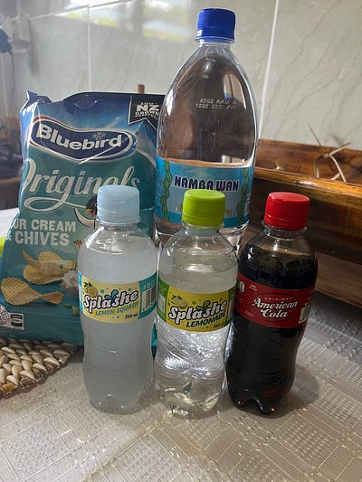超市初體驗

逛完超市其實也才兩點多，但我真心無處可去😆 只好搭公車回機場換匯（至少這個公車司機沒有騙我錢😆），然後走路回民宿，也算是度過悠閒的一天～

明天就是期待的小島行，目前看來tour guide 還算可靠，希望他明天可以順利找到我在哪😆🙏 （而且他明天7:30am 就要來接我，我到底是來旅遊還是行軍？哈哈哈）


