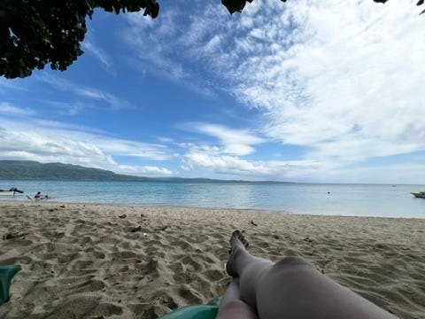
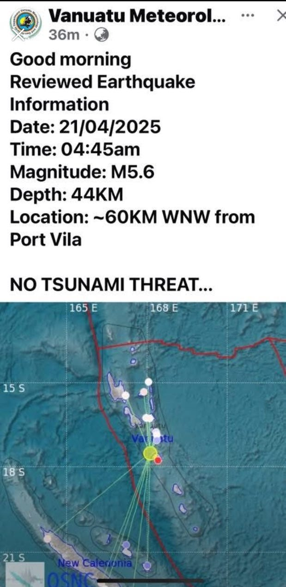
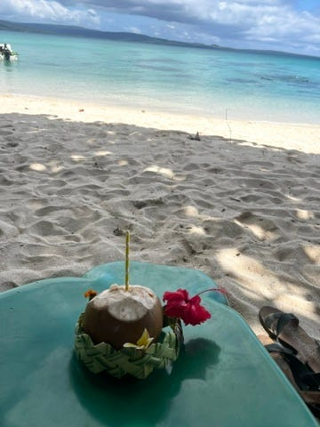
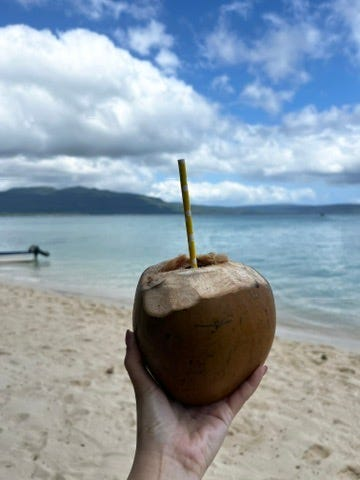
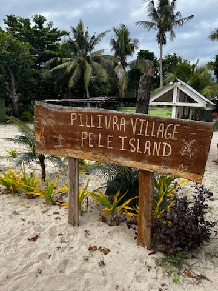
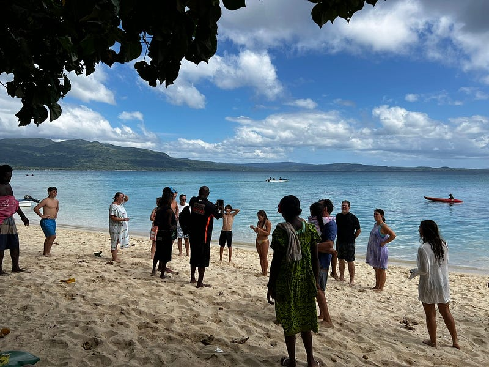
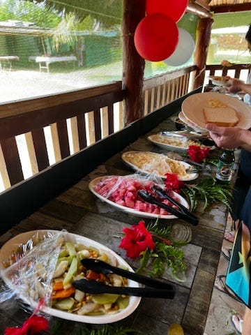
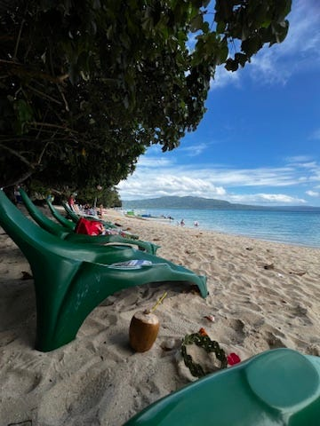
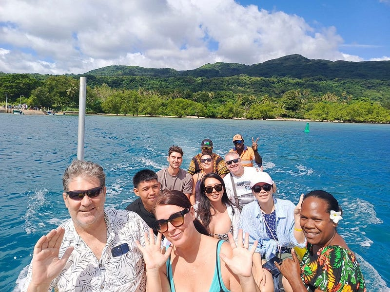

*Pele Island 一景*

(我也不知道為什麼我在這裡的每一天都很精彩🤣)

### 居然遇到大地震

今天早上四點多睡到一半，突然天搖地動！

雖然說地震對於台灣人來說不算太罕見，但萬那杜歷經 2024 年 12 月的大地震後一直到現在也還沒恢復過來。這裡的房子也不知道穩不穩固，於是我立刻把房門打開，想說如果有需要的話可以快速逃生。好險地震很快就結束了，後來上網才發現是芮氏規模 5.6 的地震，真的是滿大的🤣

*地震警報*

### Pele Island 一日遊

原訂早上 7:30 要來接我的 tour bus 7:41 才出現，我覺得其實已經很不錯了 (套句南太平洋小島的流行語來說「it’s island time～」) 😆 但司機第一個接完我之後，又接送了一些他的朋友，一直開了一個小時才把所有人接完。

不得不說去 Pele island 的路況真的很差，路上超級多大坑，我們就這樣一路在小巴上搖搖晃晃開了 1.5 小時才到碼頭，接著再搭 20 分鐘的船前往小島。

好笑的是，路程中 tour guide 解釋了一下，我們這團完全要跟昨天放我鳥的人的團併成一團🤣

可是我這團收$9000vt，那個人的團收$11000vt，我也不懂他們是怎麼運作的(後來發現我們的確待遇比較差，少了一些東西，但其實這也不一定，例如贈送的免費白酒我就剛好有喝到😆)。

到了島上有個迎賓飲料椰子水，接著開船 15 分鐘帶我們出海浮潛。

*迎賓椰子水*

我必須要說，這邊的安全意識不太高，不管是坐船或是浮潛，都完全沒有提供救生衣的選項。要是有意外發生又有人不會游泳，不就 GG 了🤣

去過斐濟跳島的我，覺得這邊的浮潛還滿一般的。是有不少魚啦，也看到一隻超巨大魚跟很多珊瑚礁🪸，但真的就是略遜一籌。

不過我跟同團的澳洲遊客馬克杯杯聊了一下，他去年 12 月才剛去過斐濟（他只待本島，沒有像我一樣跳島），他對於萬那杜的評價就高很多，說他會考慮再訪萬那杜。所以我猜斐濟跟萬那杜的旅遊評價可能取決於你有沒有跳島？

但是萬那杜的食物比斐濟好吃很多，今天的午餐菜色超級多元，飯、吐司、義大利麵、馬鈴薯、樹薯yum (是當地主食)、雞腿、牛肉、魚，超級誇張，簡直是滿漢全席！除此之外，還有下午茶（茶、咖啡、餅乾、水果）跟冰淇淋。

浮潛完我就悠哉坐在沙灘椅上放空。

這個一日遊還包含當地村莊導覽，我覺得非常有趣！

*村牌*

Pele island 島上有四個村莊，人口大約40人(官方資料寫200人）。這裡沒有電力系統，但大部分人家裡有太陽能 (據說是去紐澳工作後換回來的）。這裡也沒有淨水系統，飲用水是直接承接雨水儲存，地下水不能飲用，但會拿來洗澡、洗碗等等。

四個村莊有一個酋長 (chief)，當地也沒有法院跟派出所。如果有紛爭，就是找酋長調節。集合方式是敲打一塊木頭，所有人一聽到敲擊聲，就要到會議小屋集合。

我這一團有八個人，全部都是澳洲人😆 大家人也都很好～

馬克杯杯聽到我早上超早就上車之後超傻眼（因為說真的，我住的地方其實在港口跟其他人的住宿點中間），跟我說我等一下回程要記得跟 tour guide 說請他們第一個放我下車。我後來完全忘記這件事，他還主動幫我去提醒 tour guide，所以我就成為本團最早下車的人，五點就到家了✌️

**

*午餐、同行遊客*

### 奶奶語錄登場：**「這吹風機沒人用過」**

回來之後果然不意外還是沒有熱水，其實前兩天我都沒有洗頭，但今天下海了真的是不洗不行。冷水洗頭真的好刺激🤣

洗完頭不意外找不到吹風機，把衣服洗完之後我就直接去煮泡麵了（沒錯，我在萬那杜三天，每天晚餐都吃泡麵🤣 因為機場附近真的什麼店都沒有，晚上我又不想出門，連去超市都要坐公車）。

沒想到吃飯吃到一半，奶奶敲大門說她要進來用洗衣機洗一下床單。於是我不抱希望問了她一下吹風機，沒想到她居然有。找出吹風機後她跟我說「這個吹風機已經買了好幾年了，但從來都沒有人用」（我心想，好吧，這的確是文化差異，只有華人女生愛吹頭髮XD）。

因為吹風機是英國插頭，我們又找了一下轉接頭（萬那杜的插頭跟紐澳是一樣的，所以我根本也沒帶轉接頭)。瞎忙了一陣子之後終於找到轉接頭，插上電發現吹風機根本壞了不能用🤣🤣🤣

跟奶奶閒聊了一陣子之後送走奶奶，然後我一轉頭在地上發現9000vt(大概澳幣$115/台幣兩千多)，是我剛剛拿給奶奶的房租😆😆😆

誠實的我立刻追出門把錢給奶奶，真心差點住免費的，笑死！而且奶奶從頭到尾沒提過租金的事(這已經是我入住的第三晚了)，還是我今晚主動提起的😆

### 女生獨旅的不便之處

明天我要移動到一個離市區開車40分鐘的度假村 Banana Bay Beach Resort (BBBR)，據說要轉好幾班公車才能抵達（之前說過公車沒有固定班表跟路線），想想就覺得好麻煩啊。試探性問了一下今天的 tour guide，他說要3000vt。後來我在臉書社團發文，有個人私訊我只要1500vt (這是之前度假村跟我說的合理價格，奇怪的是度假村也不幫我安排，還要我自己處理），請祝福我明天順利🙏

我個人很享受獨旅，但我覺得作為女生還是有其不便之處，像我就有點擔心我明天的人身安全🤣 （試探性問了一下奶奶，她覺得一個女生搭車安啦，她說「有些人只是特別友善，所以你可能會覺得不習慣」)

這也是為什麼我一直覺得男女平等可能終究難以實現，我超常在旅行過程中被問說「Where’s your husband?/ Are you married? Why are you travelling alone?」 一開始我都會直接回答說我單身，後來發現這樣的回答只會引發更多追問(大部分是禮貌的，少部分就開始求婚???)，於是後來我就直接說「對啊，我結婚了，我老公在澳洲，他晚我幾天過來」🤣

我相信如果我是男生，以上的問句就不會發生，沒人會管我是已婚未婚還是離婚😆


