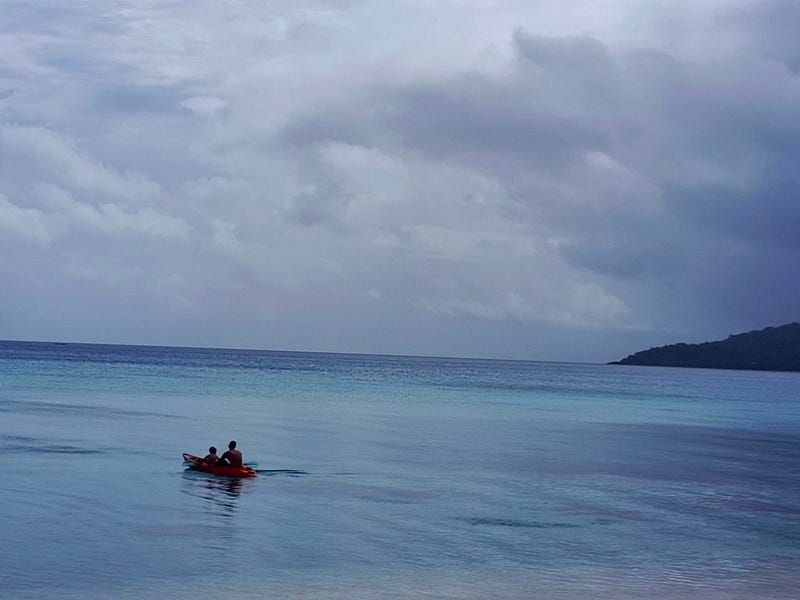
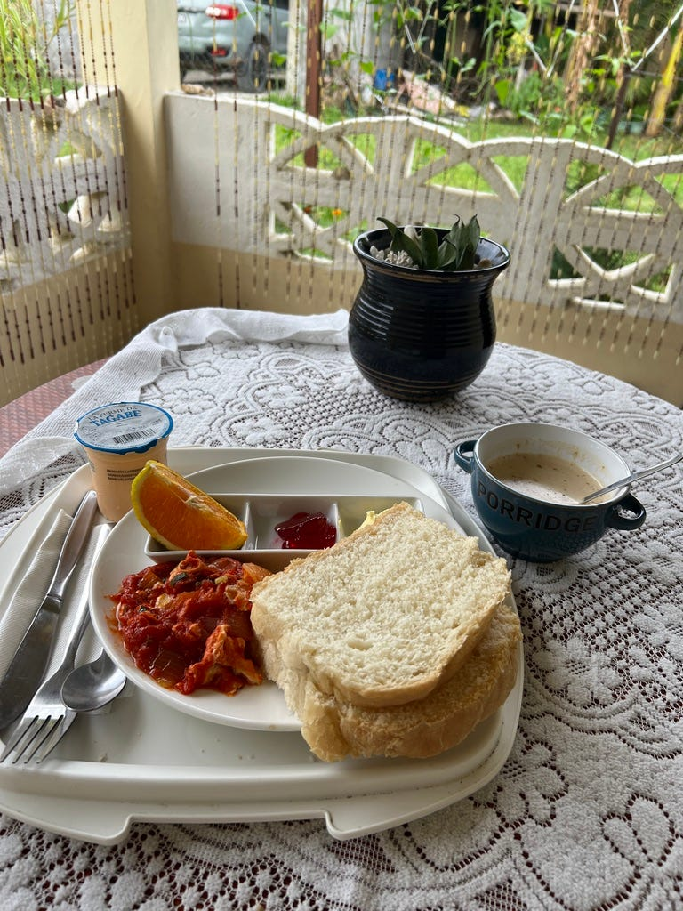
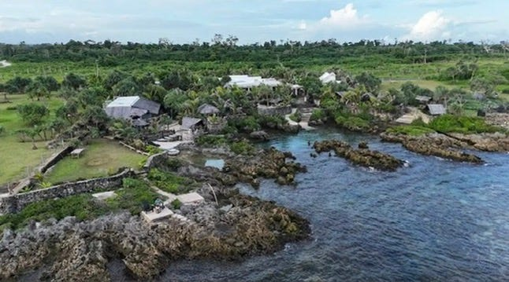
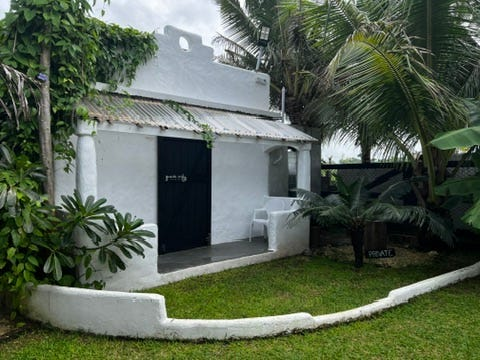
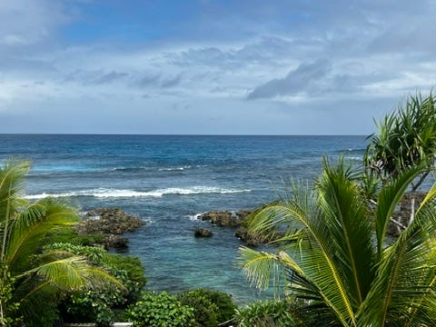
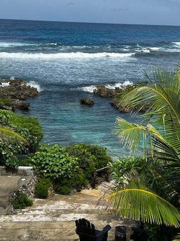
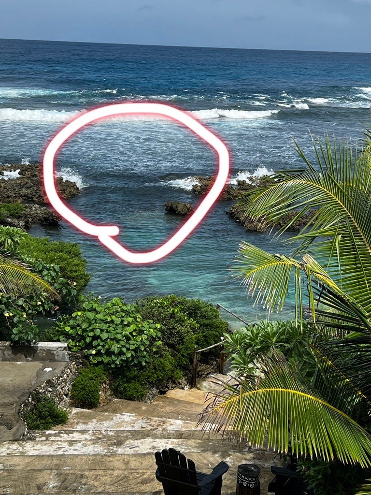
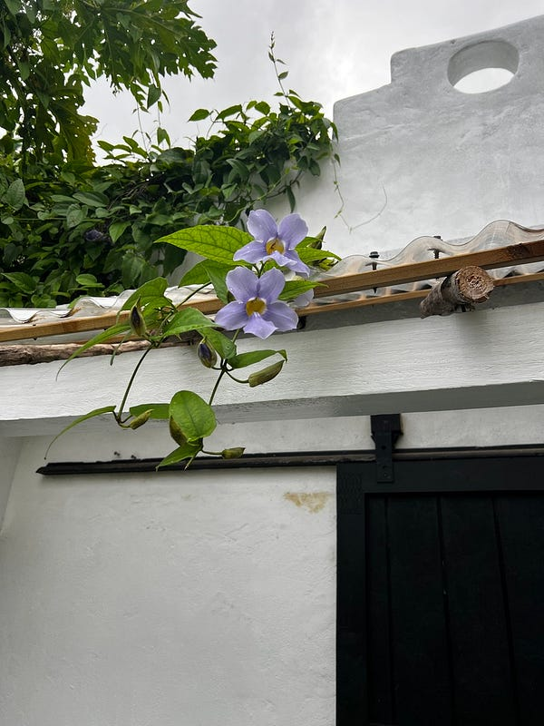
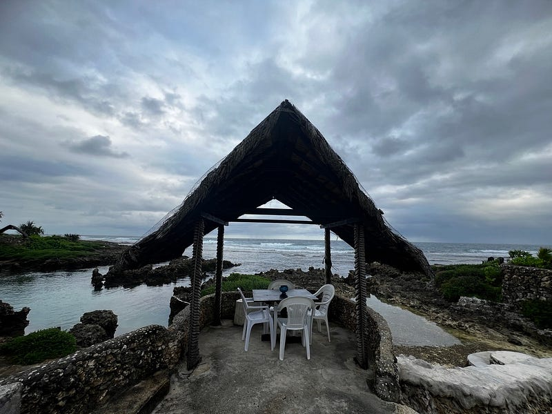

* * *

### 太平洋小島上的大冒險：2025.04.22 Vanuatu Day 4 接送烏龍、浮潛驚魂，什麼時候才能沒有驚喜？

(有生之年我能不能在 Vanuatu 洗到熱水澡🤣）

### 萬那杜不意外

奶奶自製的超豐盛早餐

早上起來先把昨天洗的衣服收一收，吃完早餐、收拾完之後準備跟民宿奶奶道別。我跟奶奶說我今天要去 Banana Beach Bay，已經在網路上聯絡好一個司機，報價 vt1500。他說我的民宿有點難找，所以要我走去機場等他，我覺得ok，反正民宿很近，走路只要五分鐘（只是中間的馬路是黃土路，而不是柏油路）。

奶奶聽了後說「可是你這樣還要拖著行李箱走去機場耶，你有他的電話嗎？我打電話跟他說～」（前情提要是那個人今天早上傳訊息跟我說他來不了，會派他姪子來接我，並給了我姪子的名字跟電話）。

奶奶講電話講了超久，我開始覺得情況不妙🤣

講一講奶奶還疑似開始問價錢，奶奶放下電話後跟我說，那個人說要收3500vt，而且他以為我是要從 Banana Beach Bay去機場！完全跟講好的不一樣🤯 只能說萬那杜不意外，於是我立馬決定放棄他，開始聯絡其他我昨天在臉書上聯絡的人。

接著奶奶說她其實也認識一個公車司機可以問問他，最後奶奶幫我問到的價錢是 2500vt，我立刻答應。至少是奶奶認識的人，安全有保障😆 (說真的我一個女生要獨自搭 40 分鐘的私人包車，離開市區，去 Port Vila 小島東南方的度假村，我還是有點小擔心自己的人身安全)。

後來那個人到了之後奶奶才跟我說這個人其實是她哥哥（她有六個哥哥）。我們後來整整開了一個小時才到，司機在我一上車之後就放了一個牌子在擋風玻璃，後來也沒有再接其他人，感覺是包車的意思，我覺得挺划算的！

### Banana beach bay resort

Banana Bay Beach Resort

Banana beach bay resort 大家通常都是 day trip 時經過來吃午餐，但我要直接在這邊住兩天。而且我早上 10 點就到了，有夠早😆

在我之後來了一個澳洲女生，她好像是一個人包車來的(?)，我只有看到她跟一個當地人（我在猜會不會是司機，因為他就跟我一起坐在餐廳吃東西，也沒有去玩😆）。後來偷聽了他們的對話證實了我的猜測。

今天本來是陰天，結果我午餐吃一吃就開始暴雨。午餐吃完房間也剛好整理好了，所以他們12點多就讓我入住了，這點還不錯。

整理完房間我就繼續跑出來二樓的小空間發呆，看到一對情侶跑下去浮潛。然後我就開始糾結要不要也下去，後來陽光出來了，我就回去換泳衣加擦防曬。等我弄好又開始暴雨🤣🤣🤣🤣

只好又開始發呆🤣

### 差點被海浪捲走的浮潛驚魂記

好險後來又被我的等到短暫放晴，順利浮潛成功！我甚至覺得這裡好像還比 Pele island 漂亮。不過這邊的風浪很強，我中間游到這個小小的開口，結果差點被大浪卷出去外海🤣🤣🤣

差點喪命囧

好險我嚇了一跳之後，立刻恢復冷靜，先用手抓住旁邊的礁岩，固定住自己，然後等浪打回來的一刻順勢用力游回來！真是太驚險了！你們真的差一點就可能看不到我了😂

### 跟說好的都不一樣

我的小屋上有可愛小花

回到房間後，我想說來拍個房間的影片。最好笑的是，我拍完影片就把正門拉起來了，因為正門對應的是所有車輛進出的大門口。然後正門的門閂就從外面鎖住了🤣🤣🤣

傻眼，只好從後門走出去再把前門打開 😆😆😆

另外又是一個號稱有熱水，但沒有的地方🤣🤣🤣 然後也號稱可以跟櫃檯借吹風機，但櫃檯說他們沒有🤣

因為這邊也是沒有電的，純靠太陽能。我看 guest book 寫到這就覺得不妙，因為今天陰雨天。結果一試果然沒有熱水🤣

不能用吹風機的理由是一樣的，電力不足，吹風機電壓太大。但房間裡有煮水壺？可能是吹風機要用比較久？我真的很希望下一個住宿點有熱水澡可以洗😆😆😆🙏

* * *

**如果你喜歡海外生活、澳洲職場、文組轉職工程師的相關文章，歡迎按下「拍手」給我鼓勵 (喜歡的話請多拍幾次！)。同時記得「**[**按此訂閱我的Medium部落格**](https://medium.com/@cloudarchitectec/subscribe)**」，這樣你就不會錯過我的更新囉～**

**需要職涯導師嗎？澳洲雲端架構師 EC 提供轉職工程師、澳洲求職、移民生活等全方位諮詢服務。**[**現在就填寫線上 1:1 諮詢預約表單，開啟你的職涯新篇章!**](https://docs.google.com/forms/d/e/1FAIpQLSeWoo4ZVLNc6IQc76nRU29ydr2T9vUJrlNgX5fFrkqiOT-K3g/viewform)

**如果想要進一步支持 EC，歡迎透過以下連結請我喝杯咖啡！你們的支持是我持續創作的動力，如有任何問題或是想要看的主題，歡迎留言與我互動 :)**

  * **歡迎追蹤 Facebook**[**澳洲雲端架構師 EC 臉書粉專**](https://www.facebook.com/cloudarchitectec)
  * **歡迎追蹤 Threads**[**Cloud Architect EC**](https://www.threads.net/@cloud_architect_ec)
  * **合作請聯繫:**[**cloudarchitectec@gmail.com**](mailto:cloudarchitectec@gmail.com)

