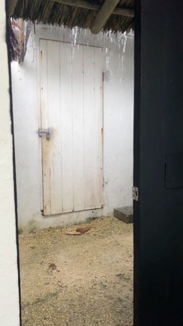
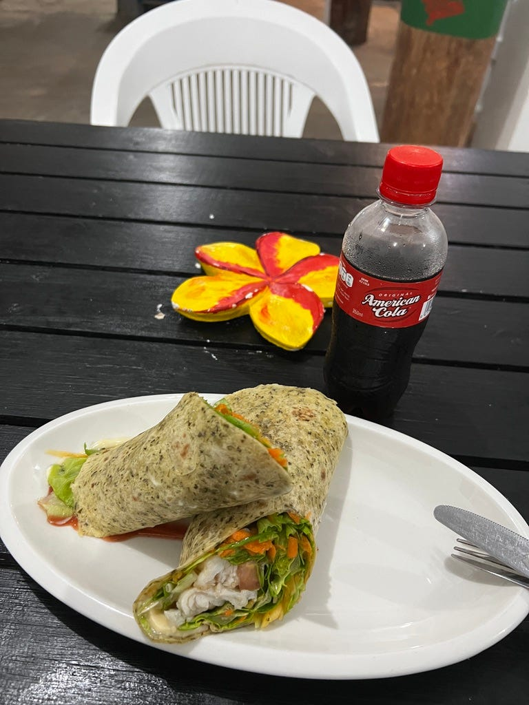
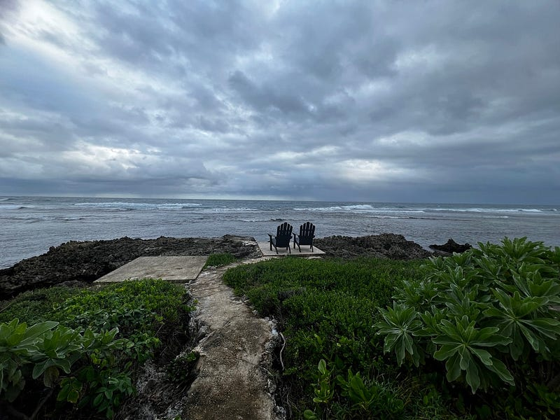
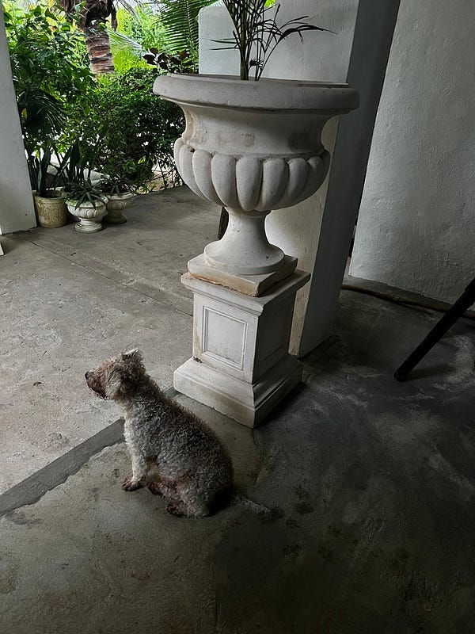
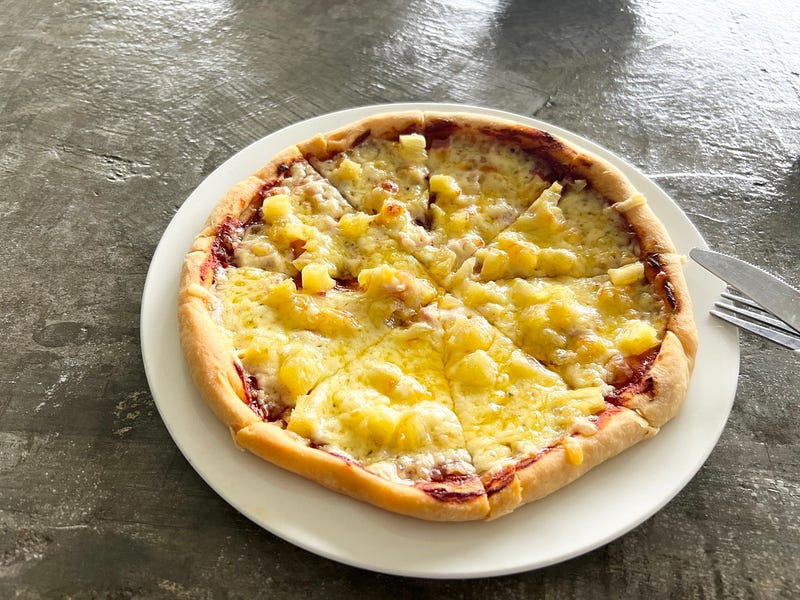

* * *

### 太平洋小島上的大冒險：2025.04.23 Vanuatu Day 5 計劃改不上變化，變化趕不上天氣造化

(在萬那杜，跟人類一樣不可控制的還有天氣)

### 隨便聊聊就成交

先讓我們把時間轉到昨天下午，因為度假村沒有吹風機，所以我就在這個度假村內走走晃晃，晾我的頭髮。

突然我看到一個司機，他跟我打招乎，其實我只是想問他說明天會不會帶團去附近開車5分鐘的熱門景點 blue lagoon，然後我們就聊了起來。

他說明天要去泥漿浴、top rock 浮潛跟另一個浮潛地點，剛好是我之前想去，但後來放棄的地方，因為我覺得太遠了。問了一下價錢只要 vt5000，感覺很合理，所以我就跟他訂了tour，果然是神奇的萬那杜 (一切都沒有規劃，卻又好像命中注定)😆

### 我的晚餐呢

這個度假村 day trip 的客人只收到三點，我現在一個人在度假村亂晃，看不到任何一個人（住客/工作人員）🤣🤣🤣

剛剛三點多時工作人員問我等一下要吃晚餐嗎？我問她廚房開到幾點，她說6:30。我說好，那我再想想～

結果到了下午五點，整個度假村空無一人！完全沒有看到其他住客，也沒有看到任何工作人員，想說該不會我今晚又要吃泡麵了吧🤣

我覺得這裡真的是很適合想要躲在海邊的人居住，因為度假村不大，離市區也有段距離，完全很適合自己躲在這裡聽海浪的聲音！

不過這個度假村的訊號很不好，wifi 只有餐廳收得到。其他地方基本上沒有wifi(包含我的房間)，連手機訊號都只剩下斷斷續續的3G，很不適合宅宅🤣

我一路在外面看海看到 5:30，工作人員才再度出現，感覺他們剛剛好像是出去採買了。晚餐就吃了一個 fish wrap，要價澳幣23.5。也開喝了超市買的 American cola，我覺得比可樂甜，卻又比較沒氣，感覺還是可樂好喝😆

### 下雨天，宅宅天

讓我們把時間拉回現在！

沒想到從昨晚就開始下大雷雨⛈️，到了早上七點還沒停，所以我就打電話把tour 取消了😂 （因為要在大雷雨中開1.5–2小時，對於未知的路況我真的覺得不太妙。而且我覺得雷雨中浮潛感覺也不是一個好主意）

果然就是計畫趕不上變化的萬那杜！

取消之後司機還非常不放棄😆 他一下說「我們可以晚一點去啊」，然後又打電話來說「我們可以把行程縮短」，但我真的覺得雷雨天感覺還是待在 resort 最安全，所以還是努力拒絕他了！

但不得不說下雨天真的沒什麼事好做！我的房間沒訊號，所以只能坐在廚房玩手機。這個度假村的所有室外座位都不防水，所以也不能坐在戶外看下雨的海景。

好不容易等到一對 day trip 的客人，工作人員還試圖幫我問他們的司機能不能加入他們的行程（想說能不能至少去一下開車只要五分鐘的 blue lagoon)。只可惜他們來這邊看看之後，就要回市區的巧克力工廠。因為我明天就打算租車開回市區，所以行程完全不順路，只能放棄。

午餐吃了一個評論說很好吃的夏威夷披薩，要價$19.3澳幣，我覺得很不行。吃完之後我就跑回房間睡午覺，結果大睡了四小時😆😆😆

很有手工感的披薩

在半夢半醒之間，天氣好像放晴了好一陣子，也來了很多 day trip 的客人。我甚至還聽到有一個小朋友說「this is the best day ever」😆 只能說就算是同一個時間點在同一個地方，大家還是可以有非常不同的旅遊體驗！

明天開始我就要來挑戰租車自駕了！請大家祝福我 🙏


