* * *

### 太平洋小島上的大冒險：2025.04.24 Vanuatu Day 6 自駕萬那杜：路上的坑坑疤疤都是我的自駕小冒險

(如果你是個J人，租車是你在萬那杜最好的選擇)

### 苦苦守候租車公司的到來

早上五點不知道為什麼就有人在外面嗨，感覺是開車經過的一大群人，還播著音樂。因為播放的是輕鬆的海島音樂，因此我判斷他們是在開趴而不是在抗議😆 為了安全起見我就沒有開門出去看了。

早上不到九點我就把行李都整理好了，說好的租車公司九點要到，果然他們到了10點也還沒出現🤣

於是想說先把我的 tap 結清，結果超好笑的，他們根本只有紀錄到我第一天中午的漢堡跟啤酒，後面兩餐都沒記到帳，在我的提醒後才把後面的餐錢補上😆 (差點又獲得免費的食物)

後來租車公司完全11點才到，傻眼！我中間等到太無聊/太餓，還點了一杯smoothie 🤣

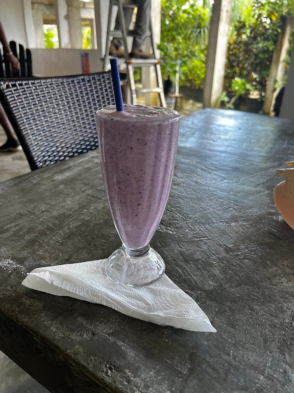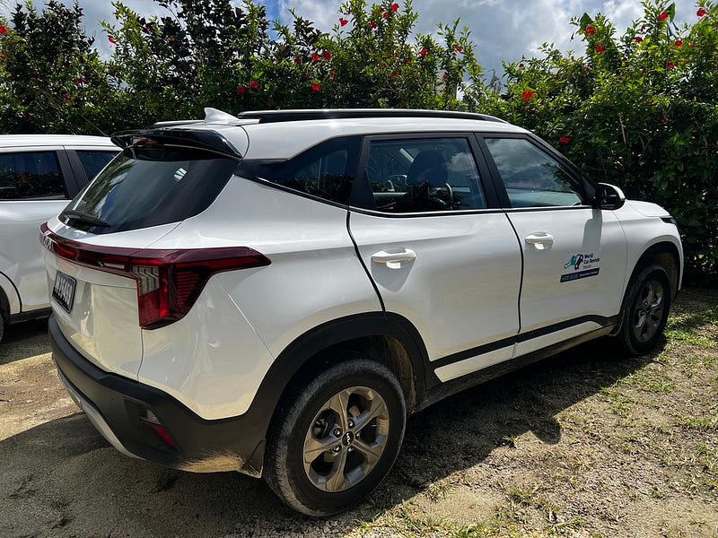

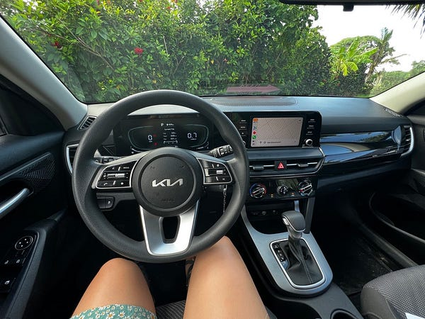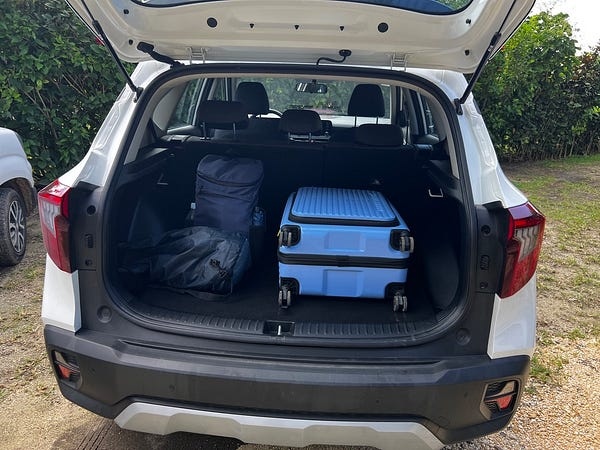車子滿新的，里程數也不高！很喜歡～

### Eton Beach

第一站 Eton Beach 是個風景秀麗的海灘，但感覺沒有太適合浮潛，我只看到一點點魚。甚至用了防水手機套帶著手機下水錄影，但只錄到一堆落葉🤣

不過這邊倒是滿適合家庭來玩水的，因為岸邊的水位很多，有滿多遊客跟當地人家庭在這裡玩水。

這裡的入場費應該是 vt1000，但不知道為什麼我開車進來的時候完全沒有人跟我收錢？所以我一毛錢都沒付XD (題外話是萬那杜的海灘大多要收入場費，據說是用來維護公用設施的，但絕大部分的公用設施還是滿破舊的，甚至收錢的人我也不知道是不是官方的人。)

### Blue lagoon

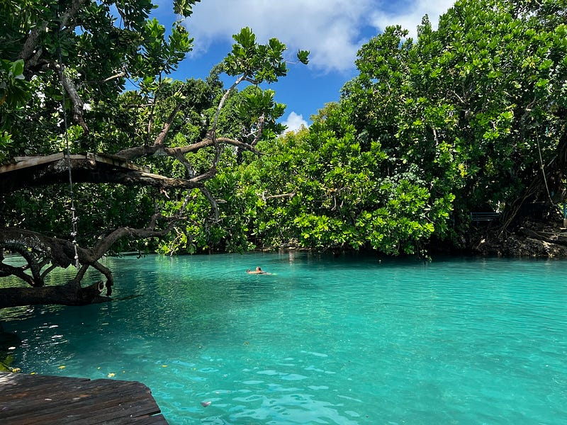超美的 Blue Lagoon

第二站 Blue lagoon，通常入場費是1500vt，但度假村主人說報她名字只收vt500。所以我就跟入口的人解釋了一番，也不知道他有沒有聽懂，反正我只付了500😆

我個人覺得游湖完全比游海可怕很多耶🤣 一開始我連跳下水都有點害怕，下去之後也覺得浮力有差，大概只下去五分鐘我就上來了。不過這邊還滿適合水性好、喜歡冒險的人，不僅有跳水平台、還有繩索可以玩，我看其他人跟小朋友都玩得很開心。

### Aelen Chocolate Factory/83 Distillery

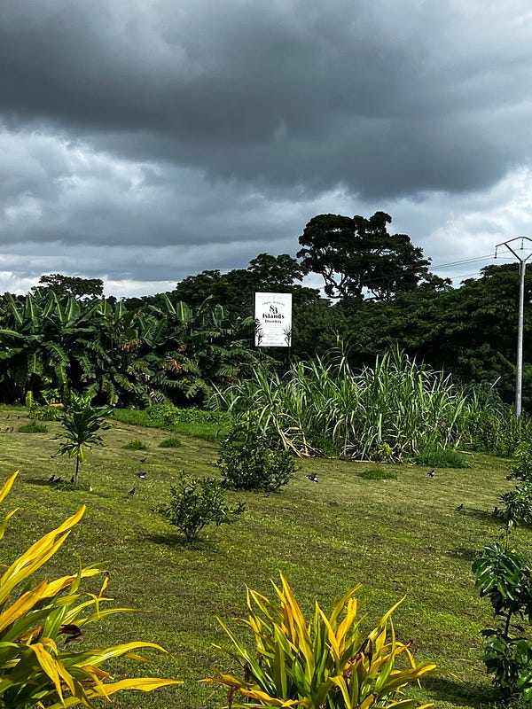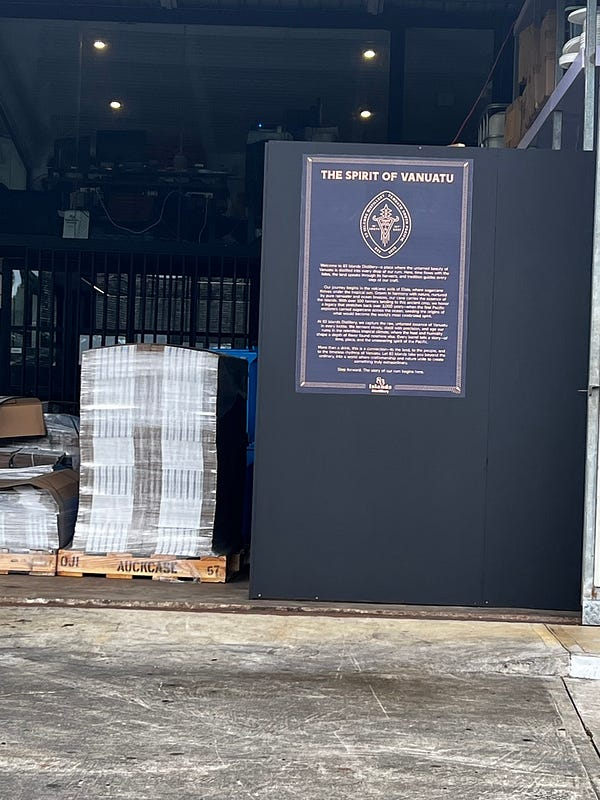83 Distrillery

本來要去巧克力工廠 Aelen chocolate factory（我去之前還看到他們的臉書廣告），但導航先帶我到了一個道路施工的地方，後來繞了一圈也沒找到，只好放棄。

之后就開車去附近的釀酒廠 83 distillery，可惜他們這邊沒有供應餐點，我一個人開車也不能參加 tasting (品酒活動)，所以上了個廁所我就走了🤣 （不然我覺得那邊充滿了蔗糖香，超好聞）

### Nambawan Café

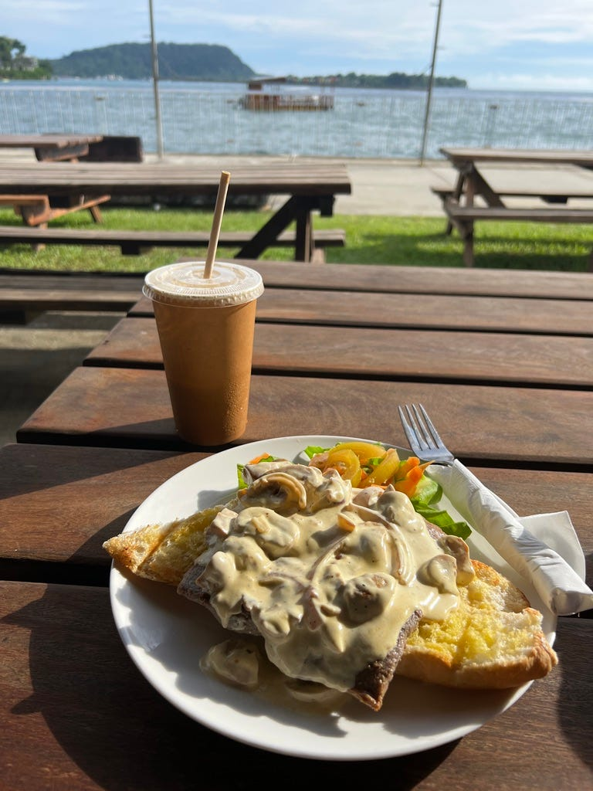超大份 steak sandwich

最后我總共花了兩個小時，才開車回到市區的咖啡廳 Nambawan Café (Number One Cafe) 吃飯。Nambawan Café 其實就在我第二天去的咖啡廳 Rossi’s 隔壁，其實我一開始完全不懂為什麼會有很多人推薦他們，因為我覺得 Rossi’s 環境更加舒適、服務好、菜色選擇多。直到我點的 steak sandwich 上菜（我一開始還想說也煮太久了吧），超級豐盛的，這樣只要澳幣$11.6。飲料我喝了 iced tanna coffee，應該是用火山島 Tanna 產的咖啡豆，但我覺得喝起來就是很水的冰咖啡🤣

### 自駕感想

今天的自駕遊讓我覺得很不錯，一路上的風景很漂亮！而且有種事情又回到我的掌控的感覺，隨時想出發就出發、想停下來就停下來，不用在那邊跟什麼時候會來，然後又不知道會不會坑我的公車司機鬥智鬥勇🤣

Port Vila 南邊的路比起北邊來說好很多，雖然有坑，但沒有到超級多。實際自駕之后發現有些路上的坑我根本避不開（因為萬那杜的路況就是這麼糟），好險我當初租車時就指定了 suv，果然底盤高、開起來也穩 (其實還有更便宜的小車可以選)

開進市區時還體驗了一下塞車。萬那杜跟澳洲一樣，多數時間都是以圓環取代紅綠燈（其實那邊根本沒有紅綠燈，開車靠眼神），轉彎時因為跟澳洲的駕駛方向不同，所以真的滿困惑的，時時要提醒自己圓環要看左邊來車（萬那杜是右駕，開車靠右，跟台灣一樣，跟澳洲相反）。

### Pacific Lagoon Apartment

今晚的住宿是兩房的 garden apartment，一晚 $200 澳幣的力量果然非同凡響，剛剛試了一下，有熱水！我好興奮啊！

但後來我發現我太天真了😆 雖然這裡有熱水，但完全沒有洗髮精跟沐浴乳🤣 好險我自己有帶一塊小肥皂！然後洗完澡發現，吹風機的風超級弱，電風扇都比它強😂

晚餐糾結了很久要不要出去外面吃，看了一些 Google reviews，覺得出去還要開車、還要被蚊子叮，餐點看起來也一般，價錢又高，就還是決定在旅館吃泡麵了🤣

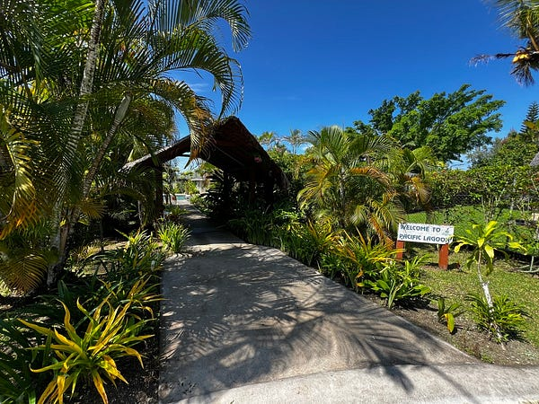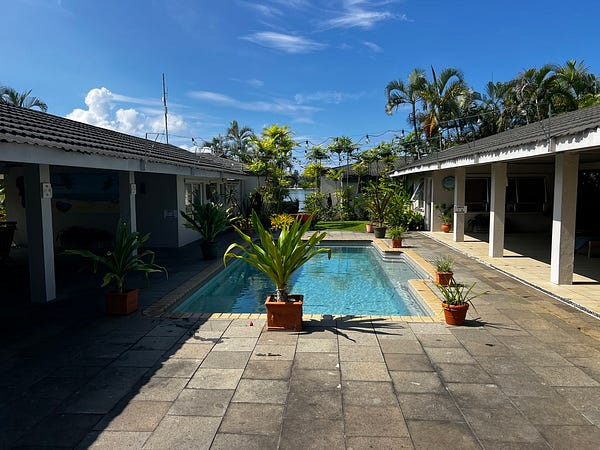

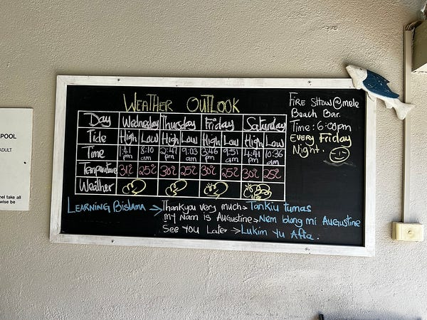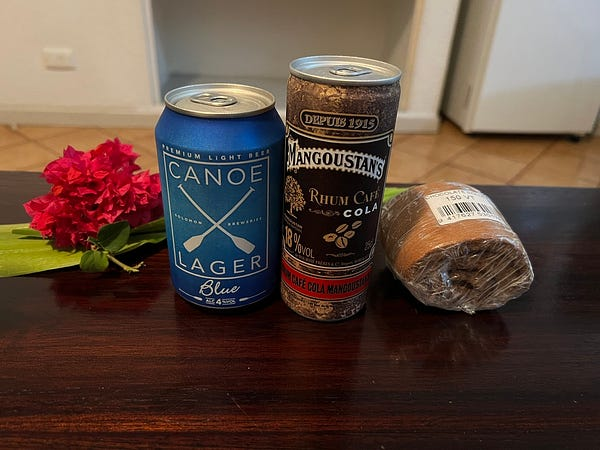

* * *

👉 **需要職涯導師嗎？澳洲雲端架構師 EC 提供轉職工程師、澳洲求職、移民生活等全方位諮詢服務。想進一步了解諮詢細節，請點擊** [**<<澳洲雲端架師 EC：專為轉職者量身打造的職涯諮詢｜海外職場×履歷優化 × 面試攻略 × DevOps /雲端職涯>>**](/posts/2018-01-03-ec-consultation/)**，開啟你的職涯新篇章!**

☕️ **如果想要進一步支持 EC，歡迎請我喝杯咖啡！**

**📱 想追蹤更多？**

  * 📘 [Facebook 粉專：澳洲雲端架構師 EC](https://www.facebook.com/cloudarchitectec)
  * 🧵 [Threads：Cloud Architect EC](https://www.threads.com/@cloud_architect_ec)
  * 📩 合作信箱：[cloudarchitectec@gmail.com](mailto:cloudarchitectec@gmail.com)

