* * *

### 太平洋小島上的大冒險：2025.04.25 Vanuatu Day 7 導航騙我、奶奶救我：宅宅迷路日到火焰之夜

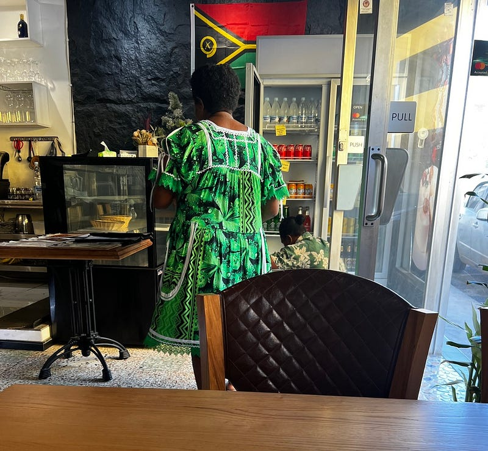萬那杜的女生很喜歡穿這樣的花花洋裝，兩側有超大口袋，我覺得很方便

(還是小島最棒了，大推 Hideaway Island Resort)

### 導航啊導航，你為什麼要騙我

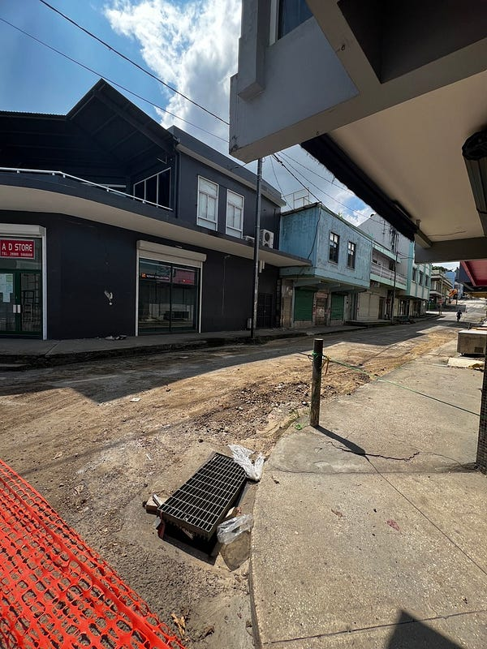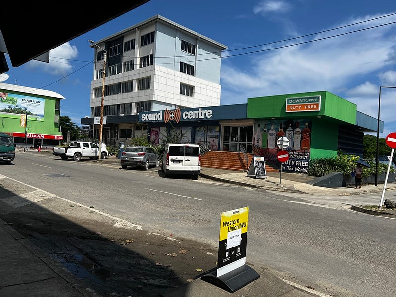就連 Port Vila 市區的道路也是坑坑疤疤

今天其實沒安排什麼行程，打算早上去巧克力工廠，順便換個錢，接著就開車去 Mele Beach，把車停在港口，搭小船去今天的住宿 Hideaway Island。

沒想到第一站就出師不利，表定開車10分鐘路程的巧克力工廠，我開了1個小時20分，包含塞車、被 Google maps 欺騙，問了路人後又繞回市區，最後問了兩個路人才發現它根本沒開🤣

因為被我問路的 cafe 店員人實在很nice，於是決定在他們店裡喝一杯抹茶星冰樂(老闆應該是中國人，所以菜單還有中文😆）。是我近期喝到最好喝的抹茶冰沙，打敗澳洲咖啡店😆

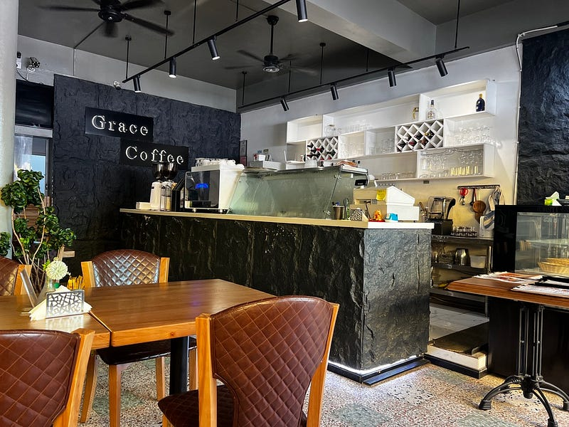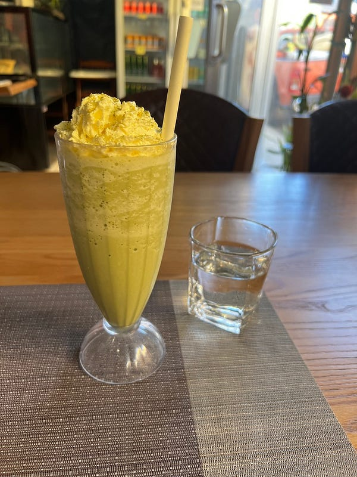Grace Cafe 成為我在 Port Vila 的新愛店

### Hideaway Island Resort

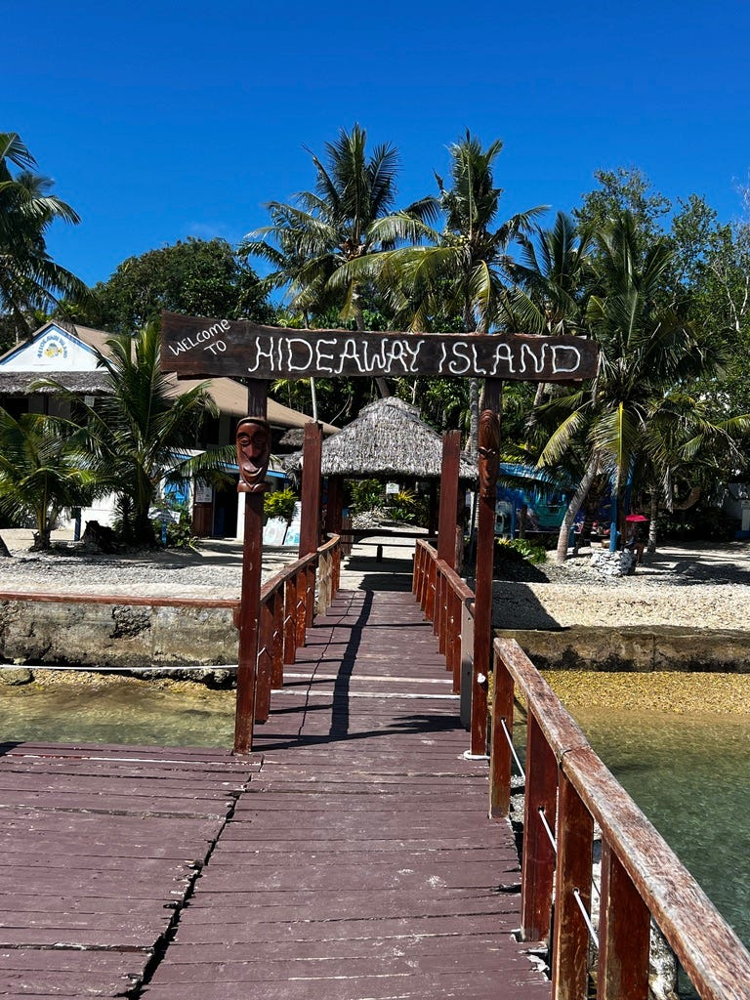Hideaway Island

之後就一路坑坑窪窪地開到 Mele Beach，當初會選擇住在 Hideaway Island Resort 這個小島上（他們的review 很兩極），就是因為在 Mele Beach 的 The beach bar 每週五晚上都有最著名的海邊火焰秀，但這邊交通非常難抵達，離市區開車約 40–60 分鐘。雖然我租了車，解決了交通問題，但是我還是不想要在萬那杜晚上開車，於是住 hideaway island 就是最佳選項！晚上看完秀就直接搭船回住宿，還可以喝酒，請叫我小聰明😆

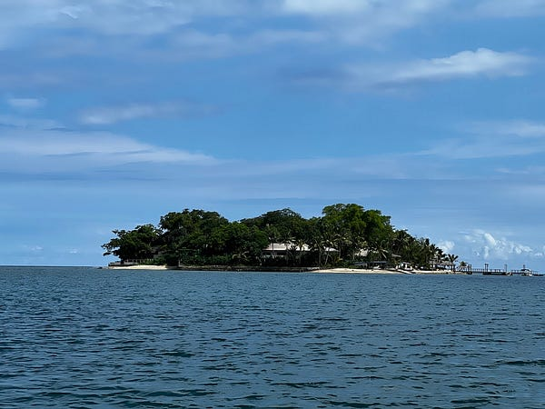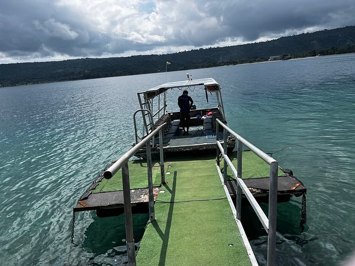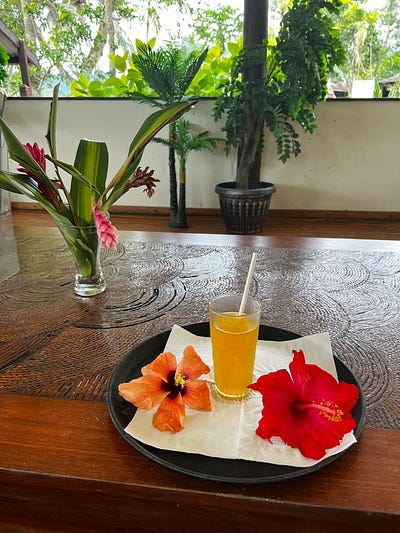Hideaway Island

入住之後發現 hideaway island resort 比我想像中好太多了！首先是房間寬敞，還有自己的洗手台！雖然廁所跟衛浴是跟其他房間共用，但各位，他們有超強大的熱水！！！而且浴室還有一瓶海倫仙度絲可以洗頭，真心是超棒棒！

這裡的 snorkelling 也真心是美翻！Amazon 買的防水手機袋意外不錯，我拍的潛水影片到一大群魚，此時我其實離岸邊才20公尺以內吧！超誇張～ 雖然後來就開始大暴雨，但瑕不掩瑜啦😆

真心推薦大家來萬那杜只需要租車來這個地方即可，是我這幾天來的highlight 😆😆😆

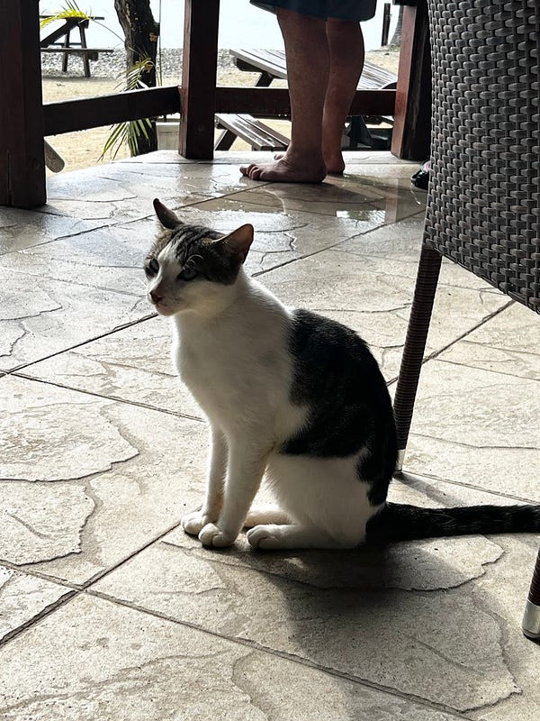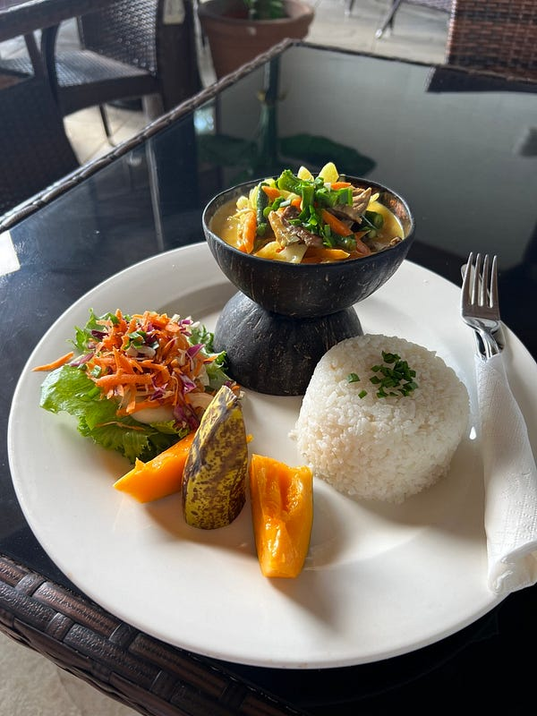島上還有可愛貓貓！這個椰汁牛肉咖喱真心爆好吃

### Beach Bar 火焰秀

洗完澡之後就開心搭船回 the beach bar，超爆多人😂 不過他們人不錯，我當初一個人訂位，他們還是有幫我安排位子（六人桌的其中一個位子，我還沒坐下來之前旁邊的奶奶就跟我說「這個位子超濕」，奶奶果然沒有騙我，應該是白天下雨把這塊木頭浸濕了，就算我下面墊了牛仔外套還是一路濕上來，這塊木頭到底多吸水🤣）

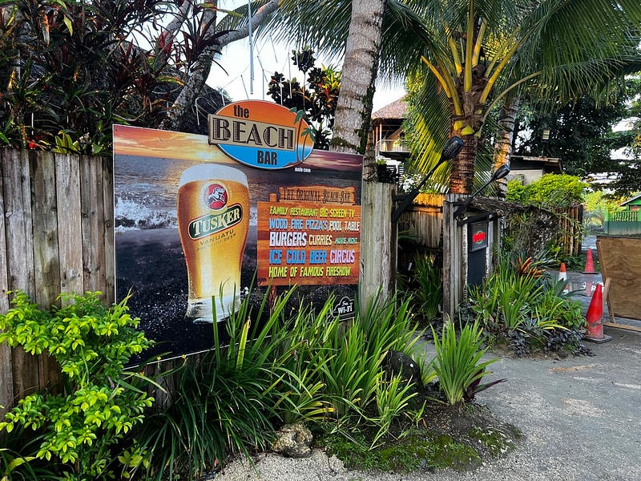The Beach Bar

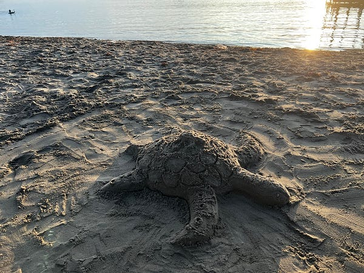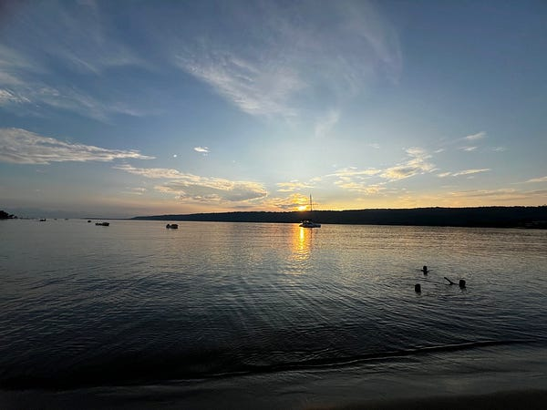夕陽也很美

晚餐點了窯烤 pizza，才發現不是所有窯烤披薩都好吃🤣 明明起司也很多但吃起來真的很普😆

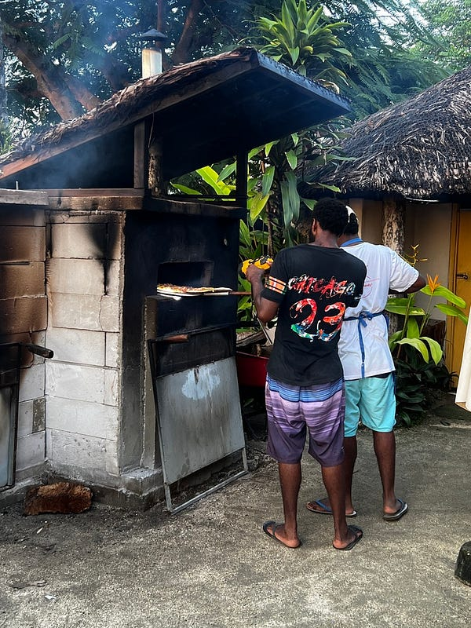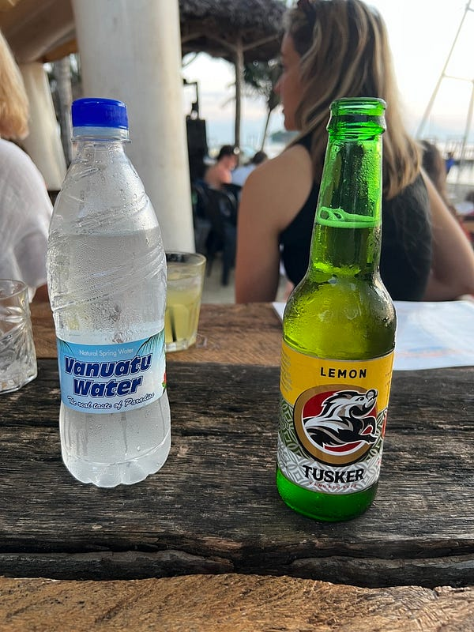

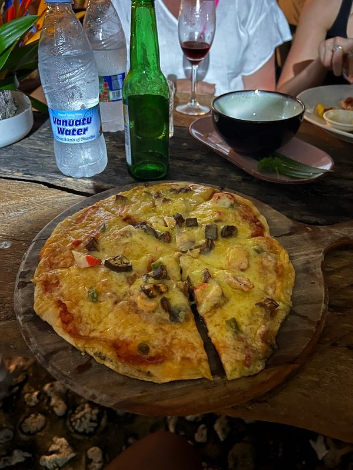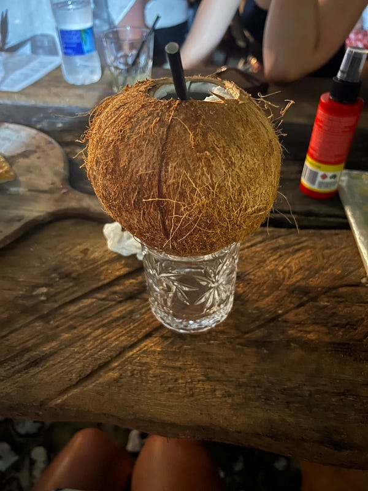窯烤披薩因為光線不足，還需要另一個人拿手電筒打燈XD

最後火焰秀晚了半個小時才開始（餐廳規定要5:30前入座才能保留位子，也就是我們等了2個小時，等到快睡著🤣），但我覺得很值得耶，表演非常精彩！！！有西方音樂、傳統配樂，甚至還有空中瑜珈😆😆😆 而且表演是靠自由樂捐的模式，我真心覺得這麼精彩的表演值得強制收費😆

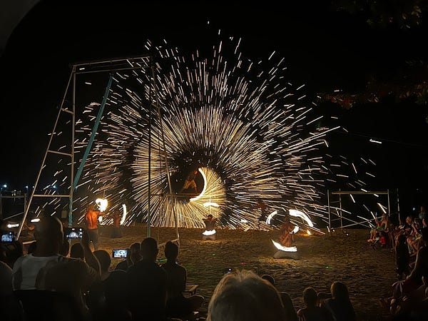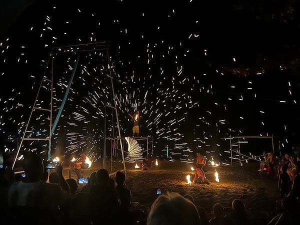火焰秀


