---

title: "太平洋小島上的大冒險：2025.04.26 Vanuatu Day 8 高級度假村午餐、高級住宿、高級蚊子包"
date: 2025-04-26
slug: "2025-04-26-vanuatu-day-8"
cover:
  image: "images/medium-1*lU6MPT_D-CrjXH72Ri8mQg.jpg"
  alt: "海島度假村早餐時光"
images: ['images/medium-1*lU6MPT_D-CrjXH72Ri8mQg.jpg', 'images/medium-1*stHnWueAbTORnYhAAg04-Q.jpg', 'images/medium-1*Vw1O8kJxeedy44zZq-k_Yw.jpg', 'images/medium-1*6I4Q_R_w9K_Zp_cGQjcfpQ.jpg', 'images/medium-1*LjsP2mSLIYyYlloh2n74ww.jpg', 'images/medium-1*RAd8Mb0kWPTpD-Teonn5vw.jpg', 'images/medium-1*no3tjedAvhx7VwsIz5FKUQ.jpg', 'images/medium-1*7G8g-1VxNiVFUmdA9mfbSA.jpg', 'images/medium-1*fflQ8QIAHr6PfptVmajPGQ.jpg', 'images/medium-1*W7owmjCAeFlIwjdPkFGwxA.jpg', 'images/medium-1*CrgNkmjUtuPiMfdQbw5AnA.jpg', 'images/medium-1*VHDaTaSP_-F8d-SJng2rdA.jpg']
categories: ["旅行紀錄"]
tags: ["旅遊","萬那杜","獨旅","自駕"]
episodeseries: ["萬那杜旅記"]
---

(簡直要被蚊子吃了🤣)

不知道為什麼想像中的海島度假很悠閒？對我來說每天都是跟蚊子的對抗，目前兩隻腳應該有 20–30 個蚊子包🤣

出發前我帶了防蚊手環（我覺得沒用）、防蚊貼（我覺得也沒用）跟兩瓶防蚊液（新買的一瓶是純天然的，100ml 已經被我噴到見底了🤣舊的那瓶買很久了，這幾天就被我拿來噴門窗，試圖嚇阻蚊子入侵）。

每天出門前就是要先抹上一層厚厚的防曬，然後再狂噴防蚊液，這個過程至少 15–20 分鐘跑不掉。然後只要下水一次，又要重複一次🤣

我個人也很討厭在洗澡後還噴防蚊液（雖然它號稱 100% 天然成份)，所以也都儘量避免在日落後出門，但為數一兩次夜間出門立刻就獲得了超多包，所以後來我也不管了，就算洗澡後還是要防蚊液噴好噴滿，我真心覺得我這幾天都要吸防蚊液吸到要中毒了😂

今天早上離開 hideaway island 前，很糾結要不要再浮潛一次，最後決定還是覺得算了（不想重複上述流程）。

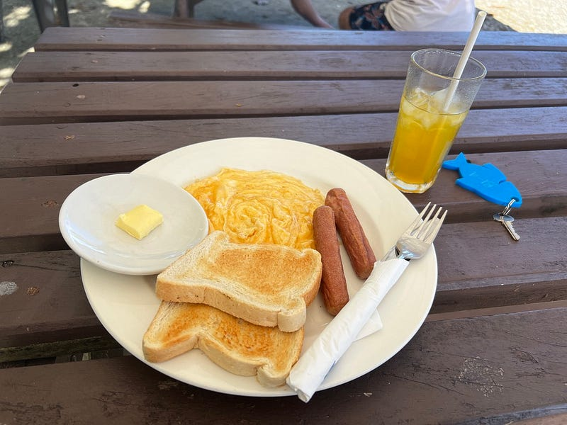

*我吃早餐，蚊子吃我?!*

### M Resort & Spa

第一站本來是一個叫 Tanna Coffee 的咖啡店，但我用了兩個導航軟體交叉比對（Google & here we go，Apple Maps 在這裡完全不能用），發現定位一個在東邊、一個在西邊🤣 於是我立刻放棄！不能再重蹈昨天 10 分鐘路程開了 1 個多小時的覆轍😆

於是直接前往 M Resort & Spa，果然 20 分鐘的路程我又開了 50 分鐘，因為北邊的路真的太爛了 😂😂😂 而且我開到最後三公里 Google maps 也失去作用，完全一片空白，好險路上還有少少的指標。

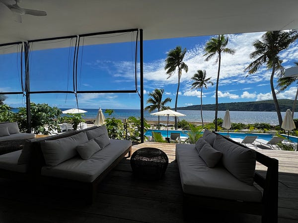

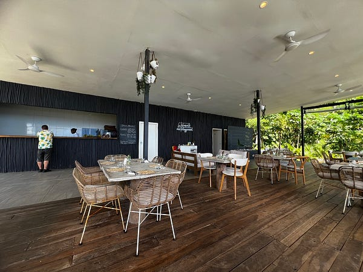

*M Resort & Spa*

一到之後完全覺得也太美了！完全就是高級度假村的風格，超美！我點了 lemongrass chicken (擺盤很美、份量很大，但味道一般），反倒是我點的 mocktail 很好喝，但我一直以為 mocktail 應該會做成雞尾酒🍹的樣子？我覺得這杯比較像是 smoothie 吧😆

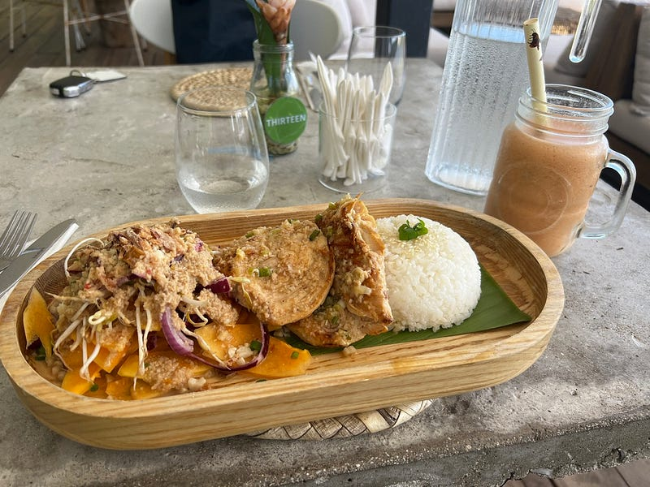

*擺盤好美！*

這裡除了有餐廳之外（他們其實也有住宿），還可以免費浮潛！但是這邊的水超級淺的，我一不小心腿就被珊瑚礁割傷，一上岸之後蒼蠅一直想停在我的傷口上，太可怕了！我立刻就決定開車走人😆

### Fatumaru Lodge

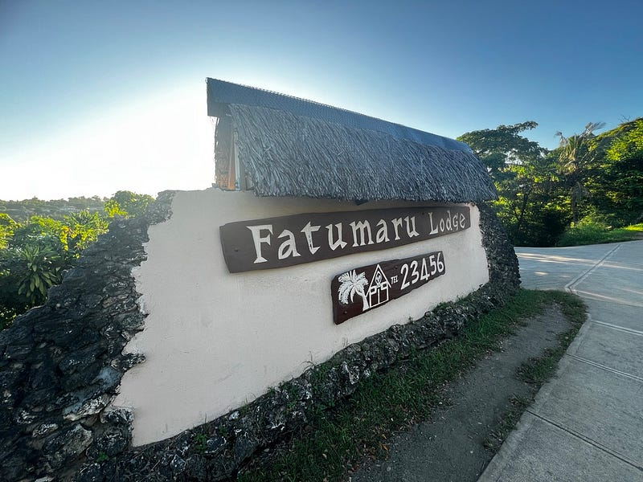

今天的住宿也是金錢的力量，一晚要澳幣 $226，但不得不說滿漂亮的，設備也很齊全，淋浴間有兩個蓮蓬頭，洗完澡去櫃檯借吹風機還借到一台 dyson!!!!! 這是我第一次用 Dyson 吹風機，我平常吹頭髮大概要 20–30 分鐘，還無法全乾，Dyson 居然只要吹五分鐘就乾了，太神了吧😆

唯一的缺點是我以為這個住宿可以直接走進海水裡，沒想到我的住宿居然是二樓😆 然後也沒有樓梯可以直接進水裡🤣

到住宿點時已經快三點了，我馬上把握時間把這裡玩了一遍，先試了浮潛，水底超糊的什麼都看不到，果斷放棄。

接著試了人生中第一次 kayaking，我覺得很好玩耶！操控方向比我想像中容易，但因為旁邊完全沒有人，所以我也不敢滑太遠，只敢在海灘附近繞圈圈😆

甚至還跑去使用了一下這裡的游泳池，然後我突然發現為什麼我這幾天就算旅館有泳池我也沒去（雖然主要是因為時間不夠），因為真的好無聊🤣🤣🤣 我都來到這種有真海邊的地方了，一個人在泳池真的不怎麼好玩😆

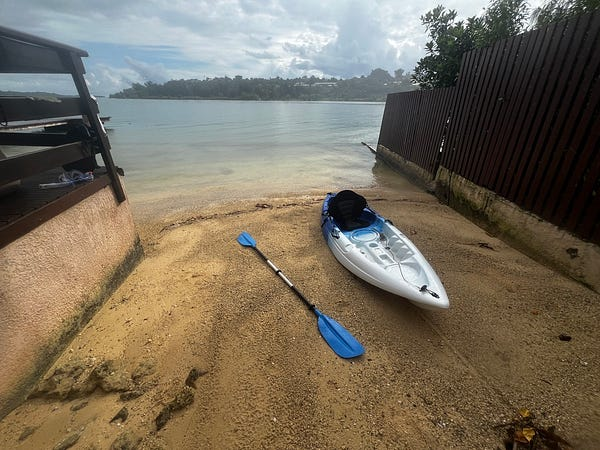

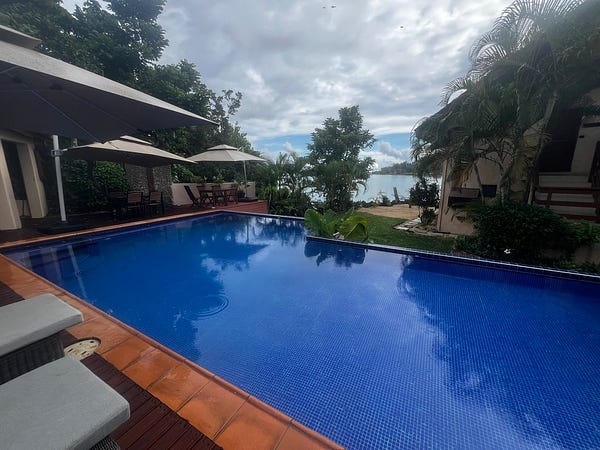

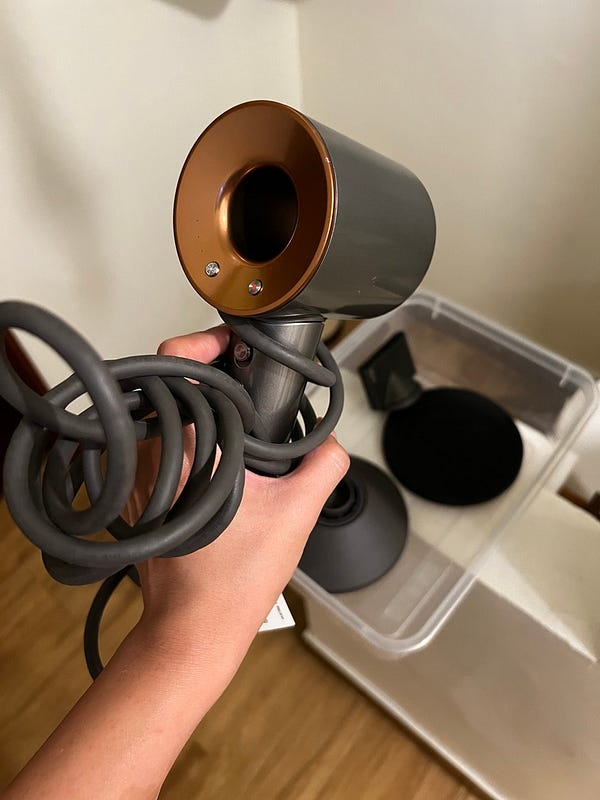

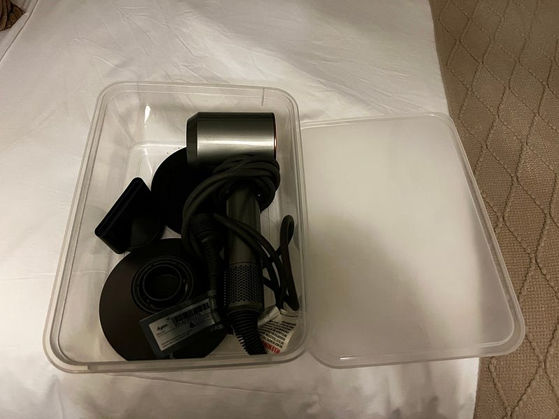

*Fatumaru Lodge*

晚上本來全副武裝（狂噴防蚊液）準備開車去附近的餐廳吃飯。吃飯前我先開車去超市附屬的加油站加油（這裡的加油站是像台灣一樣會有人服務的喔，完全不用下車！）

結果我完全太會算，一加完剛好就是我還車需要的油量+10 公里。進到超市後發現他們居然有在賣烤雞跟薯條，於是我就決定外帶回旅館，這樣剛好明天租車公司可以直接到旅館領車，我也不用再加油。

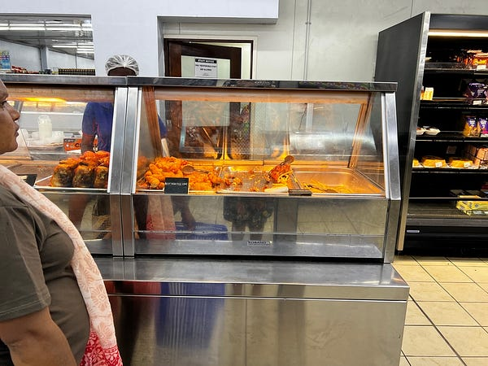

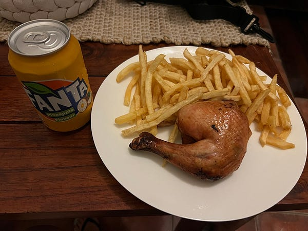

*超市晚餐*

我真的覺得這個租車公司不錯，市區內他們可以免費到你的住宿點 pick up 車子。希望萬那杜的基礎建設可以慢慢改善，東南海岸線開起來真的很舒服～ 西南海岸線跟北區則是悲劇一場。然後市區平日很容易大塞車，我覺得在這裡體驗到塞車也是很有趣😆
