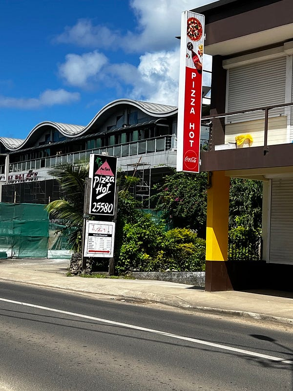
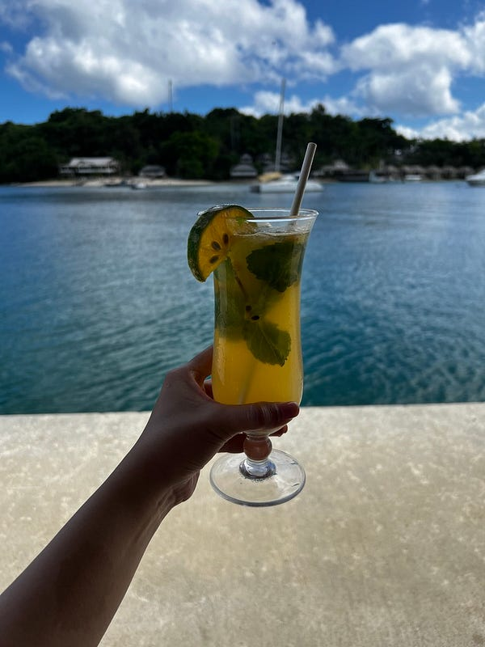
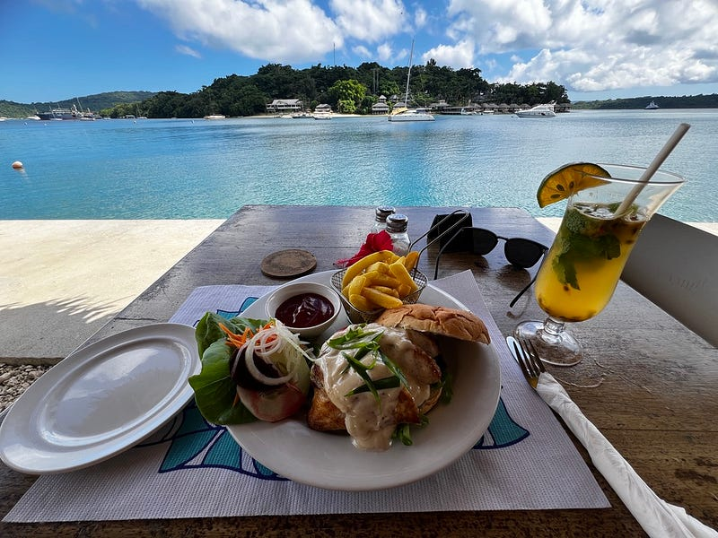
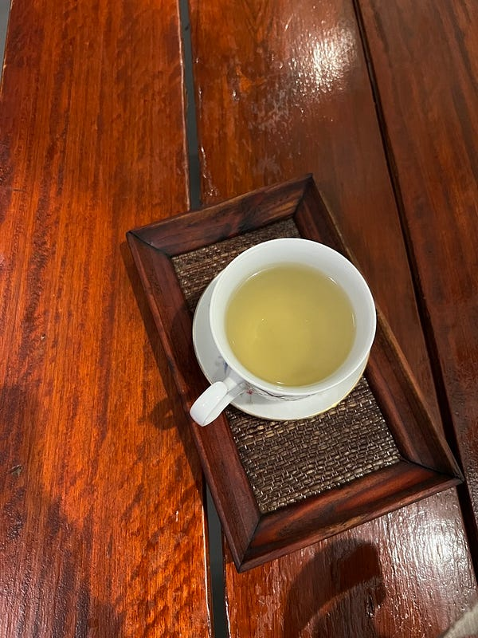

* * *

### 太平洋小島上的大冒險：2025.04.27 Vanuatu Day 9 挑戰完成！一個女生成功闖蕩萬那杜！

(I’m flying home today 🇦🇺❤️)

路上的裝置藝術

### 最後的市區半日遊

是 Pizza Hot 不是 Pizza Hut 喔XD

早上 checked out 之後就先把行李寄放在旅館，好好拍了一下車子的影片（請祝我還車檢查順利），然後就把車子鑰匙留給櫃檯，開始我的市區漫步游。

這個住宿點真的不錯，走到 Banyan bar 只要 10分鐘，接著走到市區約15分鐘。今天天氣不錯，所以海看起來還是很美！

因為天氣真的爆熱、一到市區就決定先去我的愛店 Grace coffee 再喝一杯抹茶星冰樂（必須說他們的食物看起來份量大也很好吃，但真的都沒有機會典點🤣），然後就到處逛逛。

今天是週日所以絕大部分的景點都不開，但我還是逛了幾家市區小店，但真心沒有買東西的慾望，東西感覺質感一般，價錢也差不多就是Kmart 等級（感覺還不如在 Kmart 買😆）。

查了一下，決定午餐要去高級水景餐廳 Waterfront bar & grill。不愧是高級餐廳，一上來先上冰毛巾擦手，在高溫的萬那杜簡直是太爽了❤️

窮人如我點了fish burger，裡面居然是 grilled fish 覺得很超值，而且感覺什麼食物配上這個景都是無敵😆

Waterfront bar & grill

### 按摩便宜又有冷氣吹，太舒適了

逛街途中經過一家按摩店，剛剛本來心一橫想訂2小時的按摩，但打電話過去他們只剩一個3:15的90分鐘的位置🤣

吃完午餐之後已經1點多，發現就算本來週日有開的店家也逐漸關門，甚至我本來想在市區先把剩餘的錢換回澳幣，結果所有換錢所都關門了🤣

到了1:35，但我真的無事可做，於是就跑來按摩店吹冷氣，店員整個大傻眼😆😆😆

不過至少他們店是萬那杜少數有冷氣的地方，雖然中間還跳電兩次🤣

沒想到他們居然是真泰式按摩耶，我完全被折來折去！我本來以為只是一個噱頭😆

按摩店意外的高級

### 我已經不是當年的我了

回程時差點又要被詐騙🥺 好險我已經熟知這一切！

早上旅館跟我說我五點回去時，他們再打電話幫我叫計程車就好。結果我剛剛回去說他們叫不到，員工會去路上幫我攔公車，還是收vt1500(注意一般來說公車只要150）。

結果一上車我立刻問司機去機場多少錢，他回vt2500⋯⋯我立刻說旅館員工說1500，然後他就沒說話了😆

短短五分鐘路程，但司機一路飆車。超怕出什麼意外😂 最後我在gate 關門前40分鐘趕到機場，順便換匯完成！

沒想到到了機場之後還有另一個考驗，首先是這班飛機完全要人工 check in。接下來是安檢大排長龍，表定6:15 登機，我直到6:22才過完安檢🤣 好險 Port Vila 的機場很小，過完安檢後兩分鐘就上飛機了。

表定9:25點到的飛機，提早25分鐘抵達。8:40降落，9:02我已經通關並領完行李，還上了一個廁所😆 完全是史上國際線+領行李最速通關😆


