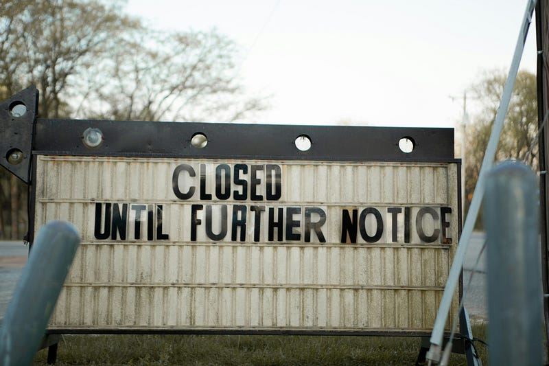

* * *

### 倖存者日記：沒想到 2025 年還有續集？當裁員成為澳洲科技業的新常態！

Photo by [Andrew Winkler](https://unsplash.com/@andrew_winky?utm_source=medium&utm_medium=referral) on [Unsplash](https://unsplash.com?utm_source=medium&utm_medium=referral)

### 前言

好久不見！繼萬那杜與紐西蘭遊記連載結束後，EC 終於又要回歸職場系列 — — 而且一開場就是壞消息（哭）。 是的，又是裁員。

如果你還沒看過我 2023 年記錄微軟裁員潮的觀察日記，推薦先參考以下兩篇：

(因為裁員消息實在太頻繁，我 2023 年從微軟辭職時，身邊的人都很驚訝，可能沒想到在這種風雨飄搖的情況下，居然還有人主動放棄高薪XDD）

**倖存者日記：2023 Q1 科技大廠裁員潮 — 澳洲微軟員工觀察日記（第一次經歷大裁員的震驚與混亂）**

[**倖存者日記：2023 Q1 科技大廠裁員潮 — 澳洲微軟員工觀察日記**  
 _2023 年初，科技大廠 FAANG 相繼爆發裁員潮，微軟也不例外。本文記錄我身為澳洲微軟員工的第一手經歷，從內部謠言到團隊成員突然被裁的震驚瞬間。看似「安全」的組織，其實也暗藏危機，讓人深刻體會在變動職場中建立心理安全網的重要性。_ medium.com](/posts/2023-02-11-2023-q1-layoff/)

**倖存者日記：2023 澳洲微軟裁員後續，裁員風暴仍在持續（當你以為風暴已過，卻發現連管理層也未能倖免）**

[**倖存者日記：2023 澳洲微軟裁員後續，裁員風暴仍在持續**  
 _本來以為裁員朝已經落幕，結果災難還在延續。繼上次失去兩位同事之後，又有同事持續消失，這回甚至連我的直屬主管也受到影響！微軟的裁員 SOP 一出手，誰都可能有可能走人，就算爬到管理層也無法避免！_ medium.com](/posts/2023-04-06-2023-layoff/)

如今來到 2025，我本以為裁員潮已稍見平息，沒想到這波竟然燒到了我目前的公司 — — Shell。這篇我們要來談的是最近的 Shell 裁員 (2025 年 6 月熱騰騰的消息)。

### 數據觀察：裁員成為新職場週期？

在分享這次的裁員觀察日記之前，我想問問大家有沒有覺得自從 2023 那波科技大廠集體大型裁員潮之後，這幾年裁員其實斷斷續續在發生？

以下是近幾年的概況整理：

#### 📉 2023 年：裁員高峰年

  * 根據 Layoffs.fyi 統計，2023 年全球有 585 間科技公司裁員，總人數超過 15 萬人。Meta、Amazon、Salesforce 等均有大規模人力調整。
  * 這波裁員主要來自於疫情後的過度擴張、通膨壓力、利率上升與需求回落。

#### 📉 2024 年：裁員持續但略趨緩

  * 略為趨緩，但仍有超過 5 萬名科技從業人員被資遣。Dell、Intel、Tesla 名列重災區。
  * 雖然規模略低於 2023 年，但仍顯示出裁員潮未止息，尤其在 AI 導入與成本壓力下，企業持續調整人力結構。

#### 📉 2025 年上半年：裁員再起

  * 裁員再起，截至目前已超過 6 萬人失業，涵蓋 130 間企業。微軟、Google、Amazon 等科技巨頭仍是主主力裁員者。
  * 趨勢顯示，裁員已從「一次性調整」轉變為「策略性精簡」，並與 AI 導入、人力再配置密切相關。

根據我現在還在微軟的同事表示，基本上大概每六個月都會有一次 re-org 或裁員，他都麻木了。我也認同現在的趨勢看起來就是企業大概每半年或是一年就會開始「策略性精簡」，至於這個策略到底有沒有用？仍需後續觀察。

### 壞消息總是來得突然

兩週前，CIO 宣布公司即將進行組織調整。老實說，我完全沒有多想 — — 因為去年也經歷過類似變動，但其實只是我的 manager 的 reporting line 改變了（也就是我們 team 改為 report to a new GM），但工作內容沒變動，我的直屬經理也還是同一個，說真的是幾乎沒影響。

一週前，GM 突然跟我們 team 進行了一場 info session，語氣含糊，只說公司在做「策略調整」。當時雖感氣氛不尋常，但也沒往裁員那邊想。

接著是週一早上我們團隊中最資深的 DevOps 同事突然掛上 OOO（Out of Office），我以為他請假，也沒多想。週二他還是掛 OOO，但一直到週二下午 GM 公布新年度的團隊架構圖：從 5 個 DevOps Engineer 職位變成 4 個 (組織架構圖上沒有名字，只有職缺)。我才意識到，那位做了三年、是經理以外最資深的 A 同事，不會再繼續跟我們一起走下去了 (經理的年資是19年，是真的開朝元老)。

A 同事是我們團隊中最資深的 DevOps Engineer (剩下四個人都是在一年半前同時加入的)，參與過多個關鍵專案，有許多 domain context 只有他掌握，我們其他人都沒有碰過。我原以為這樣掌握核心知識的角色「怎麼可能會被影響」。但事實是：組織在調整時所思考的，往往不是「誰最懂這個系統」，而是：「這條技術路線還要不要走下去？」或是「是否可以用其他人合併取代？」

你以為有經驗、有貢獻就能倖免，現實卻告訴你 — — 「沒有一個人是真正不可或缺的」。

說實話，layoff 其實是沒有交接這件事的，因為主管都會覺得被影響的人已經很衰了，會希望其他人盡量尊重他們。但完全沒有交接的下場就是很多知識/程序可能就此流失，但我猜領導層可能也不在意，畢竟工作也不是他們在做lol

很多人形容裁員後的「倖存者」有種罪惡感。我覺得更貼切的說法是：你像個目擊者，夾在震驚、茫然與焦慮之間，感到滿心困惑，卻又無所適從。你會想：「他都會被裁，那我呢？」、「我的角色是不是也可被取代？」、「我是不是過度依賴眼前的安穩？」這些聲音會悄悄浮現。

### 過來人的5個生存小秘訣

這讓我重新檢視自己的職涯策略 — — 不只是技能組合，還包括心理建設。

以下是我整理的幾個小心得：

🔹 **備份你的價值**  
在風平浪靜的日子裡，我們很少停下來總結自己做了什麼。但我發現，定期紀錄自己參與過的專案與具體貢獻，是非常值得投資的習慣。這不只是為了更新履歷或面試準備，更像是一次次重新認識自己的機會。暮然回首，你會驚訝於那些日常中的努力，其實早已構築出屬於你個人的職場價值。

🔹 **避免成為知識孤島，提升能見度**  
即使你在自己的系統中無人能及，如果沒有橫向合作與團隊之外的曝光，當裁員來臨時，你的價值可能無人知曉。我學到的教訓是：別讓自己只守在某個熟悉的技術角落，要主動走出去，建立跨部門的橋樑、參與更大範圍的對話，讓自己被「看見」！

🔹 **保持彈性**  
科技變化飛快，今天的熱門技能，明天可能就被 AI 取代。不要讓自己被綁死在某個技術堆疊上。學會觀察趨勢、預判風險，同時保留學習新領域的空間與彈性，是一種面對未來的自我轉換力。

🔹 **讀懂高層語言**  
當主管開始強調「聚焦核心」、「調整方向」、「資源優化」等詞彙時，那往往是變化將至的信號。與其等著被通知，不如提早理解這些語言背後的真正含義。試著從管理角度思考：哪些職能會被保留？哪些工作是公司下一階段優先考量的？職場中的敏感度，有時也是一種自我保護機制。

🔹 **經營心理安全網**  
裁員並不只是職涯上的事件，它牽動的是情緒、信心、社交與生活節奏。我從這次經歷中體會到，平時就要經營「心理安全網」──包括情緒支持系統（朋友、伴侶或諮商師）、財務緩衝，以及能轉移焦慮的興趣、社群活動。這些東西看似與職場生活無關，卻是在崩潰邊緣把你拉回來的力量。

### 結論

其實我寫這篇文章本意是想要分析裁員的原因，這也是我在得知裁員消息後一直想要找尋的答案。但我後來發現，這件事可能根本沒有答案。

我後來跟我的經理談過這件事，他語帶保留，只說他的確比我更早知道消息，但似乎沒有參與決策過程，只能說是更高層下的決定，他得知消息時基本上名單已經確定了。我也詢問了可能的影響因素，他只說是各種因素的綜合考量，年資越久通常表示薪資也更高，所以的確可能是薪資考量，但專案能見度、溝通能力、高層喜愛度等等更多因素其實也參雜其中。

我後來發現探尋這件事的原因其實沒有意義，因為裁員不是對個人能力的否定，而是組織資源重新分配的結果。沒有人能保證永遠安全，被裁的人可能真的就是「比較衰」。生命中總是會有一些不幸的事會發生，這點可能跟你做了什麼，或是沒做什麼，一點關係也沒有(哭)

所以這篇文章不是為了製造焦慮，而是想提醒你 (也提醒我自己)：在一切看似平靜的當下，為未來留點餘裕、彈性與轉身空間。

**真正的職場安全感，不來自任何一家公司，而是你自己。**


