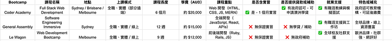

Photo by [Meghan Holmes](https://unsplash.com/@yellowteapot?utm_source=medium&utm_medium=referral) on [Unsplash](https://unsplash.com?utm_source=medium&utm_medium=referral)

上週在 Threads 上分享了我當年靠著讀完 coding bootcamp 成功從文組轉職工程師入職澳洲 Amazon 的故事，收到廣大熱議XD

如果你還沒讀過那篇文章，請見：

[**文組轉職澳洲 IT 工程師，我靠 Coding Bootcamp 進了 Amazon 當工程師！**](/posts/2022-12-03-bootcamp-to-aws/)

應讀者應求，今天就來跟大家聊聊如何挑選 coding bootcamps!

# 前言：Coding Bootcamp 不一定適合每一個人

如今的時空背景已經截然不同，而 coding bootcamps 本來可能也不適用於每一個人。我 2020 年畢業時，大概只有 80% 的同學成功完成學業（入學時 20 人，16 人畢業），最後也只有約 40% 的同學 (8個人) 在畢業後的半年內找到程式設計相關的職業，有一些人即使到五年後的今天也沒有轉職成功

有時候我甚至認為，轉職成功這件事可能只是**倖存者偏差**？以下文章有我的相關反思：

[**轉職風險與規劃全解析：如何判斷你該換工作了？來自成功海外轉職者的建議 (台灣文組轉澳洲工程師)**](/posts/2022-12-10-career-transition-analysis/)

當大家瘋狂熱議說「這不適用於2025年啦～」的時候，我只想告訴你們，這件事在 2020年其實也沒有多容易啊XDDDD

總的來說，投資理財有賺有賠，風險自負。投資自己，也不一定是一條穩賺不賠的路線。人生的每個選擇都有背後要付出的代價，與其覺得「時不我予」而自怨自艾，不如好好評估一下自己的目標跟你願意付出的代價。如果評估過後覺得值得一試，那就勇敢衝吧！

畢竟嘗試過後不一定會成功，但如果你連嘗試都沒有去嘗試的話，那就真的 100% 不會成功喔XDD

我在 2015 年決定要拼澳洲移民時，也是覺得困難重重啊！就結果論來說，透過謹慎評估、成功執行計劃，我在2018年成功入籍、成為澳洲公民。而我當年還在觀望的朋友，時至今日也還在觀望:)

# 轉職方式比較：Coding Bootcamp vs 大學學歷 vs 自學成才

在聊如何選擇 coding bootcamp 前，讓我們先來簡單聊聊還有什麼其他選擇？

### 自學

這是我最早放棄的一個選項，但其實也會是我建議大家第一個嘗試的選項。

網路上很多免費的學習資源，在你決定要踏上轉職之路前，我建議至少先自學一些簡單的程式設計課程，例如 HTML、CSS、JavaScirpt 跟 Python。

如果你學一學發現自己實在**很討厭寫程式** 這件事，那這個探索之旅就可以就此結束了！

這個方向不適合你，開始考慮其他選項吧 ～

(題外話，IT 是我當年轉職的第一選項，但其實不是唯一選項。我本來考慮如果試了IT 不成功，那我就改試金融XD)。

如果你自學了幾堂課，覺得還算有趣，那你就可以開始思考下一步了，你覺得自己可以光靠自學習得所需要的技能，然後成功找到工作嗎？

當年的我覺得我不行！

因為自學很容易遇到瓶頸，而當年的我就算自己花很多時間研究，我不懂的東西我還是不懂（因為知道的東西真的是太少了），所以我覺得我必須要找到一個可以回答我所有程式問題的專業人士，進行更系統化的學習。

話雖這樣說，我也有認識自學程式成功，後來先後進入 AWS 跟 Canva 工作的人，所以也不是說自學就完全不可能轉職成功！

### 重讀大學 IT 學位

我下一個考慮的選項其實是重回大學。

簡單來說，好處有：擁有澳洲本地大學相關學歷找工作更容易、訓練更扎實。

缺點有：時間長、學費貴。

澳洲的學士學位是三年（跟台灣的四年不同），也可以讀兩年的課程制的碩士學位。

我當時考慮的是重讀學士，因為我覺得 bachelor 的訓練比較扎實，我甚至去修了澳洲高中生的數學課，來滿足澳洲大學的入學需求。

但我後來沒有繼續這條路，因為我覺得三年真的太長了。

轉職就跟移民一樣，時間拖得越長，變數越多。我的人生準則就是盡可能用最有效的方式來達成目的。

就結果論來說，似乎是一個成功的模式？

### Coding Bootcamp

最後我選擇的是 coding bootcamp，因為時間短 (根據學校不同，從 3 個月、6 個月到一年的課程都有)

而且訓練的方式完全是以實務跟求職為主，不像大學一樣，還需要學習一些通用科目跟學理型科目。

最重要的是我挑的 coding bootcamp 在課程後會提供一個月的企業實習媒合，我相信這會大大提高我的轉職成功機率。

# 我當年怎麼選：文組轉職者的決策過程

好了前面說了那麼多，我終於要切入正題了。以下我就來跟大家分享一下我當年的決策心路歷程。

確定要選擇 coding bootcamp 後，2019 年的我在雪梨的選項有三個：

  * **Coder Academy:** 澳洲本地的政府認可機構，提供完整的全端開發訓練與一個月實習，適合想拿學貸、尋求本地求職支援的學員。
  * **General Assembly (GA):** 國際知名的科技教育機構，強調實戰與業界接軌，適合重視品牌與國際職涯流動性的學員。
  * **University of Sydney (Trilogy Education):** 當年是雪梨大學跟 Trilogy 這個教育機構首度合作舉辦 coding bootcamp。現在好像已經找不到相關資料了？

大家可以看到 2019 年的選擇其實不多，我剛剛隨手一查，現在簡直百花齊放，選擇一堆。

首先，知己知彼，百戰百勝。

三間學校的招生說明會，我都有報名參加。

簡單來說，

- **University of Sydney (Trilogy Education)** 因為是第一年舉辦，當年的他們感覺還沒準備好，甚至連師資都還在談，基本上先打了一個問號。

- **General Assembly** 算是澳洲辦 coding bootcamp 最源遠流長的學校，成功案例也不少，但是他們的課程只有三個月，我當時覺得有點短。

- **Coder Academy** 我那年好像是第二還是第三屆，他們還滿用心的，可以跟顧問約 1:1 諮詢，我當下問了很多問題（下面會分享），覺得他們的回答很實際，也有相關就業數字，所以當下的觀感就不錯。

最主要的決定因素其實是 **Coder Academy** 是唯一一個澳洲教育部認可的組織。

一般 coding bootcamp 讀完後會給你一張畢業證書（其實就是一張私人教育機構發給你的紙，沒什麼用XD）

但 **Coder Academy** 的畢業證書是**澳洲教育部認可的 Diploma of Information Technolgoy** 

澳洲學制跟台灣不同，但 Diploma 大概類似於台灣的五專學歷。讀完 Diploma 後如果以後想要繼續升學讀 Bachelor，可以用此作為學歷證明，並且抵掉學分。

這點有兩個好處：

  1. **因為我當時已經是澳洲公民，所以可以申請澳洲公民才有的學貸。** 澳洲的學貸制度也滿有趣的，在學期間一毛錢學費都不用出。等你畢業之後，根據你找到的工作的薪水多寡，來決定你每一年要還多少錢（也就是每年賺越多就要還越多，還沒找到工作就先不用還）
  2. **(這點好處我在入學的時候其實不知道) 但其實這是我為什麼有機會入職 Amazon 的主因。** 簡單來說，coding bootcamp 畢業後 (2020 三月)，剛好 Covid 來襲，當時所有人都不知道未來會怎麼樣，很多公司都直接凍結招聘流程，開放的職缺少的可憐。所以我在三個月內 (2020 三月到六月) 投了 200 封履歷，最後只拿到一個 offer，就是 Amazon！當年 Amazon 這個職缺的招聘對象是大學畢業生，所以你必須要是當年或去年獲得 Bachelor degree 的人才符合申請資格。我當時在 LinkedIn 上看到這個徵才廣告，想說「雖然我也不符合資格，Amazon 感覺也不會找我去面試，但反正我有一個 **Diploma of Information Technolgoy** 學位證書，感覺好像勉強擦邊，反正也不會上，不投白不投！」然後我就投了，之後就是 Amazon 邀請我去面試、我順利通過了六關面試，一路殺到最後，成功取得 offer。（如果有興趣聽這段故事的話，請留言XD）我知道我很幸運，但我前面也說過了，做了不一定會成功，但如果不去做，就真的什麼都沒有喔～ 所以積極準備，努力展現最好的自己，誰也不知道哪天就天降好運了，對吧XD

# 選 Bootcamp 要問自己的 6 個問題

**1.我能投入多少時間？（全職？兼職？）我預期多久會看到成果？（或是何時該停損？）**

我當時是毅然決然辭職，因為我覺得不成功便成仁XD

沒有啦，因為前面也說了我的準則就是以最有效率的方式達成目的，我覺得花六個月讀全職課程（每週 40 小時）比花 12 個月讀兼職課程（每週 20 小時）更能專注學習。

而且我有足夠的存款可以支撐生活，加上申請了澳洲學貸不需要支出學費（畢業後再還），所以我就選了全職就讀（辭職的時候我完全沒有跟家人講，就這樣過了幾乎一年假裝自己還在上班的生活XD）。

**2.我的預算是多少？如果資金不足，有沒有其他方案？**

建議至少準備好課程期間的生活基金，還有大約六個月的緊急準備金，畢竟畢業後也不一定能馬上找到工作。

如果目前還沒有足夠的資金，可能就要考慮跟家人借錢，或是延後計劃再多存點錢。

**3.我希望找到什麼類型的工作？（Web dev？Data？Cloud？）**

當年我就讀時還沒有這麼多選項，基本上大家都是學全端網頁開發 (full stack web development)。

現在的選項可多了，可以學 web development、cybersecurity、data analysis等等，建議好好思考一下自己未來想要發展的方向，畢竟要學習的技能跟職缺都還滿不一樣的。

**4.我能接受什麼樣的教學風格？對師資的期待是什麼？**

師資其實是 coding bootcamp 最關鍵的因素！好的老師帶你上天堂，壞的老師帶你住套房（？）。

以我自己來說，我非常幸運遇到一個不只技術強、實務經驗多，還超級會教學的老師（他其實是自學成才，非科班出身，真的很強）！

大家應該多少都遇過那種自己實力很強，但帶人的時候沒有辦法讓對方理解的高手吧？

所以要遇到很強又會教的老師，真的是可遇不可求。這時候老師的評價就很重要！

不過就我個人的觀察來說，澳洲 coding bootcamp 的老師多是合約制，很多人教兩三年就不教了，每年都換不同老師的也不少見。

還有很多 coding bootcamp 讀完找不到工作的畢業生，搖身一變就成為下一屆的授課老師。如果可以的話，請盡可能收集老師的評價。

因為老師的精力有限，助教的實力跟會不會教學也很重要！

除了師生比例之外，也記得要問一下每個課程會配多少助教（我當年是２０個學生，一個老師，兩個助教，我覺得效果不錯。

我們當年每堂課也都全程錄影，回家後可以自己看影片複習。

如果可以的話，最好是選實體課程的，有問題容易隨時發問，學習效果也比較好。我覺得網路教學的效果還是略差一點。

**5\. 我在意實習機會與就業率嗎？是否希望畢業後有明確職涯銜接？**

這一點也是非常關鍵，我會建議至少要選有實習媒合的。

的確 bootcamp 畢業生最容易找到工作的方式就是先去實習，如果實習表現不錯，就可能拿到 return offer。

也記得要在入學前詢問學校畢業生的就業比例，提供一下問問題的技巧：

「請問你們的學生在**畢業後三個月（或是六個月）** 內找到**工程師相關工作** 的比例有多少？」

因為有些人的求職時間非常長，然後有些人會甚至找不到相關工作，而是跑去做助教、行政人員等等。

我當年拿到的答案是 80%，但我們那一屆的真實數字其實是 40%。

**6.我在乎學校的評價與口碑嗎？是否願意花時間做功課查詢？**

其實我覺得選 coding bootcamp 就跟找工作一樣，要自己努力多查網路評價。

如果有機會，最好要求跟招生人員一對一詳談，把你所有的問題跟疑慮都好好跟他們聊一聊（就跟面試一樣），

如果有機會直接跟授課老師對談，看看教學風格那就更棒了。

我當年也有在 LinkedIn 搜尋畢業的學長姐，問他們第一手的學習經驗跟求職經驗。

### 12 個你一定要問的 Bootcamp 課前問題

看到這裡的人有福了，以下是我總結出來 12 個你入學前絕對要事先釐清的問題！

  1. 課程教授哪些技能與技術（tech stacks）？ 是否符合目前就業市場需求？
  2. 是以專案導向還是講課為主？有幾個完整作品集項目可產出？
  3. 課程期間是否有安排實體/遠端的個別輔導的時段？
  4. 學校是否提供課後錄影回放？缺課怎麼補？
  5. 授課講師是否具備業界經驗跟教學經驗？
  6. 助教配置比例為多少？他們的背景是什麼？
  7. 有機會試聽現在正在進行的課程，或是跟授課老師簡單聊聊他們的教學方針嗎？
  8. 能否提供歷屆學員對老師與助教的評價？
  9. 是否有實習機會？大多去什麼樣的公司實習？
  10. 畢業後幾個月內找到工程師工作的學員比例是多少？（請提供數據）
  11. 是否有提供履歷健檢、模擬面試、LinkedIn 輔導等服務？
  12. 這門課程適合哪種類型的學生？（零基礎、自學一段時間、有 IT 背景等）

下面順便提供網路資訊查出來的澳洲前三大 coding bootcamp 的比較，僅供大家參考！

實際的最新資訊還請自行上每間學校的官網查詢（畢竟每個學校可能隨時更新規定）

  * **Coder Academy** : <https://coderacademy.edu.au/courses/bootcamp>
  * **General Assembly** : <https://generalassemb.ly/students/courses/software-engineering-bootcamp/sydney>
  * **Le Wagon**(我記得這家也算滿大的，但光看他們的網址 url 就覺得很不行XD): [https://www.lewagon.com/melbourne/web-development-course?_gl=1*10g6vin*_up*MQ..*_gs*MQ..&gclid=CjwKCAjw7MLDBhAuEiwAIeXGIT-WMD4MG6tjPjPLpy47eG3-zYI1IO6c-ozl-bQLmpGHIImJD0E55RoCa3UQAvD_BwE&gbraid=0AAAAA-Gd-TMmfyi1X5dx1ZmuqE7Ulm9Uk](https://www.lewagon.com/melbourne/web-development-course?_gl=1*10g6vin*_up*MQ..*_gs*MQ..&gclid=CjwKCAjw7MLDBhAuEiwAIeXGIT-WMD4MG6tjPjPLpy47eG3-zYI1IO6c-ozl-bQLmpGHIImJD0E55RoCa3UQAvD_BwE&gbraid=0AAAAA-Gd-TMmfyi1X5dx1ZmuqE7Ulm9Uk)

### 結語

前面說過，轉職的方式有好幾種，bootcamp 並不是唯一解。建議大家謹慎評估自身狀況來選擇最適合自己的轉職方式。如果你選擇了 bootcamp，也要注意這只是一場馬拉松的起跑點，bootcamp 並不是保送 offer 的入場券。就算是全球排名第一的 bootcamp，也不能保證你畢業就上岸。真正決定你能否成功轉職的，還是你自己。

一個適合的 bootcamp，能幫你少繞點路，幫你把基礎打好、建立成長型心態，也可能讓你認識志同道合的夥伴，讓這條路不會那麼孤單。好幾個我當年在 bootcamp 認識的朋友（一個義大利男生、一個俄羅斯女生），後來都成為我一輩子的朋友！

最後，如果你對 bootcamp 的學習規劃、轉職工程師、或是海外職場求職策略有興趣，歡迎預約我的職涯諮詢服務，或留言敲碗任何你有興趣的主題！


