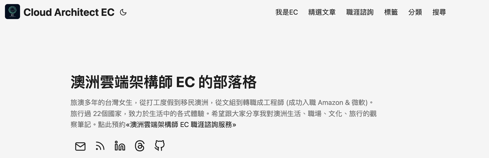

嗨大家！

好久不見～燃燒了許久的 Medium 出走潮，最終還是燒到了我身上XD  

**重磅消息：從今天開始，我將會停止在 [Medium](https://medium.com/@cloudarchitectec) 更新文章，正式搬家到自架部落格啦！**

對我來說，壓倒駱駝的最後一根稻草，除了文章收入不斷下降之外，更關鍵的是 Medium 曾經一度不允許自訂 Canonical Link (Canonical Link 是一種 SEO 用的標籤（`<link rel="canonical">`），用來告訴搜尋引擎：「這篇文章的原始版本在這裡。」)。大約一個月前，我突然發現不管我怎麼修改，Medium 的預設行為都會強制把 Canonical Link 指回 Medium，導致 SEO 流量全被 Medium 吃掉，簡直是 SEO 惡夢現場。😭

雖然我剛剛又測試了一下，似乎恢復正常了，但對我來說 —— 為時已晚！！！

澳洲雲端架構師 EC 的部落格，已經建好啦 🎉  

🏠 新家地址：[https://cloudarchitectec.com/](https://cloudarchitectec.com/)

💌 好消息：未來所有新文章都會在新部落格首發，而且完全免費閱讀！

這也是 EC 為什麼最近這麼安靜的原因，除了工作很忙之外，我很努力在架設自己的部落格（當然，中間還順便跑去紐西蘭滑雪也是原因之一XD）

目前整個部落格完全使用免費資源打造：  
- 🚀 部署：GitHub Workflows + GitHub Pages  
- ⚡ 架構：Go + Hugo  
- 🎨 模板：[PaperMod](https://github.com/adityatelange/hugo-PaperMod)

* * *

### 🛠️ 自架部落格的甜蜜與挑戰

雖然我是 DevOps 工程師，之前也學過網頁開發，但是這麼認真的自己架站還是第一次XD (以前多是學生時期的 side projects)

以下是我主要面臨的挑戰：

- 1. Medium 匯出地獄 💀
Medium 匯出的檔案格式真的慘烈，文章和留言混在一起，每篇都獨立成一個 HTML 檔案，而且因為我的主要寫作語言是中文，所以檔案的名稱大多數是亂碼(哭)。最終我靠著與 GitHub Copilot 的共同努力，寫了好幾個小程式來判斷哪些是留言、哪些是真正的文章，然後把文章統一修改成可以閱讀的格式。

- 2. Hugo 主題 Debug 馬拉松 🐛
這個部落格是用 Hugo 建立的，Hugo 雖然強大，但主題兼容性很脆弱。一開始我換了三個主題都踩坑，最後才在 Copilot 推薦下選了第四個主題才成功運行。

- 3. GitHub Pages 部署設定 ⚙️
設定 GitHub Workflows + GitHub Pages 的部署也花了一些時間，不過成功後真的超有成就感 ✨

完成之後，我終於也開始體會到為什麼很多人會選擇自自架部落格了！

以下的優點真的是使用第三方平台所不能擁有的：

1. **完全掌控**：所有發表的文章、網站原始碼、SEO、數據分析都是我的～
2. **版本控制**：現在我可以統一更新文章的 footer，所有文章都像程式碼一樣有版本管理
3. **效能優化**：載入速度比 Medium 快很多
4. **客製化**：想加什麼功能就加什麼功能 (雖然很多功能我都是自己寫的，所以有點陽春哈哈)

* * *

### 💝 為什麼你應該訂閱我的新部落格？

1. **第一手資訊**：所有新文章都會在這裡首發，再也不用擔心被 Medium 付費牆擋住
2. **純淨的閱讀體驗**：無廣告干擾，不會被各種推薦文章打斷。支援 Light/Dark 主題自由切換，與更棒的手機閱讀體驗！
3. **更好的文章檢索系統**：提供更清晰的文章列表、類別、標籤與搜尋功能，找舊文章超方便！
4. **留言系統整合、社群軟體分享**: 目前留言系統只支援 GitHub 登入（之後會加入其他社群登入）  
5. **立即訂閱**：如果你想繼續看到我的文章，請記得滑到文章下方訂閱 EC 的部落格，只要提供 Email 就能收到最新文章通知，超簡單！

* * *

### 💌 給 Medium 讀者的話

謝謝你們一路以來在 [Medium@cloudarchitectec](https://medium.com/@cloudarchitectec) 的支持與陪伴 ❤️

在這裡我認識了很多很棒的人，跟很多讀者與作者一同交流學習～

雖然我不會再在 Medium 更新新文章，但所有舊文章都還會保留在那裡。

接下來，我們在自架部落格見！
