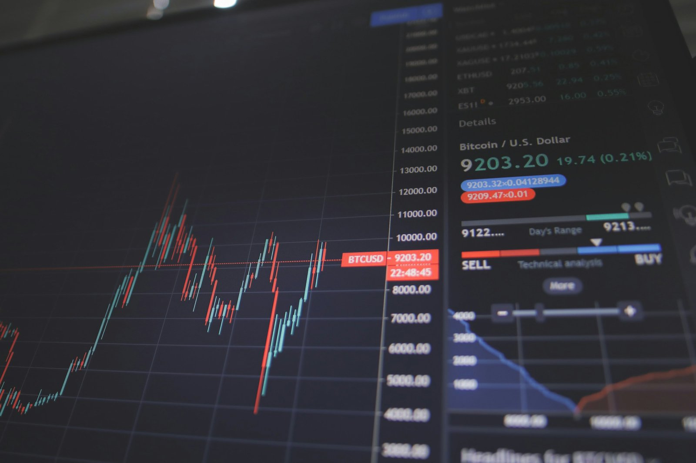

*Photo by [Nick Chong on Unsplash](https://unsplash.com/photos/black-flat-screen-computer-monitor-N__BnvQ_w18)*

## 前言：為什麼要寫這篇文章？

大家好，我是 EC！

上一篇文章[《好想要退休！讓我們來談談澳洲人最愛的澳洲指數基金 ETFs 組合》](/posts/2024-10-19-etf/)

*發表之後，收到了很多讀者的熱烈迴響，真的非常感謝大家的支持！*

其中大家最好奇的是：「EC～文章中討論到的 VGS 雖然是澳洲投資主流，但管理費要 0.18%。美國那邊有一檔代號 VT 的 ETF，費用才 0.07%。一樣是投資全世界，為什麼我們不直接開個美股帳戶買 VT 就好了？不是更香嗎？」

問得太好了，這絕對是個價值百萬的好問題！「追求更低的成本」是我們指數化投資的核心精神，所以這個問題必須嚴陣以待。

今天就讓我們以澳洲稅務居民 (tax residents in Australia)的角度，深入剖析這個投資決策：到底該選擇在澳洲股市 ASX 直接上買 VGS，還是飄洋過海去買美股 VT？

> 理財聲明：EC 目前未持有 VGS 或是 VT，但我正在考慮挑選其中一個加入我的投資組合。
本篇文章非投資理財建議，只是我個人的分析心得。不管你買與不買、買哪個，我都不會從中獲得一毛錢!好慘，寫這篇文章可是花了我幾個小時 🤣。如果你想要支持 EC，<a href="https://donate.stripe.com/8wM8xU44n5Ld9Q4bIJ">歡迎贊助 EC 喝一杯咖啡☕️</a>

## 主角登場：VT vs. VGS 究竟是什麼？

當當當～在擂台賽開打之前，先介紹一下兩位選手。

* **VT (Vanguard Total World Stock ETF):** 在美國上市的 ETF，一檔基金就打包了全世界超過 9,000 支股票，涵蓋已開發和新興市場的大、中、小型股。它的特色是極致的分散和低到不可思議的管理費，僅有 **0.07%**。堪稱「一檔 ETF 買下全世界」的完美典範，也是眾多澳洲、台灣投資理財專家推薦的無腦指數投資最佳選項之一。

* **VGS (Vanguard MSCI Index International Shares ETF):** 這是在澳洲證交所 (ASX) 上市的 ETF。它主要追蹤的是全球已開發市場的大、中型股（**重點:排除澳洲，所以不會跟現有的澳洲股市持股重複**）。

>  附註：其實 VGS 跟 VT 還是有一些本質上的不同，為了達到跟 VT 類似的「全世界」效果，我們通常會再搭配一檔新興市場 ETF (VGE) 或小型股 ETF (VISM)，這樣組合起來的管理費大約在 **0.20%** 左右。但這裡我們先不深入解析，因為本篇文章的主旨是**比較直接買 ASX vs 直接投資美股的利與弊**。

好了，規則清楚了。一個是「原汁原味」的美國選手，一個是「澳洲本地化」的明星組合。

表面上看，VT 的費用完勝，但事情真的有這麼簡單嗎？

## 決戰擂台：澳洲投資者的對決

### Round 1: 費用成本 (帳面成本與隱藏成本)

**管理費**

這回合 VT 毫無懸念地勝出。
0.07% 的年費對比澳洲 VGS 的 0.18%，長期下來確實是一筆可觀的差距。光看這點，很多人就直接判 VT 獲勝了。

**交易成本**

等等！當我們在澳洲用澳幣 (AUD) 去買美國的 VT 時，事情就變得有趣了。
1.  **券商手續費 (Brokerage Fee):** 兩者可能差不多，例如 Pearler 平台買賣澳股和美股都是 $6.50 澳元。
2.  **貨幣兌換費 (FX Fee):** 這就是魔鬼細節了！你每次投入澳幣買 VT，券商會收一筆「貨幣兌換費」把你的澳幣換成美金。將來你賣掉 VT，又要再被收一次錢，把美金換回澳幣。這筆費用通常在 0.5% 左右，你交易的次數越多、交易金額越大，這筆隱藏成本就越驚人。

**小結：** VT 的管理費雖低，但每次交易的換匯成本卻像一個隱形寄生蟲，不斷偷偷吃掉你的投資報酬 🐛。

### Round 2: 稅務（最燒腦的魔王關）

如果說費用是前菜，那稅務就是這場對決的主菜，也是最多人忽略的陷阱!

**1. W-8BEN 表格:**
想在澳洲投資美股，你必須先填寫一份叫做「W-8BEN」的表格。這份文件是向美國國稅局 (IRS) 宣示：「嗨！我是澳洲人，不是美國人，請不要用美國人的稅率來課我。」

不填會怎樣？你的股息會直接被預扣 30% 的重稅。填了之後，稅率可以降到優惠的 15%。雖然券商通常會協助你完成，但這終究是你必須處理的額外功課。

**2. 股息預扣稅 (Withholding Tax):**
就算填了 W-8BEN，你從 VT 收到的每一筆股息，都會先被美國政府「預扣」15%。這筆錢雖然可以在澳洲報稅時，透過「外國所得稅抵免」(FITO) 來抵銷，避免被雙重課稅，但這也代表：
* 你的現金流會先被扣住一部分。
* 你每年報稅時的程序會變得更加複雜。

相比之下，投資 ASX 上市的 VGS，股息會直接計入你的澳洲收入，一切都遵循你最熟悉的澳洲稅法，簡單明瞭。

### Round 3: 遺產稅（一拳 K.O. 的毀滅級風險）

如果前面的稅務問題只是讓你覺得「有點麻煩」，那這個「美國遺產稅」就足以成為壓垮駱駝的最後一根稻草。

根據美國法律，**非美國居民在美國持有的資產（包括股票和 ETF），如果總價值超過 6 萬美元的免稅額，其超過的部分將可能面臨高達 40% 的遺產稅！**

這是什麼概念？

假設你投資非常成功，在 VT 裡累積了 106 萬美元的資產。如果不幸發生意外，你的繼承人需要先向美國政府繳納 `(106萬 - 6萬) * 40% = 40萬美元` 的鉅額稅款，才能繼承你的資產。

對於我們這些以 FIRE 為目標，計畫長期累積數十萬甚至上百萬澳元資產的投資者來說，6 萬美元的門檻實在太低了。這是一個潛在的、災難性的財務風險。

而投資在 ASX 上市的 VGS 或任何澳洲本地 ETF，**完全沒有**這個美國遺產稅的問題。

**小結：** 為了每年省下 0.13% 的管理費，去賭一個可能高達 40% 的毀滅性風險，這筆交易，你覺得划算嗎？

>這裡可能會有讀者問：「等等，我記得澳洲和美國不是有稅務協定嗎？（這點跟台灣不同，台灣跟美國是沒有稅務協定的）」問得好！但關鍵在於，兩國的協定主要涵蓋的是「所得稅」，並不包含「遺產稅」。因此，在這個最關鍵的風險上，澳洲投資者並未受到特殊保障，依然適用於僅 6 萬美元的免稅標準。

## 一張圖看懂：VT vs. VGS (ASX 組合) 比較

| 特點 (Feature) | 直接投資 VT (以澳洲券商 Pearler 為例) | 在 ASX 投資 VGS (以澳洲券商 Pearler 為例)|
| :--- | :--- | :--- |
| **管理費 (MER)** | **極低 (0.07%)** | 較高 (0.18%) |
| **交易成本** | 券商費 + **貨幣兌換費 (每次)** | 僅券商費 |
| **操作複雜度** | 較高 (需填 W-8BEN, 處理換匯) | **極簡 (單純買入澳股)** |
| **稅務申報** | 複雜 (需申請股息稅務抵免 FITO) | **簡單 (按澳洲稅法申報)** |
| **遺產稅風險** | **有 (超過 6 萬美元，最高 40%)** | **無** |
| **匯率風險** | 有，體現在換匯成本與資產淨值 | 有，僅體現在資產淨值 |

## 我的選擇與最終建議

看到這裡，相信答案已經非常明顯了。

儘管 VT 的低管理費像是一塊誘人的蛋糕，但其附帶的 **W-8BEN 表格、複雜的股息稅申報，以及最致命的美國遺產稅風險**，使其成為一個「看著美好但充滿陷阱」的選項。

對我來說，身為一個目標明確的長期投資者，**追求的是長期的安穩與簡單，而不是短期的蠅頭小利。**

多付出一點管理費，就像是為我們的投資組合買了一份「保險」和「便利服務」，讓我們可以：
* **免於處理複雜的美國稅務。**
* **高枕無憂，不必擔心災難性的遺產稅風險。**
* **專注於我們真正該做的事：持續投入、長期持有。**

因此，我的選擇非常明確：**我會選擇投資 ASX 上市的 ETF 組合（如 VGS + VGE）。** 這樣做讓我能夠專注本業、安心入睡，這份心安理得遠比每年節省下來的 0.13% 管理費更加珍貴。

希望這篇文章能幫助你釐清這個重要的投資決策背後的思考邏輯！

當然如果以上的風險考量你覺得可以承受，還是可以選擇最適合你的投資方式。以上結論只是根據我個人的投資風險偏好，得到最佳解。

本篇文章都以 Pearler 平台舉例，因為這是我目前唯一使用的投資平台。我個人覺得他們的 auto investment 功能是特點，客服也非常專業。

如果你對於使用 Pearler 平台有興趣，可以使用我的[<<EC Pearler 推薦連結>>](https://pearler.com/invited/ELLIE68198)

*加入，加入後我們可以各自得到 $20。跟其他平台比起來 referral bonus 是滿爛的，我看其他平台都直接送股票哈哈哈哈，所以不加入也沒關係～*

如果想要看澳洲投資平台的比較，或是其他問題，都歡迎留言或來信跟我說！

