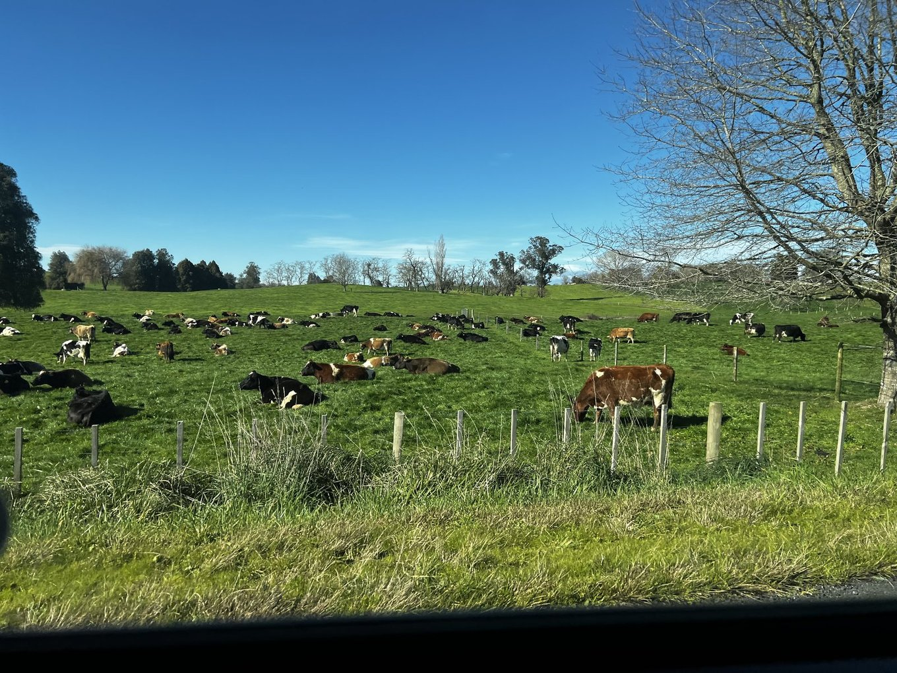
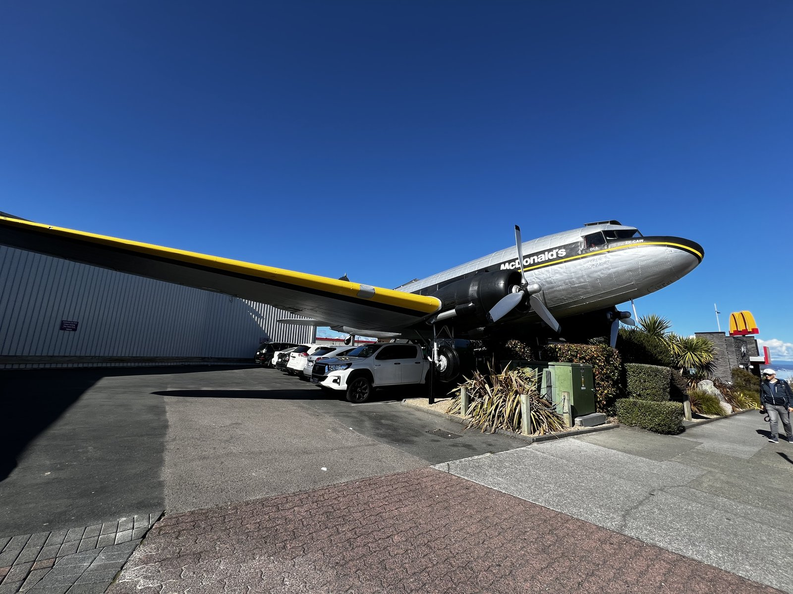

---

title: "紐西蘭北島滑雪之旅(上集)：2025.08.10-08.15 滑雪之外的 400 公里自駕與溫泉天堂"
date: 2025-10-25
slug: "2025-10-25-2025-nz-trip-snowboarding-1"
cover:
  image: "images/blue-spring.jpeg"
  alt: "紐西蘭北島滑雪之旅(上集)：2025.08.10-08.15 滑雪之外的 400 公里自駕與溫泉天堂"
images: ["images/blue-spring.jpeg","images/flight-macca.jpeg","images/cows.jpeg"]
categories: ["旅行紀錄"]
tags: ["旅遊", "自駕", "滑雪", "紐西蘭"]
episodeseries: ["2025 紐西蘭滑雪之旅"]
---

請問是誰，連續兩年都去紐西蘭北島自駕滑雪？就是 EC 我XDDD

這次也是跟一位女生朋友同行，但跟去年不同人。類似的行程，不同的體驗。

有了 2024 年的經驗值累積，今年的滑雪行程又更上一層樓～

不得不說我在澳洲真的認識很多這種英文一把罩、開車自駕一把罩、生活技能各種點滿的台灣女生，真是太厲害了！

## 一切的開端

這次的紐西蘭北島之旅，老實說，我完全是衝著滑雪去的。但旅行就是這樣，那些不在計畫內的「額外行程」，有時候反而會成為最深刻的記憶點。

這篇文章，我想先來聊聊「非滑雪」相關的心得，以及這趟旅程的靈魂人物——我的超罩旅伴 Whitney。

這趟旅行我本來的打算是一個人獨旅，沒有要特意找旅伴。

但我有次跟 Whitney 吃飯時，分享了我的紐西蘭滑雪計劃（單純分享行程規劃跟我 2024 年去紐西蘭滑雪的經驗），沒想到就這樣意外在 Whitney 心中埋下一顆種子！

在我出發的兩三個禮拜，我突然收到 Whitney 的訊息說「誒～你覺得我加入你的紐西蘭滑雪行如何？」

EC: 「當然好啊～我最喜歡這種會開車、自主能力高的旅伴了！」

## 凌晨下飛機就直衝 400 公里的熱血

我的旅程從凌晨 4:30 抵達奧克蘭機場開始！

過完安檢、拿了行李之後在機場等了一陣子，終於等到 6 點租車公司開門。

仔細驗完車之後，我就開車前往奧克蘭市區去接 Whitney

（這是 Whiteny 第一次去紐西蘭，所以她決定提早我幾天抵達，先在奧克蘭周遭玩一圈）。

（這裡提醒大家出國租車除了一定要保全險之外，拿到車之後一定要全方位錄影加拍照，避免之後可能的租車糾紛喔～）

大概 7 點初，我就在奧克蘭市區接到了 Whitney，然後...她就接手了方向盤，一路「飆」了 400 公里直達雪山山腳 (National Park)。雖然我會開車，但是還是當副駕最爽了XDDD

事後回想，幸好 Whitney 成功被我推進了紐西蘭滑雪這個坑，並順利發芽成行。如果依照我原訂的「獨旅計畫」，那個只在飛機上睡了三小時的我，根本不可能有體力在當天自己開完 400 公里。

<紐西蘭自駕就是會看到好多牛牛～>

**EC 的良心建議：** 如果你也是搭紅眼班機，又打算獨旅，最保險的選擇是在奧克蘭睡一晚，隔天再出發，千萬別學我原先的瘋狂計畫。

## 背包客棧的「大煮特煮」人生

Whitney 是一位非常講究飲食健康的旅伴，這點真是太棒了！

我們幾乎每天都在背包客棧的廚房「大煮特煮」，基本上都是豐盛的兩菜一湯麵，水準比我平常自己吃的都還要高（笑）。

唯一的例外，是滑雪第二天我自己跑去附近的餐廳吃飯。不為什麼，就因為我當天真的累爆，而且實在不想再去吸背包客棧廚房那混雜的油煙味了！(但對於分開吃 Whitney 也是一點意見都沒有，嗚嗚嗚，遇到這種可以一起行動也可以分開行動的旅伴，夫復何求！)

## 陶波湖快閃與 Rotorua 的 MVP

結束了三天的滑雪行程，我們踏上歸途，走了另一條路線：先經過陶波湖 (Taupo)，再到 Rotorua 住一晚。

在陶波湖，我們吃了一頓美味的午餐，也再度參觀了去年就去過的「飛機麥當勞」。

跟去年陰雨綿綿的狼狽不同，今年迎接我們的是萬里無雲的大晴天 ☀️。

接著，就是此行非滑雪部份的 MVP（Most Valuable Place）！

我們在 Rotorua 訂的公寓式旅館 [**Alpin Motel & Conference Centre**](https://www.booking.com/hotel/nz/alpin-motel-conference-centre.en-gb.html?aid=311984&label=alpin-motel-conference-centre-udJ3JGmU2wi_It3%2A4JNbSQS442454505006%3Apl%3Ata%3Ap1%3Ap2%3Aac%3Aap%3Aneg%3Afi%3Atikwd-11457017408%3Alp9069087%3Ali%3Adec%3Adm%3Appccp%3DUmFuZG9tSVYkc2RlIyh9YXORK0YJiVoOxcWODxYDaAA&sid=0d41785ff962b3a8ebe01296f48ec2ed&dest_id=900039038&dest_type=city&dist=0&group_adults=2&group_children=0&hapos=1&hpos=1&no_rooms=1&req_adults=2&req_children=0&room1=A%2CA&sb_price_type=total&sr_order=popularity&srepoch=1761374495&srpvid=4e6f2f0d76ba005a&type=total&ucfs=1&)

*，簡直是天堂！這是一間兩房公寓，重點是——每一戶的後院都有 Private Hot Tub！*

在經歷了四晚克難的雪山背包客棧後，這個公寓的一切設備都讓我們感動到不行！

我們原本的計畫是出門去泡那種要付費、可以選不同泉水溫度的溫泉。但在看到後院那個 Hot Tub 之後，我們立刻決定：「Check in 先泡一次，晚上回來再泡一次！」

事實證明，這是再正確不過的選擇。第一泡下去，前三天滑雪累積的肌肉酸痛立刻舒緩了大半。

泡完澡，我們出門參觀了免費的地熱公園（大自然真的好神奇！），逛了每週四晚上才有的 Rotorua 夜市。

然後心滿意足地回到旅館，進行我們的「第二泡」。

泡完澡，就是完美的 Cheese & Wine Girls' Night。真是太享受了！

真心推薦大家，如果經過 Rotorua，一定要住這間 Alpine Motel。設備超新、床超好睡，而且還有免費的洗衣機跟烘衣機。對於剛從雪山下來的我們，這一切簡直是「夫復何求」！

## Blue Springs 健行與完美句點

最後一天，我們從 Rotorua 出發，先去 Blue Springs 走了一小段健行（風景超美，水清澈到不可思議）。

接著在 Hamilton 吃了一頓好吃、服務又好的生魚片午餐，然後就直奔奧克蘭機場還車，結束了這趟為期六天的紐西蘭自駕滑雪之旅。

## 感謝神奇的緣分與超罩旅伴

這次行程完全以滑雪為主，所以觀光行程排得不多。

但這趟旅程因為有了 Whitney 而額外圓滿，她不只開車、廚藝一把罩，還非常會生活與旅行！

最奇妙的是，這是我們第一次一起旅行，而 Whitney 其實是透過我的部落格主動聯繫我、最後變成朋友的「網友」。仔細想想，這緣分還真的是很不可思議 😆 (她當初是看到我的斐濟遊記，主動約我出來喝咖啡，我們才因此變成朋友的。)

總之，特別感謝這位旅遊嘉賓，讓這趟滑雪之旅變得加倍有趣！
