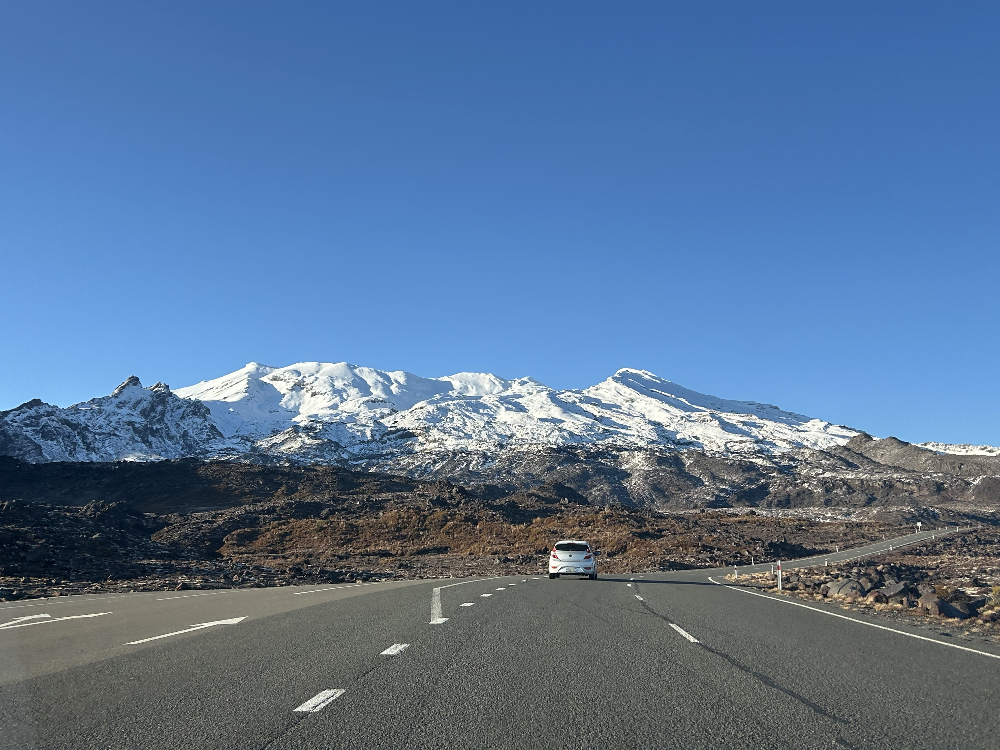
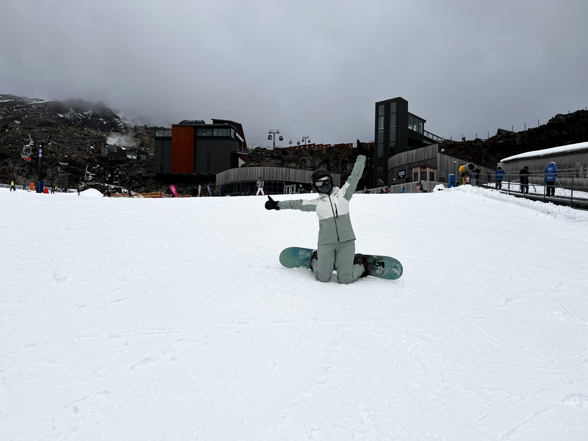

上一篇聊完了滑雪之外的心得，這篇終於要來聊聊旅程的真正主角——單板滑雪 (Snowboard) 啦！有了 2024 年的經驗值，今年的滑雪行程又更上一層樓。

還沒看過上一篇[《紐西蘭北島滑雪之旅(上集)：2025.08.10-08.15 滑雪之外的 400 公里自駕與溫泉天堂》](/posts/2025-10-25-2025-nz-trip-snowboarding-1/)的人，記得趕快去看～

## 幸運值點滿：完美的天氣與教練

今年的人品大爆發！我們抵達前的週末剛好降下大雪，所以我們在雪場的三天，雪況都超棒。

* Day 1: 整天艷陽高照 ☀️
* Day 2: 大部分晴天 (飄了幾場小雪)
* Day 3: 上午晴天，下午陰雪天

總之，三天都是扎扎實實地「滑好滑滿」，完全沒有浪費！

這次我狠下心買了兩天的整天私人教練課，對我的單板技巧幫助巨大。我現在對於「前後刃落葉飄」已經非常有信心，基本上是想去哪就去哪、想停就停，也可以很有信心地避開障礙物跟人。至於 S turn 呢... 只能說「初見雛形中」啦 🤣

另外 Whiteny 的加入，也讓私人滑雪課更加划算。本來一整天的私人滑雪教練課 (6小時) 是 699NZD，但加一個人只要再加 100NZD 即可，也就是說費用立刻下降到 400NZD/人 （約台幣7100），真的是非常划算！

私人教練課也有 1小時、2小時、3小時的選項。

如果沒有指定教練的話，就是由雪場安排，我本來還以為兩天都會是同一位教練，結果居然不一樣。但可以體驗不同教學風格也是滿有趣的～

## 私人教練課，上整天真的比較好嗎？

這是我個人的體悟。對於體力不夠的人來說（就是我本人XD），連續上整天課真的會累爆。

我的教練 1 其實有建議：「每天早上上三小時教練課，下午自行練習/復習，每天都保持上課的節奏，效果可能更好，CP 值也更高。」

我個人非常同意！下午其實已經累到有點恍神，學習效果會打折。

但這次的兩位教練都超棒！教學風格不同，但都非常細心認真，我已經在考慮之後去日本也找他們上課了！

## 拜託你，護具一定要買！

吸取了去年的「慘痛」經驗，我今年採買了全套護具。根據我親身體驗（各種花式摔倒）後，我可以肯定地說：每一個護具，都有其絕對的必要性！

#### 1. 安全帽 ⛑️
這真的不是開玩笑。其中一趟纜車，我下 chair lift 時不小心頭撞到纜車椅的鐵桿。

要是我沒戴安全帽，我應該就掛了🤣 大家滑雪真的一定要戴安全帽！一定要！

#### 2. 護膝
一開始復習「後刃」時，我還天真地覺得自己根本不需要護膝...

沒關係，等到你開始學「前刃」時，你就會知道了 😆

前刃就是各種花式跪地！有了護膝，你在雪地裡跪著休息時也會覺得很輕鬆，CP 值超高！

#### 3. 防摔褲
一開始也沒感受到它的好，但隨著技術上升，跌倒次數變少，但每一次摔的力道也大大加重。

有時候一摔完，真的是從屁股到頭都在劇烈震蕩，會有一瞬間整個人都很恍惚的感覺 🫨🫨🫨

我「有穿」的結果都這樣了，不敢想像如果沒穿，尾椎是不是已經跟我說掰掰了 😱

#### 4. 護腕
我承認我一開始很鐵齒。第一天上課時，我覺得護腕很卡、很阻礙行動，於是就帥氣地把它摘了。

結果...... 才上了一個小時，我的右手腕就開始隱隱作痛。我立刻學乖，默默戴上 😆

接下來幾天，不管我摔幾次、用手腕撐地起身多少次，我的手腕再也沒痛過。

結論：不要鐵齒，全套買下去就對了。畢竟健康的身體是最重要的！

## 其他裝備升級感想

#### 1. 滑雪手套一定要買有 GORE-TEX 的！
這是我今年最有感的裝備升級！

去年的「號稱防水」手套，大概滑半天就全濕了，手指就像泡在冰水里，心情超差！

這次換了 GORE-TEX 手套後，第一天手完全乾爽。第二/三天雖然因為天氣太熱、手指狂流汗，導致手套內部是濕的，但它超強的吸濕排汗功能，讓我的手一直都保持在溫暖的狀態！可以滑更爽、更久！

#### 2. 內搭 (Layering)
紐西蘭雪場的溫度不會太低 (大概 -2 到 5 度)，真的不用穿太多。千萬不要參考別人在日本北海道滑雪的穿著，紐西蘭滑雪真得沒有那麼冷XDD

* 上半身： 100% 美麗諾羊毛衣 (超薄型) + Kathmandu 機能衣 (也是超薄)，外面再套雪衣。第三天熱到我連機能衣都脫了。
* 下半身： 健身房七分薄 leggings + 雪襪，外面再套雪褲。

重點： 千萬不要穿不夠透氣的防寒衣，你會熱到中暑 🥵

## 魔鬼細節：學會「正確穿雪鞋」的重要性

這又是一個血淚教訓。

* 第一天： 沒學怎麼好好穿雪鞋，腳在鞋子裡滑動，做動作一直力不從心。
* 第二天： 租了小一號的雪鞋，想說緊一點就好。結果滑了整天，腳趾頭擠到超痛，下午更快就累了。
* 第三天： 教練看不下去，終於教會我如何「正確穿雪鞋」（原來有超多訣竅！）。我穿回原尺寸，滑起來... 順多了！

PS: 我已經回來兩個月了，大拇指的指甲的瘀青還沒全退掉，誇張！

## 滑雪成績單

第二次滑雪，覺得自己真的進步很大！

雖然我跟其他人比起來，算是學習進度慢的，但這次我明顯感覺到自己對於身體肌肉的控制力大大提升。 

同行的 Whitney 第一次滑單板，三天 S turn 基本上已經掌握了 😭

而且我們兩個人現在都可以「指哪打哪」，滑到對方指定的地點幫對方錄影。有一個可以隨時 stand by 的專屬同伴攝影師，真的太方便了！

啊，差點忘了說！這次也成功達成「上纜車 + 滑完新手區綠線全程不摔倒」的成就！

雖然只是新手區，但對於自己能達成目標還是非常滿意！希望很快就能解鎖上日本纜車的目標啦 😆


