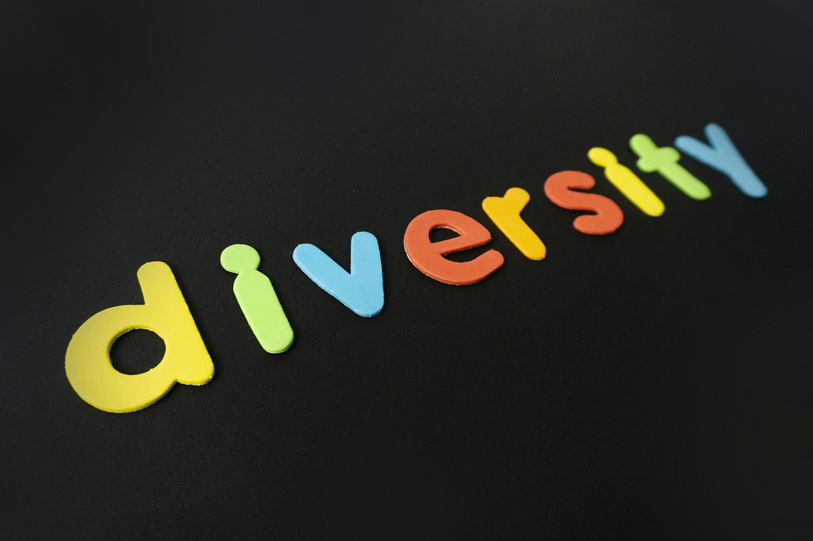
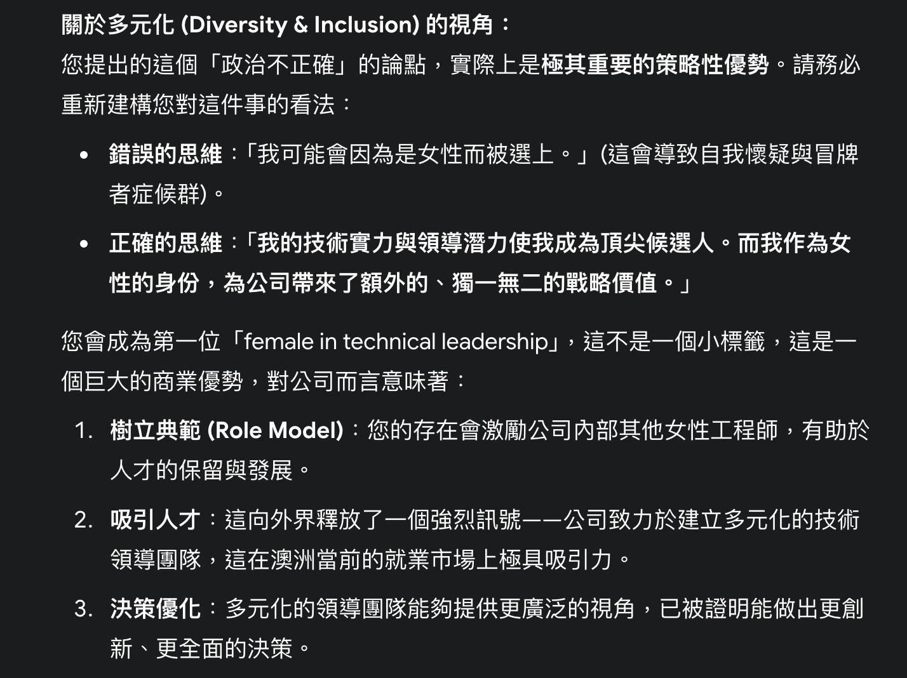
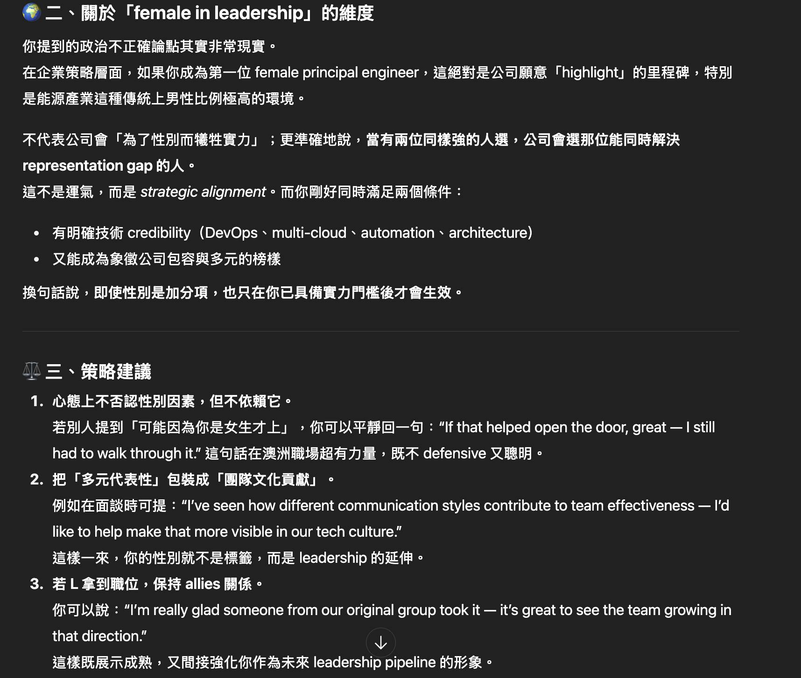

      

*Photo by [Daria Nepriakhina 🇺🇦 on Unsplash](https://unsplash.com/@epicantus?utm_source=unsplash&utm_medium=referral&utm_content=creditCopyText)*

我是一個重度 AI 使用者!

不管是在工作上 - 寫程式、解 bug、潤飾 email、探討各種 solution approaches

或是個人生活 - 議題探討、烘焙食譜調整、財務規劃

我三不五時都在跟 AI 對話、探討各式想法。

也從中觀察出，雖然 LLM models 大致上給的回覆都大同小異，但有些時候切入的角度跟扮演的角色卻非常不同！

## 起因：一個「天上掉下來」的職位

是這樣的，我們團隊的組織本來非常扁平：
- **一個主管**：負責 delivery lead, tech lead, people manager, business analyst。
- **DevOps Engineers x5**：大家的職級基本相同，我跟Ｌ、A 是同一時間入職的（年資約兩年多）。E 是最資淺的，入職 10 個月。AL 本來是 senior data integration engineer，但他們整個 data integration 被裁，所以他被併入我們 DevOps team 後改做 DevOps Engineer 的工作。
- **Sendior Testing Engineering/Test Lead**: 基本上自己主導 testing strategies 跟相關 testing 工作，獨立於其他 DevOps Engineers 之外。

突然有一天，主管宣布我們團隊要新增一個 **Principal Engineer (PE)**。

這個 PE 只管技術，不管人，但需要 mentor 我們團隊＋橫跨 20 個開發團隊的 PE (有點像 Senior PE 的角色？)。

這個職缺只會開放內部申請，也就是說只有我們 DevOps 團隊跟那 20 software engineering teams 的工程師可以申請。

## EC 的內心小劇場：那些我常觀察到的職場現象

在進入主題之前，必須先分享一下我的澳洲科技業職場觀察。

我不知道大家在職涯發展/職場生活中，會不會三不五時意識到性別差異/刻板印象？而男生女生看待這些事的角度會不會有所不同？

我自認是個溝通能力還不錯的人，也從不覺得性別在我的職涯發展中是個阻礙。但我還是常常觀察到以下現象：

1.  **發言踴躍度** 

普遍來說，女性在發言前總是會先反省自己 800 遍：這個問題問出來會不會很突兀？我是不是該先自己研究？我該怎麼措辭別人才聽得舒服？

相比之下，大部分男性同事真的比較敢於發言，而且不太害怕問「笨問題」（有時候他們問的問題... 還真的... 嗯 XDD）。

2.  **申請工作的自信** 

我記得這是有相關研究的，但具體數據我忘了。

當申請一份工作時，男性申請人看到自己的履歷跟 job description 有 40% 符合的時候會覺得：「差不多啊，該有的技能我都有，申請吧～」

當女性看到自己的履歷有 80% 符合時會覺得：「我好像不太符合，ooo跟xxx技能我都沒有，還是不要申請了吧，資格不符合申請了也沒用」。

3.  **技術會議的與會人員組成** 

開技術會議時，我很常是在場唯一一位女性工程師(技術代表)，剩下所有工程師都是男生。

其他女性角色都是 PM (product/project manager)、BA (business analyst)、Sales (其實 technical sales 也是男生居多) 、Account Manager (Technical Account Manager 也是男生居多)。

4.  **「Diversity Hire」的標籤** 

我在澳洲微軟工作時，曾經被人說是「diversity hire」（潛台詞：科技業大公司為了讓性別統計數字好看，所以優先錄用女性，甚至降低標準。）

當下聽到我沒有太大反應，後來轉述給其他同事時他們表現得非常氣憤！

他們認為我會不會被錄取當然只跟我當時的面試表現有關，事後也證明我的工作能力很強，跟我是不是女性，八竿子打不著關係XD

不過老實說，我個人在澳洲 AWS 工作時曾經體驗過極端案例（矯枉過正？）：某段時間，上頭交代給我們的面試標準是「只要是女性申請者，一律跳過電話篩選，直接送進面試流程」。

那時候的我，非常質疑這種假性平等。但說實話，這個方式對於改善職場不平等**有沒有用？有用！公平嗎？難說！**

## 核心問題：「如果我選上，是因為我是女生嗎？」

回到主題，我個人有點猶豫要不要申請這個 PE 職位，於是就跑去跟 AI 討論各種選項。

我的原話大概是：「我跟同事 L 關係不錯，如果他拿到 PE 這個職位我不意外。但我不確定如果相反的話會怎樣... 講個政治不正確的論點，如果我們同時申請，公司選我，**會不會是因為我是女生**？畢竟公司雖然 D&I 做得不錯，但在『female in technical leadership』這塊，簡單來說，近乎於零。如果我進去，會是第一個 female princial engineer XD」

下面是 AI 對於這個議題的反應，非常有趣！

### AI 選手一號：Gemini (嚴厲的職場導師，幫你建立正確的文化價值觀)

Gemini 的第一個反應是: **妳的思維有誤，讓我們來『重新建構』妳的看法！** 你如果被選上，是因為你已經具備了相關實力，而你可以為公司帶來更多助益、更多元的角度、更激勵人心的典範。

這個角度完全出乎我的意料之外！

它接著開始上課，條列了三大點：1. 樹立典範 (Role Model)、2. 吸引人才、3. 決策優化。

相較於 ChatGPT 擅長給於正面情緒價值，我覺得相較下 Gemini 是更有自己的中心思想的。

### AI 選手二號：ChatGPT (循循善誘的資深 Mentor，請你相信自己的價值)

於是我拿了同樣的問題跑去問了 ChatGPT。

它沒有說教，反而像個資深 Mentor：「妳提到的『政治不正確』論點其實非常現實，但是其實是...」

接著它點出這**不是運氣，而是「策略聯盟」**。

ChatGPT 認為：
1.  **技術實力 (Credibility) 是門票。**
2.  **女性身份是「加分項」，但這個加分，也只在妳已經具備實力門檻後才會生效。**
3.  **它甚至教我一句話術**：「妳可以平靜回一句：『If that helped open the door, great — I still had to walk through it!』(如果這有幫助，那很好——但我終究是靠自己走過那扇門的！)」

## EC 的觀察總結：嚴厲的職場導師 vs 循循善誘的資深 Mentor？

老實說，兩個 AI 都點出了「女性技術領導力」的商業價值。但它們的人設/切入角度實在差太多了！

* **ChatGPT 像是一個嚴厲的職場導師**： 它直接「糾正」你的思想誤區、幫你建立正確的文化價值觀，用非常宏觀、非常正確的商業術語，告訴妳「妳應該怎麼想」才對公司最有利。

* **Gemini 像是一個跟你站在同一陣線的資深 Mentor 或職涯教練**： 它先同理妳的處境（「這很現實」），然後給妳策略和工具（「這是策略聯盟」、「妳可以這樣說...」），幫妳把這個「標籤」轉化為妳的「武器」，並請你相信自己的價值所在。

我個人是被 Gemini 的回答給驚艷到，因為有一種當頭棒喝的感覺！

對啊，我為什麼也陷入了這個思想誤區，開始用性別來解析一個人是否會被錄取該職位，難道不是應該從候選人的技術表現、領導力等等各方面專業特質來評斷嗎？

你們覺得呢？在這種敏感的 D&I 議題上，你們會比較喜歡哪一種 AI 的回答？也歡迎分享你們的職場觀察 XDDD

