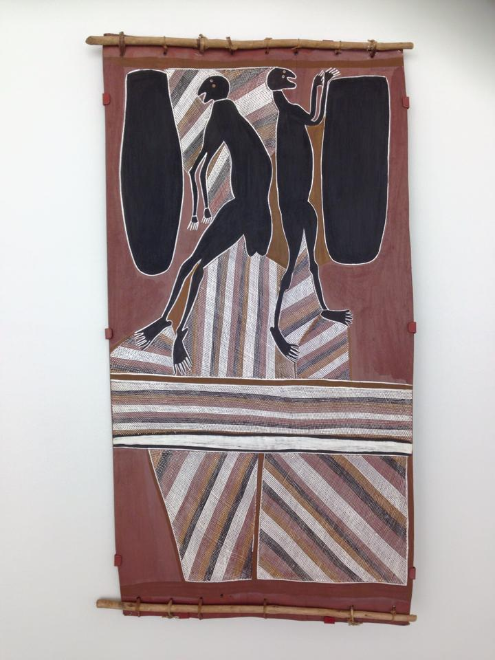
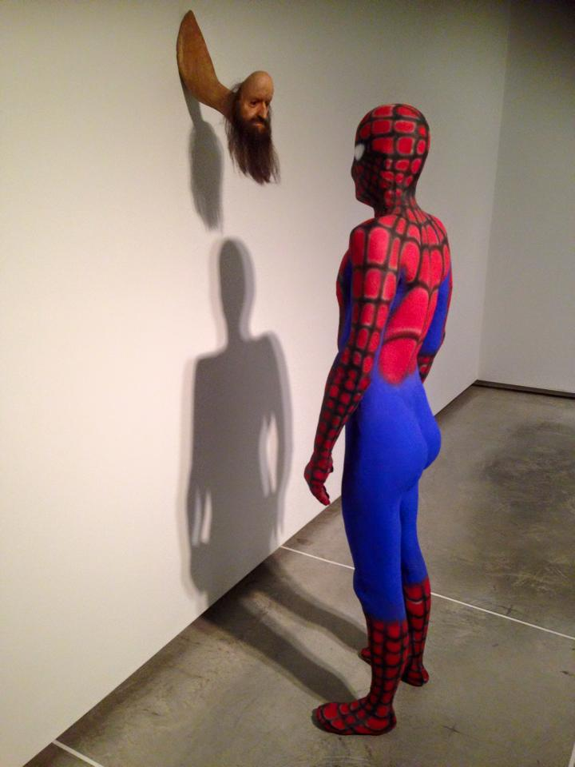
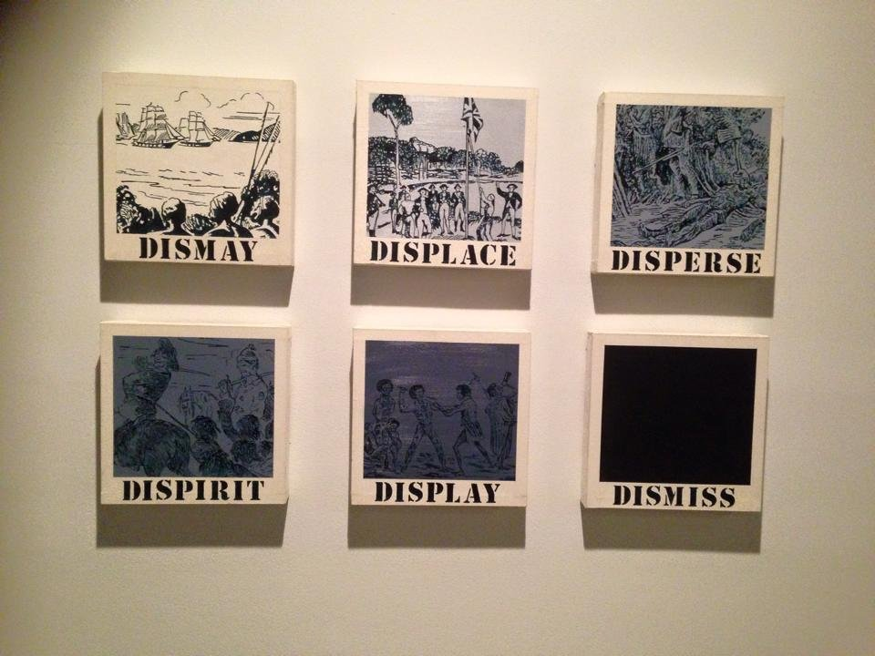
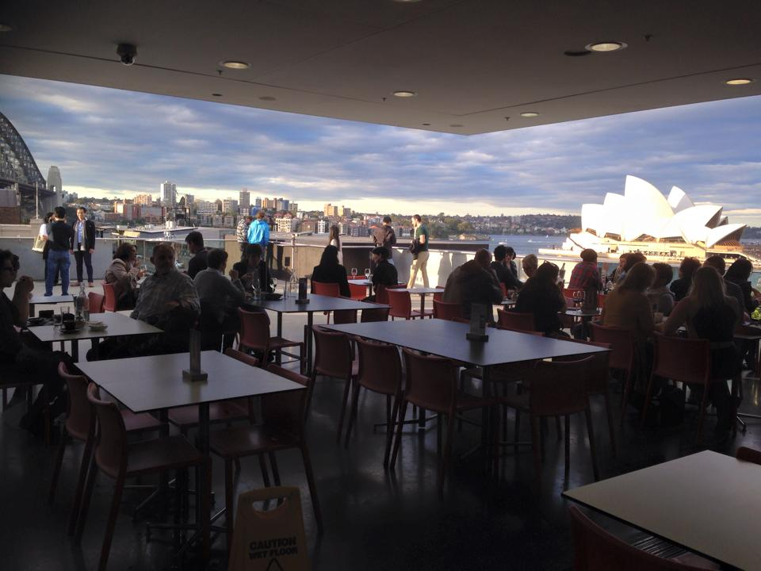
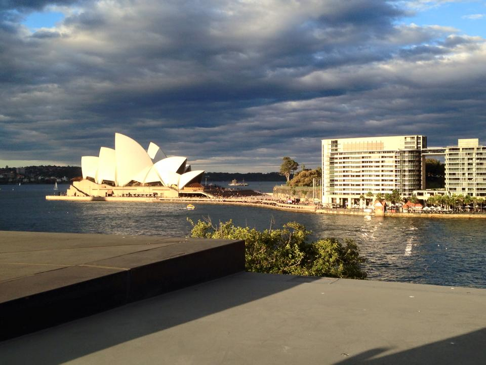
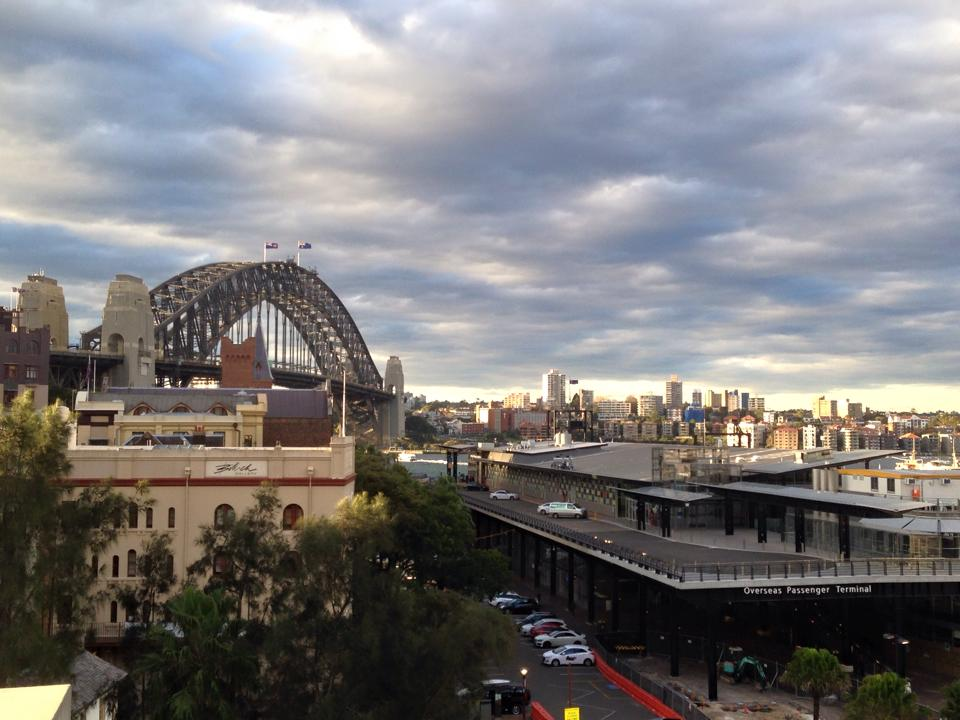

今天要來介紹"當代藝術博物館(MCA，Museum of Contemporary Art)"，位於雪梨的岩石區，也就是歌劇院、港灣大橋、植物園、岩石區市集的所在地。不過可能因為這邊有太多景點了，所以很容易讓人三過門而不入(我自己去過岩石區幾十次，也是第一次進去哈哈)，不過這種免門票又有特殊景觀的地方，真的是不去可惜!

首先這個博物館並不大，免費參觀的地方大概0.5~1小時就可以逛完。不過其中一層樓會舉辦不同特展，有興趣的人可以買票參觀。但既然我們是窮背包客/留學生，就還是免費的看一看就好XD

第一張是原住民藝術品，畫名是 "採集蜂蜜的祖靈(ancestral spirit beings collecting honey)"，不覺得他們很可愛嗎? 感覺超樂在其中的XDDD 希望我工作的時候也可以有這麼快樂就好了~

第二個藝術品的標題是"無名 (untitled)"。這個雕像真的超妙!!! 而且我覺得蜘蛛人的屁股好翹XDD 好啦，這個雕像描述的是大眾文化核心中的衝突與慾望，藝術家覺得蜘蛛人代表了我們集體想像中的超級英雄，雖然有超能力，但基本上還是"人"的形象，而這個長得像條蟲的光頭就是我們內心中扭曲的慾望。

第三個藝術品...其實是英文詞彙測驗??? 哈哈，其實這是表示從以歐洲文化為中心的觀點來看待澳洲原住民，藝術家想表達的是語言的力量，以及語言如何塑造文化和身分認同。

最後要介紹的就是神祕景點啦~ 博物館的頂樓是個開放的咖啡廳，可以遠眺雪梨歌劇院和港灣大橋!!! 這麼美又不用錢，又可以點杯咖啡或開瓶啤酒與三五好友一起談天賞景的地方哪裡找啊!!! 真是美呆了~
如果大家下次有機會來雪梨，請千萬不要錯過! 如果已經錯過的人...那就再來一次吧XDD


