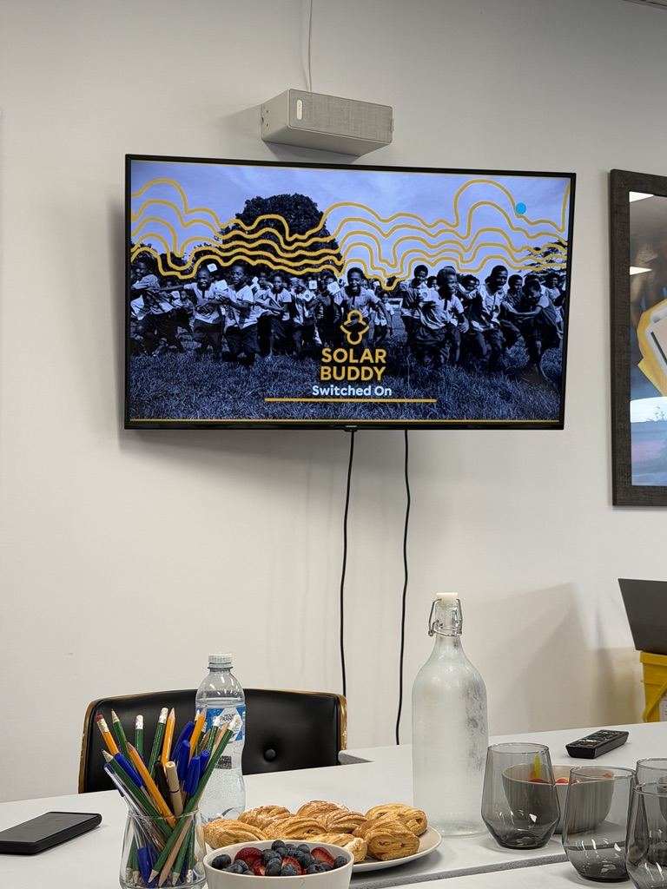
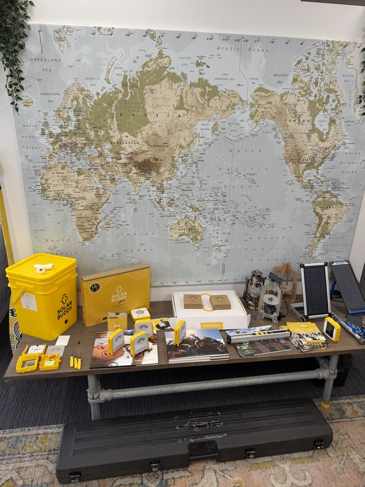
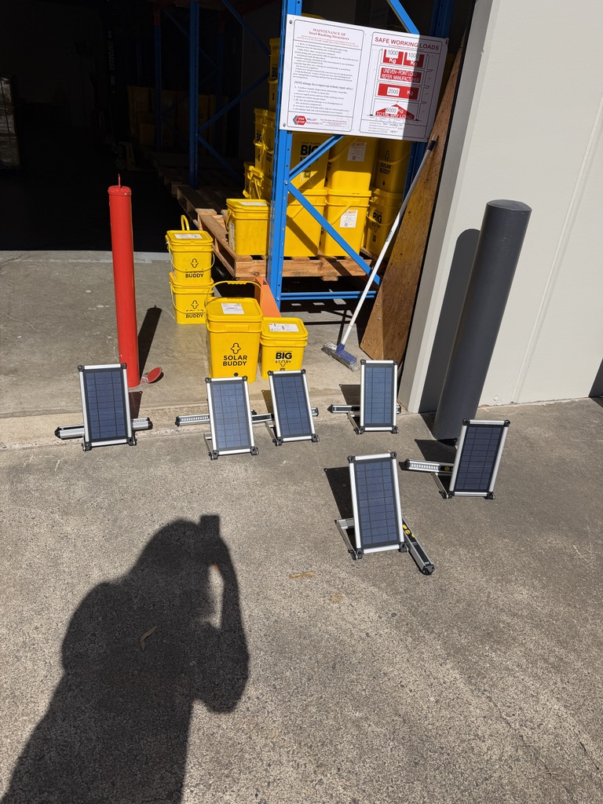

現職澳洲能源公司的員工福利之一，是每年有兩天義工假（Volunteer Leaves），可以請假去做公益，薪水照領。

前陣子我利用這個機會參加了 SolarBuddy 的 Switched On Program。

活動其實只有半天，結束後跟同事去附近一家可頌店吃午餐，鹹點甜點都有一定水準，吃完我們就各自開心回家了，也不需要回公司上班XD (真是太爽了～)

## 義工假到底是什麼

在參加之前，我其實沒想太多，只覺得「可以利用上班時間去做公益活動，不用上班、薪水照拿，還可以回饋社會」，還有這種好事XD

後來查了一下資料才發現，這其實是這幾年的趨勢。

Volunteering Australia 的 Corporate Volunteering Snapshot 統計顯示，至少 78% 的澳洲公司有企業義工計畫。

根據美國人力資源管理協會（SHRM）2024 年的調查，約有 28% 的美國公司提供帶薪的社區服務或義工假，平均每人每年大概會有 20 小時。

順帶一提，這不完全是企業做慈善而已：研究資料顯示，參與公司公益活動的新進員工，離職率明顯比較低；Culture Amp 也整理出，義工假能明顯提升員工對公司的認同感，是個員工、公司、社會三方共贏的制度。

如果你的公司也提供類似福利，但你卻從沒認真用過，真心推薦找一天排進行事曆，活動內容可能會比你想像的更有意義。

如果你的公司目前沒有這項制度，也可以試著跟 HR 或是領導層推廣這個活動，我個人真的是強烈推薦企業及個人都多多參與！

## 能源貧窮

[SolarBuddy](https://www.solarbuddy.org/)是一個總部在澳洲布里斯本的公益組織，2016 年由 Simon Doble 創辦。

2011 年 Simon 從一篇報導裡第一次接觸到能源貧窮的概念，得知有孩子因為使用煤油燈而受傷甚至喪命，才決定投入研發太陽能照明這個項目。

2013 年 Simon 在難民營裝了全球第一批太陽能燈具。這些年下來，SolarBuddy 已經在超過 20 個國家、600 多所學校推動計畫，累計捐出超過 20 萬盞太陽能燈。

全球目前有超過 6.6 億人完全沒有電力可用，21 億人仍靠會產生污染的燃料煮飯照明，這些數字背後，是很多人日常生活的困境。

Switched On Program 讓我第一次意識到，能源貧窮（Energy Poverty）到現在都還實實在在地影響很多人的生活。

不只是前面說的統計數字而已，活動裡 SolarBuddy 分享了不少真實案例：

因為缺乏穩定電力，很多偏遠地區的小孩，天黑後就再也沒有照明可以讀書了；

因為缺乏穩定電力，助產士得靠嘴巴咬著手電筒才能在日落後協助孕婦接生；

因為缺乏穩定電力，很多小孩一天得走上好幾公里的路，只為了幫全家人的手機充一次電。

這些小孩通常都是小女孩😢

因為充電速度很慢，她們一整天都要待在充電處等待，也因此失去了去學校上學的機會。

在充完電回家的路上，也很容易在沒有任何光線的鄉間小路被襲擊🫠 (SolarBuddy 有一款太陽能燈具是做成類似長棍的形狀，因為必要時也可以拿來充當武器💔)

這些事，對每天下班回家隨手開燈的我來說，是過去幾乎沒想像過。

## 活動內容

活動中我們親手組裝了 SolarBuddy 的太陽能燈具，並了解他們怎麼跟在地社區、學校還有企業合作，把這些燈具送到需要的人手上。

從燈具設計、配送流程與企業的合作，推廣至澳洲校園的教育課程，都看得出這個組織花了不少心思，希望在資源有限的環境裡發揮最大效益。

每一組/箱太陽能燈具裡，還會附上企業員工或是學生的手寫信，真的是讓人感到很溫暖！

活動結束後，我真的是深受感動，覺得他們做的事情真的太有意義了，回家後立刻刷卡捐獻了一筆小小心意，希望能支持他們繼續做下去！

(雖然說公司行號參與這些企業公益活動，本身都是已經投入一大筆企業支出給公益組織了，但我自己真的想要在額外多做一些什麼🙂)

對我來說，這一天的義工假換到的不只是一次公益體驗，更是重新意識到「打開電燈」這麼理所當然的動作，對很多人來說卻可能決定了他們能不能讀書、能不能安全工作，甚至攸關生命安全的關鍵。

如果你對能源貧窮這個議題也覺得陌生，很推薦花幾分鐘研究一下這個議題，或是閱讀相關文章。如果你任職的公司剛好也有企業義工日或 Volunteer Leave 制度，SolarBuddy 會是一個很值得認識、也很容易上手參與的組織。

🔗 [solarbuddy.org](https://www.solarbuddy.org/)
