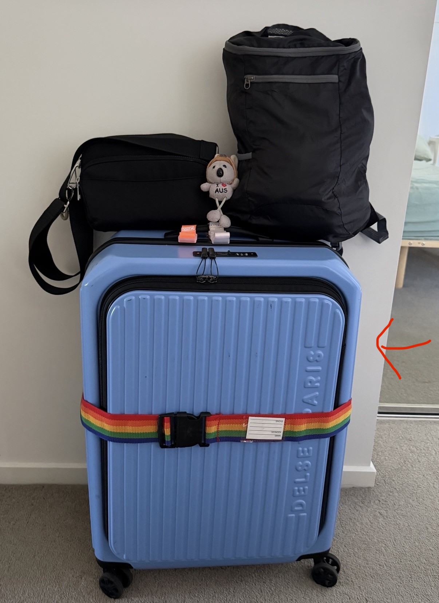
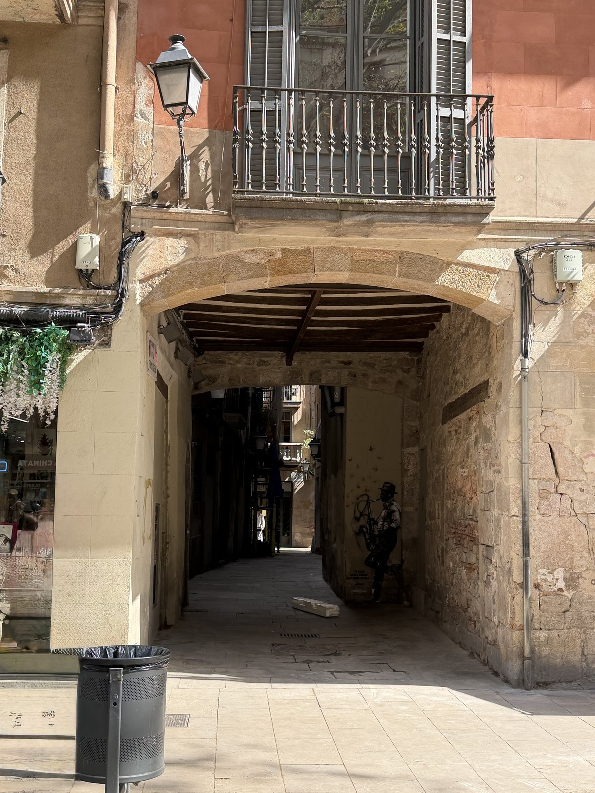
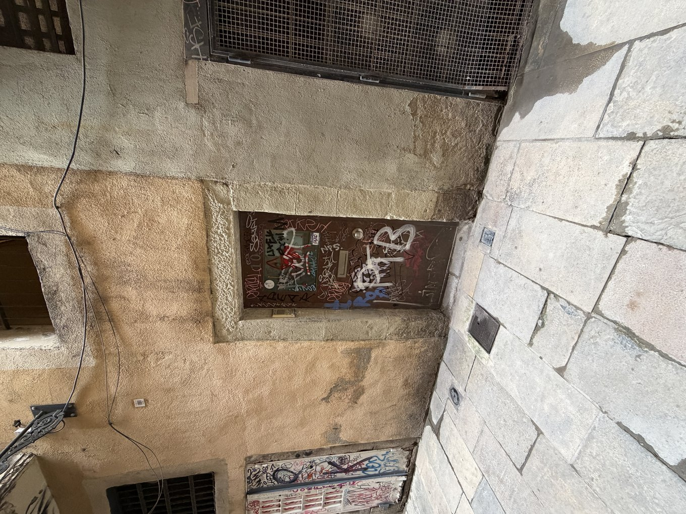
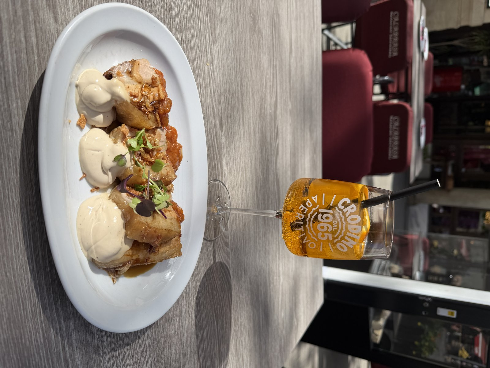
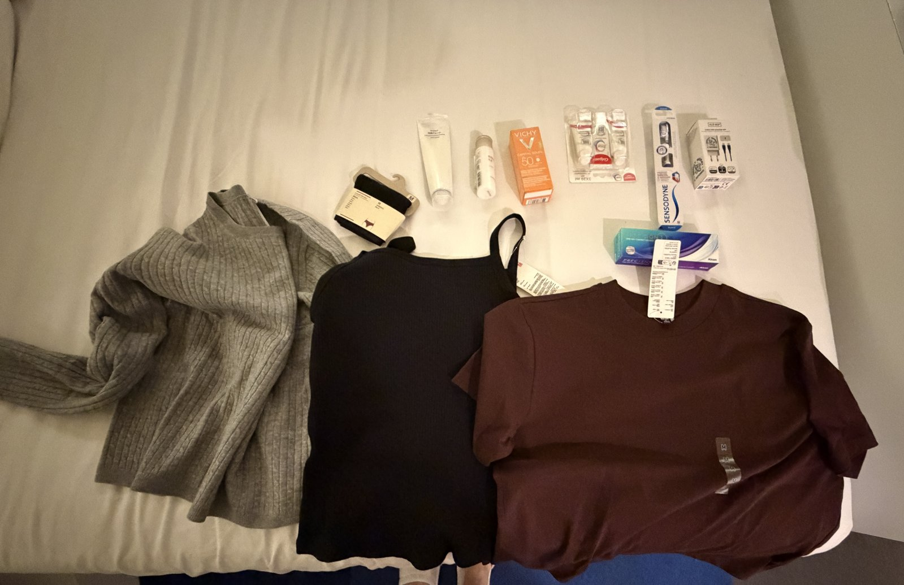
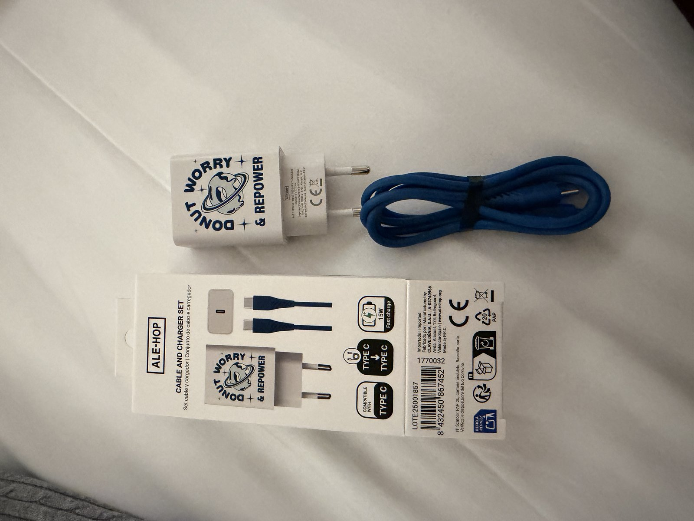

這幾天收到讀者來信，說想看西班牙行李遺失的故事，還分享了他自己的旅行經驗（也是相當精彩😆）。

作為一個有求必應的作者，只要有人敲碗，我就會寫出來~

所以這篇文章就讓我們跳過義大利跟葡萄牙，直接進到今年我為期三週的歐洲之旅的第七個城市：西班牙巴塞隆納。

---

### 2026.03.31

歐洲之旅的最後一站，我搭廉價航空 Vueling 從西班牙 Granada 飛往巴塞隆納。

因為已經領教過惡名昭彰的義大利火車、西班牙火車，以及其他歐洲境內航空（前面還搭了 TAP 葡萄牙航空跟 Ryanair），所以這一次我完全沒有想太多，身上只背了一個 20×30 公分的小側背包，裡面只裝了護照、手機、iPad mini、行動電源等等最基礎跟重要的物品，其他東西都放在 23 吋的托運行李箱裡。

下飛機的時候我想說反正不急著拿行李，先吃個小東西再走，省得等一下到旅館肚子餓。

等我吃完，去行李轉盤的時候，發現所有行李都已經被從轉盤上拿下來，放在外面，但我來回繞了兩三圈都沒有看到我的行李箱。我的確有看到一個顏色很類似的行李箱，但只要近看就會發現把手的顏色完全不一樣，它的把手是銀色的，我的是黑色的。而且我的行李箱很顯眼，是水藍色的，拿錯的機率應該不高，但我當下也沒想太多，可能就是有人不小心拿錯了？

接著我找到航空公司服務台，跟他們說我找不到我的托運行李，但行李箱裡面有放 AirTag，所以可以看到 AirTag 的定位。

第一次查看定位時，行李箱距離我大概約 2 公里，我問服務台人員說，這個距離的話，請問行李箱是在機場裡面還是機場外面？因為我想知道是行李運送過程中出了問題，例如不小心掉在機場的某個角落，還是真的已經被別人拿走了？

他回答說有可能在機場內，也可能在機場外，因為定位剛好在機場環外道路上。後來他又說「啊，不然你去某幾個地方看一看（就隨口說了幾個大型行李托運處跟其他行李擺放處）」，我看了看當然沒有，所以又跑回去找他（還要重新排隊一次😂）。

這次他就跟我說「好吧，那看來你的行李的確是不見了，你先填一個表吧」。

我說 OK，結果他居然給我一個 QR Code，叫我掃描 QR Code。

我試了好幾次都掃描失敗，後來想說那就算了，先離開行李轉盤區，跑去機場二樓的警察局報案。

機場警察局還蠻神秘的，要走到一個角落之後按對講機，厚重的鐵門才會打開，不同的對講機號碼代表不同的意思。

我先跟一個機場人員描述了情況，他就說那你要按 1 號，然後我就按了 1。稍微跟警察透過對講機溝通了一下，他們放我進去之後，發現他們是刑事警察，不管這個，叫我去找旁邊的民事警察辦事處（同一個空間，不同的角落XD）。

那個民事警察很忙，但人蠻好的，聽完我描述的情況，他說「你還是必須要先有一張航空公司的行李遺失單，才可以寫報案單」，就叫我出去找航空公司。

於是我找到另一個位於機場二樓的航空公司櫃檯，跟他們說我的行李不見了，然後 QR code 掃描不出來，於是他們就給我一張紙本的表格。

後來我紙本填到一半，想說這個紙本感覺也不太可靠......畢竟這裡可是西班牙，要是他到時候解讀我手寫的資訊有困難，那我的案件豈不就消失於茫茫大海之中了嗎？😂

所以我又再試了一次 QR Code，這次就成功了。

然後我走回去神秘角落按電鈴，這次按了3 號之後，民事警察就用西班牙文問我問題，我就用英文說：「呃，我是剛剛那個講英文的人？我...」他說：「喔！我知道你是誰了，請進來吧！」XDDD

進去後就開始填寫報案單。填報案單時還有一個很有趣的地方，就是整份英文報案單裡面居然有一行是西班牙文的日期欄，我不太確定西班牙的日期是年月日怎麼排的（有寫西班牙文啦，但我看不懂喔），因為像澳洲是日/月/年，我就跟他說不好意思這個不會填，他就稍微幫我填了一下。

報案單填寫完畢之後，他就要用電腦打字的方式把報案單輸入系統，所以我在那邊稍微等了一下。輸入完畢之後他說「好，現在要幫你拍張照」，然後問我：「你有行李箱的照片嗎？」

我說有。

然後他就從被玻璃窗隔著的辦公室走出來說要拍照，我一開始以為是要拍我手機裡行李箱的照片，一陣雞同鴨講之後，沒想到他拍的是我的大頭照，要正面、側面這樣，當下內心非常困惑，想說「難道我才是犯罪嫌疑人嗎？？？」🤣。

後來發現好像是因為如果需要調監視器的話，至少他們可以知道我長什麼樣子跟穿什麼衣服(?)

而行李箱的照片，我只要用手機寄信到他們西班牙的報案信箱就可以了。

拿到機場警察報案單後，我跟民事警察說我手機裡看得到 AirTag 的定位，問他們有沒有辦法派人跟我一起去那個地方看一看（那時候行李箱的定位已經移動到離機場大概 20 分鐘車程的地方，不算太遠）。

他跟我說沒辦法，試圖跟我解釋一下，他的英文其實也算不錯，但還是有所侷限。我就想說好吧，也合理，畢竟他們是機場警察局，好像也沒有辦法出動到機場外面。

這時候我已經在機場耗了三個小時，能做的事我也都做了，只能先去旅館。

在旅館 check-in 時，我問了旅館人員有沒有什麼建議？他說如果警察說沒辦法，那應該是沒辦法😂，不過如果是他的話，因為 AirTag 顯示的位置不遠，感覺可以走去那邊試試看。

所以我在旅館簡單整理了一下，就照著 AirTag 的定位去找行李箱的所在地，走路約 20 分鐘。

走過去之後，發現它是在一個神秘小巷子裡的一個神秘的大樓裡面。如果我站在門邊，我的手機的確會顯示說：「你的行李箱就在你身邊」。

可是因為那是一棟類似公寓的樓，要按門鈴對講機才會有人開門，我也不知道要按哪一樓。

而且大門跟巷子充滿噴漆，看起來也不像旅館，外面也沒有貼門牌，總之那個門看起來蠻可怕的。我就在那邊等了一下，想說那我能怎麼辦呢？總不能一直站在那邊，看到每個路人就攔下來問吧？因為我也不會講西班牙文🤣

所以我就跑到旁邊找了一家餐廳，一邊吃一邊思考。吃完之後想說好吧，這樣不行，我就開始列了我的採買清單。

目前我身上就只有一套內衣褲、一套外出服、一件外套，這就是我所有的衣物XD。

我在巴塞隆納的行程是五天，五天之後就會飛回澳洲布里斯本。

所以我就先去 UNIQLO 買了一些衣服。UNIQLO 裡面人多到爆炸，我想說大家都跟我一樣這麼急著要買衣服嗎？

又去 MUJI 買了一些基礎生活用品，清單會列在下面。

忙完這一串之後，我真的太累了，就回旅館躺了 10 幾分鐘吧。

這個時候發現已經快八點，我還有東西沒買完，就是牙膏、牙刷什麼的，然後藥妝店也是九點就關了，所以我回到旅館後連忙再度出門，把剩下的都買一買。

當時覺得累斃了，本來想找一間餐廳吃個好的，但也覺得好累，後來就跑去超市買了個東西回來吃，重點是這道菜還不好吃，這就是我今天的經歷😭

我覺得這趟旅行應該是要教會我一些什麼吧？我還在琢磨中 😆

好險所有貴重物品都在我身上，包括護照、手機、iPad、AirPods。

遺失的行李箱裡有我的隱適美維持器（這一副也要一百多澳幣）、相機配件（也要兩三百澳幣），還有日常眼鏡、義大利跟葡萄牙的紀念品、給家人的明信片，其他東西其實也都沒有太值錢，因為我這個人本來就沒什麼值錢的東西，但是沒有行李箱真的很麻煩 🫠🫠🫠

以下是我購買的緊急物品清單：

**生活備品：**
- 牙膏、牙刷、洗面乳
- 乳液、防曬
- 隱形眼鏡（好險西班牙買隱形眼鏡不用處方簽，不然我可能就要瞎著過五天了 🤣）

**衣物：**
- 內衣褲一套
- 短褲一件（當睡褲）
- T-shirt 一件
- 長袖上衣一件

**3C：**
- Type-C 充電頭 + 線

你們猜猜這樣總共要多少錢？

總共要 170 歐元，也就是 290 澳幣、台幣 $5800。巴塞隆納到底是什麼樣的鬼地方？🤣🤣🤣

衣服是在 UNIQLO 買的、保養用品是 MUJI，剩下是超市買的，根本也不是什麼名牌，嚇死 😦

然後跟旅館要了拖鞋、梳子、棉花棒，就這樣結束了我完全沒有任何行李、也沒有任何衣物的第一天。

---

### 2026.04.01

今天愚人節，我覺得真心是太幽默了。

我覺得自己還算是一個蠻堅強的人，而且我是一個旅行經驗很豐富的人，大概有 20 幾個國家自助獨旅經驗，但遇到這種事還是蠻衝擊的！

其實一早起來心情就還蠻憂鬱的。好險我是一個喜歡規劃的人，今天的第一個行程的門票已經事先訂好了，所以還是出門了～

早上去逛了一個博物館之類的吧，我有點忘了，反正心情很受影響。

逛完之後中午回到旅館，躺在床上反省這趟旅程，想說是不是不應該一下飛機就先去吃點小東西，應該要直奔行李提領區才對？

昨天也在網路上發文了，因為還是心存可能是別人不小心拿錯行李的希望。文章發了中文、英文跟西班牙文，貼在 Threads 上，當然也沒有什麼實質的回覆。

我就躺在床上發呆，一邊跟朋友 D 聊天。

聊著聊著我就覺得，雖然已經嘗試過很多方法，例如機場警察局報案、詢問旅館人員、實地探勘等等，但我還是覺得有沒做完的部分，想再嘗試一下，所以我就奮起了！

想說我不甘心，要把所有方法都試過一遍才會心甘情願XD

於是查了一個當地派出所，走路過去大概 15 分鐘。最好笑的是，那個派出所外面貼了一張公告，寫著「本派出所無法申請行李遺失報案單」？？？？

這張公告告訴我的第一件事，就是有非常多人的行李在這裡被偷走🤣

第二件事是，行李被偷已經很衰了，這裏居然還沒辦法拿報案單！

但我心想沒關係，我已經是一個擁有報案單的人了。我走進去，試圖跟裡面的警察解釋，說我有一份報案單，西班牙文跟英文都有，還有 AirTag 的定位。

第一個警察沒辦法用英文回答我，只好向同事求助，同事的英文也不太行，兩個人比手畫腳地跟我解釋，說他們沒有辦法出動幫我找。

我說：「陪我去也不行嗎？真的很近，走路過去只要 15 分鐘。」畢竟我不會講西班牙文。

他說因為目前 AirTag 顯示的位置是固定的。如果位子固定且在室內的話，他們就沒有辦法出動；唯一的解決辦法，找是街上正在巡邏的警車，如果我能在 AirTag 的地點附近攔到一台巡邏警車，因為他們正在巡邏，有可能可以陪我去那個地方找。

我想說，好吧，於是我就走去 AirTag 定位的地方。

其實那裡不能算是貧民區，算是觀光區旁邊稍微便宜一點的地方，但的確那個區域讓我覺得不是太安全，附近雖然有餐廳什麼的，但那棟建築物是在一個很隱密的小巷裡，小巷裡充滿塗鴉，還很陰暗。

我在那個小區附近繞了一下，還還真的讓我看到一台巡邏警車，他們可能是在觀光區附近，所以開得非常慢。

我遠遠看到他們之後，就從後面追上去，追上之後繞到警車旁邊敲了敲窗戶，裡面的巡邏警察覺得超級莫名其妙，大概心想這個亞洲女生想對幹嘛XDDD

他們搖下車窗之後，我又開始跟他解釋了一番，說我有 AirTag。比較靠近我的警察英文也不太行，好險副駕有另外一位警察英文還可以，我們就重新經歷了剛剛那一番對話。

他說「即使你有 AirTag，但因為這個定位目前沒有在移動，所以我們沒辦法陪你一起去找行李箱」（巡邏車離 AirTag 地點真心走路五分鐘而已，他們也不願意陪我過去🤣）

他說唯一的方式，是等我發現那個定位開始移動的時候，可以打 112，也就是警察的緊急報案電話，那時候他們才可以出動跟我一起追查。

我心想，這合理嗎？

如果要等 AirTag 的位置移動才打報案電話，我又不會講西班牙文，很合理地懷疑接電話的人英文也不一定太行，這樣一番溝通之後，才要派出一台警車讓我上車，跟我一起追那個人嗎？🤣🤣🤣

反正就是很不合理。

警察也表示這種事很常發生，因為種種原因，沒辦法給我任何進一步協助。

我就想說，好吧，那基本上可以試的方法我都已經試了。畢竟我是一個女生在國外旅行，語言又不通，我也沒辦法直接去那棟大廈敲門，因為敲門之後也不知道該找誰，那棟樓有五層樓的門鈴，我甚至不知道是哪一層樓的人拿的，我們又無法溝通，我也不知道裡面住的是什麼樣的人，所以後來就放棄了。

所以我三週的歐洲之行最後五天，就以一個身無長物的姿態在西班牙旅行，也導致我對巴塞隆納的印象不是太好。

首先我覺得巴塞隆納也沒有塞維亞好吃、好玩。建築的話，高第的建築當然沒話說，但其實比起高第，我更喜歡設計了聖保羅醫院（Hospital de Sant Pau）的加泰隆尼亞現代主義建築大師多梅內克的建築😆

---

### 後續發展

題外話一：我手機目前還留著這個行李箱的 AirTag 定位。

有一天我無聊看了一下，發現行李箱的定位從巴塞隆納跑到了阿爾及利亞，我看了地圖才發現原來這兩個地方這麼近！

我估計非常有可能是某個阿爾及利亞的移民拿了我的行李箱。後來這個行李箱又回到了巴塞隆納，所以他可能很喜歡那個行李箱吧？帶著它去旅行耶XD (別人有旅行青蛙我有旅行行李箱，哈哈~)

題外話二：我在 threads 上看到另一個人，手機不知道在哪裡遺失，好像也是在歐洲吧，最後手機的定位也是在阿爾及利亞，覺得非常有趣！

題外話三：我後來還在 threads 上發現了一篇更精彩的文章，那個人在西班牙自駕，然後蘋果電腦在他的車上被偷了。我不太清楚他的身分，聽起來他是一個台灣人，有一個會講西班牙文的女友，然後他們還展開了一些警匪追逐戰之類的刺激劇情，最後真的走進竊賊的家，用定位去找他的蘋果電腦。

推薦每個人都去看一下他的故事：https://www.threads.com/share/HtZlK0iVM/

簡直可以拍一場不可能的任務，西班牙竊賊版XD

我的行李其實是在管制區以內被偷走的，我當下沒有第一時間出機場追查的原因是，我不確定行李到底是在機場裡面還是機場外面，一旦出了管制區，就沒辦法再回來了。

但對於有很多廉價航班的歐洲來說，我覺得買一張便宜的廉價航空機票，反正只要幾十塊歐元，就可以自由出入機場管制區，去行李提領區偷行李。

後來結合我後來查到的種種資訊，我覺得應該是犯罪集團所為。例如有一個新聞報導是另外一個西班牙機場的地勤人員跟犯罪人員互通，直接把旅客載行李箱中的貴重物品拿走。我剛剛上面說的那個很猛的台灣男生，直接闖入了竊賊的家裡，發現那邊有超多行李箱在竊賊家，後來還成功拿回了他的蘋果筆電。

我對於那個人的故事是非常欽佩的。他整個人在國外上演了一齣警匪追逐戰跟偵探劇，而我覺得身為一個獨旅的女子，這是我沒有辦法做到的，所以後來也就放寬心了，我已經盡力了😌

---

### 這件事帶給我的學習

其實現在想起來，我的感受還是很複雜的。讓我來簡單跟大家分享一下我的反思：

學習一：出國旅行一定要買保險。

說真的我其實是從來不買保險的人XD

首先我身上真的沒有什麼貴重物品，所以我覺得那個保險費不值得。

但我覺得保險這件事，從來就不是值不值得的問題，應該思考的方向是：

如果你有保險，當一件很慘的事發生的時候，你至少還有一些東西可以聊表安慰。

如果你沒有保險，當很慘的事已經發生的時候，你就只剩下那件很慘的事，沒有任何東西可以挽回你的心情。

所以我覺得買保險還是必要的XD

也可以要看你的旅行目的地決定，像我回台灣或在澳洲旅行，我可能就不會買保險，但如果你要去一些國家/城市，尤其是那些比較常發生竊案，或是其他需要旅行不便險的地方，可能還是買一下保險比較好。

就像我說的，至少很慘的事情發生的時候，你心裡會有點安慰。然後如果什麼事都沒發生的話，你也可以安慰自己說：太好了，雖然付了保險費，但這趟旅行很平安。

題外話是，我雖然沒有買旅行保險，但因為我從澳洲飛歐洲的機票是用美國運通信用卡買的，我居然有成功申請到理賠，即使中間出問題的航空公司不是用美國運通卡買的機票。

然後 Vueling 航空後來也給了我一些理賠，但這個理賠的過程也是吐槽點滿滿，如果有人想知道的話，我可以再寫一篇文章專門分享，也是荒謬至極！🤣

學習二：有一些重要的物品，無倫如何、不管你覺得再怎麼安全，都要隨身帶在身上，例如護照跟鑰匙。

我在西班牙機場就有看到有人護照不見了，正在問服務中心的人員說護照不見了，明天要搭飛機該怎麼辦。

我個人的話，是因為當時沒想太多，就把澳洲家裡的鑰匙放在行李箱裡面，想說不可能會用到嘛，結果後來就造成了一點麻煩。

因為我回澳洲的時候，剛好那幾天室友不在，大家都知道澳洲的鎖匠開鎖很貴，我們後來當然也找了一些方法解決。

再來就是，我那時候還把澳洲車庫的遙控器也放在行李箱裡面，奉勸大家鑰匙最好還是隨身攜帶。因為回澳洲之後我去問了鎖匠，我不太確定台灣是怎麼樣，但車庫遙控器在澳洲不是隨便去哪裡都可以買得到的東西，要跟 body corporate 聯絡才有辦法，最後我拿到的 quote 是一百澳幣，而且要 3-4 週才會拿到，還不保證可以用😂 （當然我最後還是用其他方式解決了）

第三個學習：反而是讓我對這趟旅行產生了一些反思。

事實證明，這些身外之物，當你沒有的時候，是真的真的真的非常不方便，就連牙線或牙膏牙刷這種小小的事情，都會讓人覺得很不方便。但好像也不會怎麼樣，對吧？一個人還是可以順利地完成行程。

所以這次我對這趟旅行的反思就是，再怎麼經驗豐富的旅行者，旅行還是會有意外發生的。

總之，這就是我精彩萬分的西班牙遺失行李箱的故事😆

如果你們還有其他想看的文章，歡迎在文章底下留言，或是隨時寄信、回覆電子報跟我分享。

很多時候我就是需要一些來自讀者的回饋，才有更多持續寫作的動力，畢竟這是一個免費的佛心事業XD

那就下次再遊記囉👋
