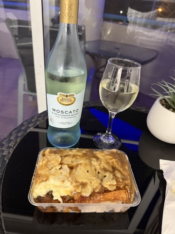
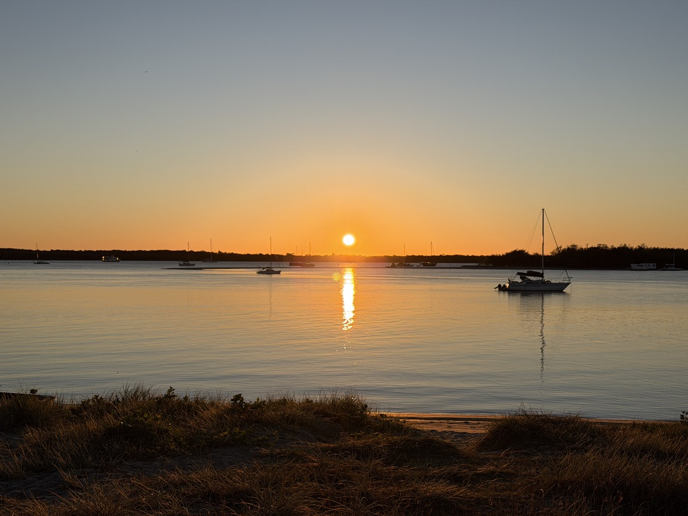
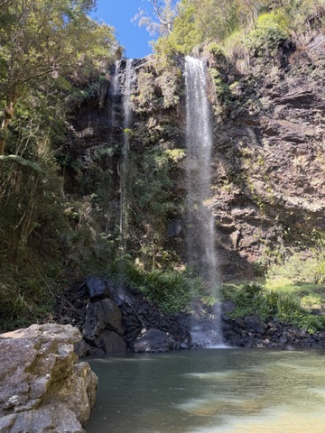
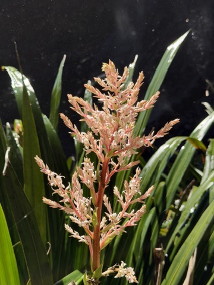
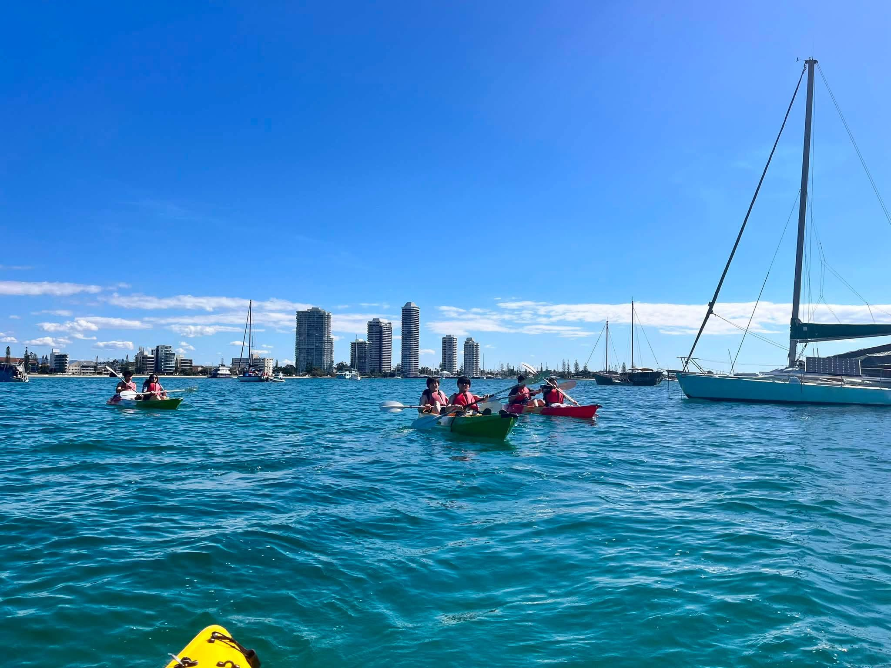

這個人造的 super long weekend，我決定一個人開車去黃金海岸渡假。

這不是我第一次去黃金海岸，以前也住過幾晚，但不知道為什麼，這趟卻是我玩得最爽的一次！

回頭想想，我以前安排的都比較像「旅行」：要去景點、要完成行程、最好一天走兩三個步道才覺得沒有浪費時間。這次卻第一次讓我感覺到：喔，原來這叫做「度假」。

一個人旅行最棒的地方，並不是一定要把行程排得多厲害，而是你可以隨時改變主意。想逛 outlet 就大逛四小時；走到一半覺得停車太麻煩，就乾脆回飯店泡 SPA；想再吃一次好吃的早餐，就連吃三天。沒有誰要配合誰，也沒有誰會嫌行程太鬆散。

這趟旅程讓我發現，有時候最適合獨旅的不是遙遠國度，而是離家一兩個小時車程、可以讓你暫時切換生活模式的地方。

## 前情提要：Ekka 假期

8 月 12 日是 Brisbane 的 Ekka Day，也就是 Royal Queensland Show 的公眾假期。它有點像雪梨 Royal Easter Show (農業版嘉年華)。

2024 和 2025 年，我都用 Ekka 假期加特休跑去紐西蘭滑雪。今年因為歐洲玩太久，特休所剩不多，加上 Amex 的 travel credit 快到期，最後就決定請 8/13–8/14 兩天，去黃金海岸放空。

本來還有一位朋友要從雪梨飛來會合，沒想到她的主管竟然拒絕了她的特休申請。原來澳洲職場也有這招嗎？？？幫朋友哭哭。

不過我本來就是很喜歡獨旅的人（已經獨旅超過 20 個國家），所以難過三秒鐘之後，就迅速切換成「太好了，那這四天要怎麼玩呢？」的心情。

## 有 SPA 的公寓式旅館，度假感滿滿

這次住的是 [Royal Pacific Hotel](https://www.royalpacific.com.au/)。三晚 studio apartment 原價 $535 澳幣（約 10,700 台幣），扣掉價值 $200 澳幣（約 4,000 台幣）的 Amex travel credit 後是 $335 澳幣（約 6,700 台幣）。

Royal Pacific Hotel 是平價旅館，裝潢有一點年代感，但我當初一看到它有陽台海景、免費室內停車位、廚房、洗衣機和烘衣機，就覺得很符合這趟自駕小旅行的需求。

廚房有電磁爐、微波爐、冰箱、廚具和餐具，代表不想每天外食時也有選擇；洗衣設備則很適合水上活動後立刻洗泳衣。

不過真正讓我一住進去就覺得選對的，是公共設施的溫水泳池和 heated spa。

後來我四天三夜泡了四次 SPA。真心覺得，往後只要是以放鬆為目的的旅行，訂房條件都要加上一條：最好有 heated spa。

## Day 1：逛 outlet、海邊散步

第一天吃完早餐，我先開去 [Harbour Town Outlet](https://www.harbourtowngoldcoast.com.au/)。這裡應該算是昆州規模最大的 outlet (？)，就連平常很討厭逛街的我，一逛就是四小時，逛到非常心滿意足！我是一個覺得實體逛街很累的人，平常旅行也完全不安排購物行程，基本上都是古蹟、教堂、博物館等人文行程。但畢竟這些在澳洲不存在(誤)，所以難得逛一下也是滿開心的。

逛完後直接在 Harbour Town 吃完午餐，再去旅館 check-in。結果櫃檯給我的停車場感應卡失效，我卡在地下停車場入口的車道上，一度非常尷尬。那個車道又陡，我只好小心倒車退出來，先把車停到路邊，再走回櫃檯換卡。

這就是自駕旅行偶爾會遇到的小插曲。以前的我可能會覺得「第一天就出師不利」，但這次完全沒有。換好卡、放下行李後，事情就過去了。

旅館對面就是海邊。我過馬路散了一下步，看城市海景，也看到海裡有小魚游來游去，超可愛。

接著我做了這趟旅程最有度假感的一件事：回旅館，獨享溫水 SPA 和泳池。

泡完上樓洗澡，直接把泳衣丟進洗衣機快洗；洗完後，坐在海景陽台上發呆。沒有下一個景點、沒有待完成清單，就只是坐著。

那一刻我才突然明白，我以前可能都只是在旅行，沒有真的在度假。

### 風大雨大的夜晚，最適合吃 family roast

晚餐我去吃 Biggera Waters 當地人很愛的 [The Carvery Roast Meals](https://maps.app.goo.gl/1MFL4VXNDyzawbDv8?g_st=ic)。看到很多人來內用或外帶晚餐，感覺就是一家很在地的 family roast shop。

我點烤豬肉套餐，配菜選了烤花椰菜、烤地瓜和烤馬鈴薯。當晚黃金海岸突然狂風大作又飄雨，根本是吃烤肉配菜的完美天氣。因為餐廳的啤酒太貴，我還順手買了一瓶白酒和超市半價的即期起司蛋糕回房間。

結果我再次發現：到了這個年紀，美式起司蛋糕對我來說真的 too much、too heavy。以前覺得是小確幸，現在吃幾口就投降😂

## Day 2：Twin Falls Circuit 步道

第二天早上醒來，意外從陽台看到日出。第一次從這個角度看日出，竟然覺得它有點像日落，很有趣。因為過個馬路就是海邊，我也跑去海邊看了一下。

早餐則走去附近的 [L'Etranger](https://maps.app.goo.gl/ZRtxqFFvsyf7jrTT9?g_st=ic)。這家店很多早餐都有 half size 的選項，我覺得超貼心，很適合小鳥胃；雖然我並不是小鳥胃XD

接著我開了一個多小時，到昆士蘭與新南威爾士州邊界附近走 [Twin Falls Circuit](https://maps.app.goo.gl/XuPPDwQgRFCgKwsp8)。這條步道最酷的地方是可以繞到瀑布後面，難度不高、來回大概一小時，算是很有成就感又不會太累的輕量行程。

不過這段路最後約半小時沒有網路。如果是自駕，建議事先下載離線地圖，不要像我一樣，仗著導航前半段很順就過度放心。現在的導航確實聰明，後段沒訊號還是能帶路，但有離線地圖會安心很多。

9:30 抵達停車場時已經沒有車位，完全可以看出這條步道有多熱門。原本我規劃今天還要再走兩三條步道，但這個停車狀況立刻讓我醒悟：早上都沒位子了，中午和下午大概只會更難停。

### 行程放棄得很快，心情卻意外很好

走完瀑布後，我到附近知名的 [The Sitting Room Cafe](https://maps.app.goo.gl/RhpWaw5Jm3u64jdm6) 喝咖啡。咖啡店本身很舒服，室內、室外座位都有；問題是停車位真的很難找。

繞了一陣子後，我最後只能在附近勉強找到可以安全停靠的位置。當下本來有一點挫折，但忽然覺得：今天既然一直在找車位，就不要再硬塞第二、第三條步道了吧。

以前的我可能會覺得這樣很浪費；這次的我則乾脆把原本的行程全部放棄。

我改去 [The Fudge Shop Springbrook](https://maps.app.goo.gl/3GBJa8GZLMe33Gyx6) 看看。店內空間不大，但外圍空間滿寬敞，口味多到選擇障礙發作。我在各種 fudge 前糾結很久，最後只買了一包綜合試吃包。

事後非常慶幸自己只買試吃包，因為我又發現了一件年紀增長後的事實：fudge 真的太甜了。我以前明明很愛甜食，現在卻只想淺嚐即止XD

原本回程還想去一個水庫走簡單步道，AI 說那裡停車位多。結果山區再次沒有網路，我差點想折返回 fudge 店跟店家借網路。

最後我決定不折騰了，先往旅館方向開，等回到有訊號的地方再確認路線。

回飯店後，我簡單吃了午餐、做了一個 AWS online assessment，還拿出電腦改了一下 side project。這也是我很喜歡公寓式住宿的原因：旅行時不一定要 24 小時都在外面跑，想待在房間做自己的事也完全沒問題。

下午四點多，我又下去泡 SPA。泡完全身舒爽，再洗個澡，出去外帶炸魚薯條。

我一時太貪心，炸魚和烤魚明明該二選一，卻想說「我都要」。結果只吃得完炸魚；還好房間有冰箱，剩下的烤魚就成了隔天的午餐。

## Day 3：冬天浮潛、划獨木舟，還巧遇海豚

第一天到黃金海岸、搜尋附近餐廳時，我意外發現旅館走路五分鐘就有獨木舟和浮潛行程的集合點。雖然現在其實是澳洲的冬天，但距離近成這樣，當然要約一下！

官網價格是 $99 澳幣（約 1,980 台幣），還要另收刷卡手續費。我改用 Klook 訂購，再搭配 ShopBack 13% 現金回饋，最後以 $83 澳幣（約 1,660 台幣）入手。這種小錢能省下來，真的很有成就感。

出發前朋友問我：「冬天浮潛真的不冷嗎？」

我的答案是：完全可行。店家會提供 wetsuit，水溫確實偏低，但我體感覺得還在可接受的範圍內。黃金海岸冬天白天氣溫大約 23 度，我猜水溫大概 19 度左右；如果你很怕冷，記得多準備一件保暖衣物，結束後立刻換上會舒服很多。

### 意外有了划船隊友

導覽 Nelson 的背景是海洋和生物學，真的非常博學多聞。一路上他帶我們看了四種老鷹，還聊到他以前在 Tasmania 做 commercial diver。

我說：「好特別！我從來沒聽過有人去 Tasmania 潛水。」

他立刻認真澄清：「是 commercial diver，跟 recreational diver 不一樣喔～」

原來 Tasmania 有很多人工養殖漁業，需要潛水員下水檢查設備。這個工作也太酷了吧！

因為我是獨旅，Nelson 問我要不要跟其他客人共乘雙人獨木舟。我一開始有點猶豫，但他說雙人船比較輕鬆，而且我們這團只有六個人，最後就答應了。

團員是一對大學生情侶、三位日本大學生，還有我。於是我就獲得了跟日本大學生一起划獨木舟的機會XDDD

划獨木舟是一件比我想像中簡單、也比我想像中難的事。簡單的是動作本身不複雜，Nelson 教得很好、也很會看水況，所以全程沒有人翻船；困難的是方向和速度真的不容易控制。

那對情侶明明也是第一次划，卻一路緊跟著導覽。他們兩個划槳的動作和速度超一致，我從後面看得嘖嘖稱奇：難道這就是情侶之間的默契嗎？

我和幾位日本大學生則全程落後，哈哈哈。

### 被魚包圍，還有六隻海豚來加碼

浮潛時大概看到了七、八種魚，有些還超大，大到我第一個念頭竟然是「看起來很好吃」（誤）。魚的數量不少，游在水裡有種被魚群包圍的感覺，很有趣。

當然，這裡不能和 Fiji 或 Vanuatu 相比；但以距離黃金海岸市區不遠、難度又低的水上活動來說，能看到這麼多魚，我覺得已經很值得。

回程時，Nelson 竟然從岸上就發現海豚。到底是什麼火眼金睛！！！總共有六隻，我們整團人立刻嗨起來。

有影片有真相：

<video controls preload="metadata" playsinline style="width: 100%; height: auto;">
  <source src="images/dolphins.mp4" type="video/mp4">
  Your browser does not support embedded video.
</video>

就當我沈浸在看到野生海豚的興奮中，其中一位日本大學生忽然跟我說：「我覺得海豚有點可怕，你不覺得嗎？我希望等等划船不要遇到牠們。」

我當下滿頭問號：「海豚？可怕？」

後來想想也很合理，牠們畢竟是野生動物，而且體型其實不小。只是站在我的角度，完全是第一次看到海豚就在旁邊游的興奮感大過一切。

回程時海豚的確和我們往同一個方向划／游。那對情侶一度像是和海豚並排划獨木舟，畫面超酷，只可惜我和日本大學生根本追不上他們XD

行程結束後，我推薦幾位日本大學生去看鵜鶘餵食秀，然後就各自道別。這大概也是獨旅很有趣的地方：你可以一個人出發，途中卻很自然地和陌生人共享一小段行程；不用交換聯絡方式，也足夠成為旅途裡有趣的一幕。

午餐回旅館解決昨天剩下的烤魚和薯條，再配一碗我從家裡帶來的泡麵。水上活動結束後吃泡麵，真的特別爽！！！

### 一場因為迷路而帶來的美味羊肉晚餐

下午我又開回 Harbour Town，退掉第一天買了之後覺得不太需要的東西。自駕旅行的一個好處，就是 outlet 離飯店不到十分鐘，想退貨不用把紙袋一路提著走。

另外在 Macpac 買下第一天看到、卻還沒下手的美麗諾羊毛帽，意外發現原本已經折扣的價格又再便宜 20%，非常幸運。

晚餐本來想重溫第一晚吃到念念不忘的 family roast，還特別想試羊肉。我用 Google Maps 搜了自以為是同一家店，照片看起來也很像，結果開到停車場才發現：根本是不同間啊XDDDD

這次誤打誤撞吃到的是 Runaway Bay 的 [Family Roast Carvery](https://www.google.com/maps/search/?api=1&query=Family+Roast+Carvery%2C+Runaway+Bay%2C+QLD)。

這就是路痴的人生嗎？🤣

既來之則安之，我照原計畫點了 small lamb meal。這家店由一位媽媽和一對青少年兒女經營，完全展現家庭企業忙碌又可愛的混亂感，過程中一直搞錯客人的單。

因為等了一下，老闆直接跟我說：「不好意思讓你等，羊肉我直接給你多一點！」太有人情味了吧。

在黃金海岸吃了兩家 family roast，我的結論是：兩家都各有特色，值得一訪。

- 第一家 The Carvery Roast Meals 的豬肉皮超脆，烤蔬菜更是爆炸好吃。
- 第二家 Family Roast Carvery 的羊肉可能是我近期吃過最好吃的羊肉，保留羊味但肉烤得剛剛好，很嫩。

兩家的配菜選擇都很豐富，例如 potato bake、cauliflower bake、roast pumpkin、roast sweet potato、炸馬鈴薯、豌豆和紅蘿蔔等。不過第二家的烤蔬菜相對普通，幸好它的 gravy 超級好吃，完全幫配菜大加分。

我看到幾乎每個當地人都要求 gravy 另外裝，就跟著照做。妹妹幫我裝了滿滿一大盒，我本來還想說「也太多了吧」，結果當地人果然最懂吃，最後我直接把 gravy 嗑光光。

當晚當然還是繼續去泡 SPA。

其實我中午划完獨木舟就已經泡過一次。那時偷看到有人按 SPA 旁邊的按鈕，才發現按下去後會冒出超多大泡泡，像尼斯湖水怪要出來一樣，還會持續大約十分鐘，非常有趣。

下午再泡時，和其他住客聊天才知道，原來前兩天這個池子沒有正常運作，溫度太低；今天終於熱到像溫泉。雖然有位住客伯伯還說這樣不夠熱、應該再更熱一點，但對我來說，已經比前兩天至少高了五度以上，超滿足♨️

## Day 4：計劃趕不上變化

前幾天意外看到日出後，最後一天我特地設鬧鐘，想來一場日出漫步。

結果雲太厚，收穫一個失敗的日出。

果然就算有了計畫，也不一定能得到想要的結果。人生啊～

不過這也沒什麼。我散步完還是再去 L'Etranger 吃早餐，這次點 chilli scrambled eggs。相較前兩天，調味沒有特別驚艷，但還是不錯。

吃完早餐、回房間整理行李，就這樣結束這趟黃金海岸四天三夜獨旅。

## 獨旅自駕花費參考

這趟四天三夜的總花費如下（Harbour Town 購物屬於個人消費，不列入旅費；台幣以 1 澳幣約 20 台幣估算）：

| 項目 | 花費（澳幣） |
| --- | ---: |
| 旅館（三晚，已扣 Amex travel credit） | $335 澳幣（約 6,700 台幣） |
| 獨木舟＋浮潛（Klook 訂購、ShopBack 回饋後） | $83 澳幣（約 1,660 台幣） |
| 食物 | $140 澳幣（約 2,800 台幣） |
| 加油 | $60 澳幣（約 1,200 台幣） |
| 合計 | $618 澳幣（約 12,360 台幣） |

如果兩人同行，單看住宿和油錢平分，大約可以省下 $158 澳幣（約 3,160 台幣）。但這也不代表兩個人一定比較便宜，因為如果有旅伴，說不定我們就會想去吃高級海鮮餐廳，最後反而花更多？

## 結語

這趟旅行沒有什麼壯闊的跨國行程，也沒有一天塞滿五個景點。我的 Day 2 因為找不到停車位而放棄好幾條步道；有一天花了四小時逛 outlet；每天都回去泡 SPA；早餐還連吃同一家三天。

但正因為這樣，它才是我近期最放鬆、最快樂的一趟旅行。

獨旅不是孤單地把所有事都自己扛下來，而是你有權決定什麼值得、什麼不值得。可以在走不下去時回飯店，可以因為一份好吃的早餐而明天再訪，也可以突然報名水上活動、和陌生人一起划船、意外在海上遇見海豚。

一個人去旅行，真的很有趣，也真的很爽！推薦給大家～
