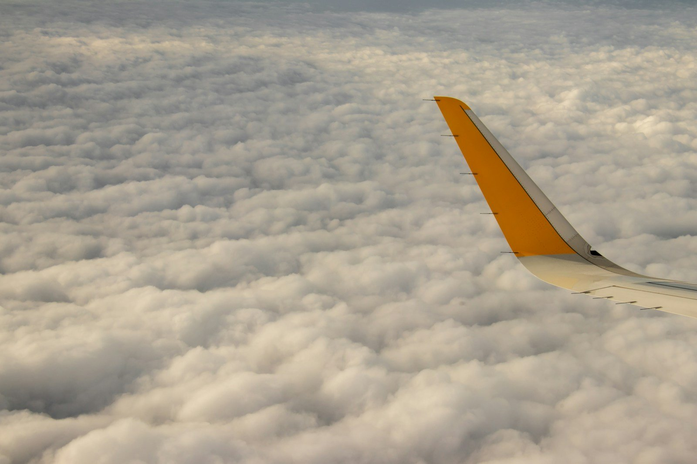
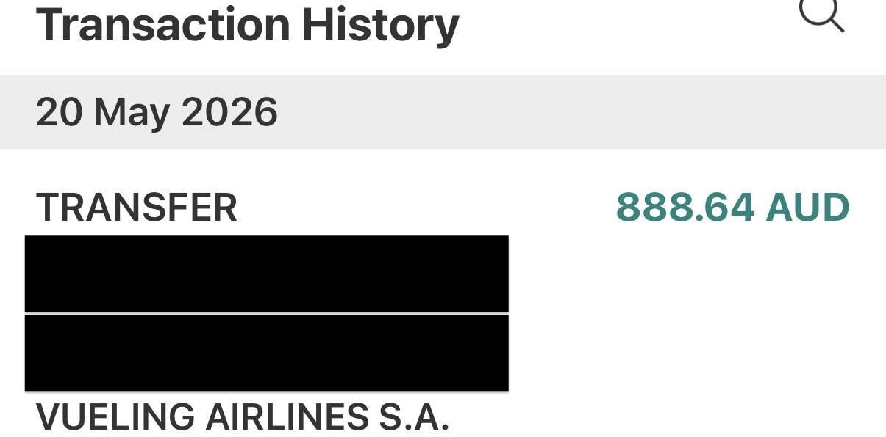

上一篇文章寫了我在巴塞隆納機場遺失行李的荒謬歷程：行李從機場轉盤消失，我根據 AirTag 的追蹤定位一路追查到民宅，但向西班牙警方求助無門。行李箱最後甚至去了阿爾及利亞旅行 😂

如果你還沒看過，可以閱讀：[行李在巴塞隆納機場被偷？獨旅 20 幾國後，我遇到最荒謬的旅行事件](https://cloudarchitectec.com/posts/2026-08-22-lost-luggage-barcelona/)。

拿到警察局的報案單和航空公司的行李遺失報告（PIR）後，我結束歐洲之旅、回到澳洲，開始向 Vueling 申請行李遺失理賠。

我本來以為最困難的部分，是整理遺失物品和證明價值。沒想到真正差點讓我放棄的，是 Vueling 的線上申請系統！

## 荒謬的理賠申請流程

Vueling 的行李遺失理賠流程很微妙。

進入官網後，我找不到「行李遺失理賠」的線上申請表或任何相關申請資訊，而是必須先透過官方 online chat 跟線上機器人聊天。偏偏這個機器人的設定極為愚蠢，必須來來回回回答很多類似的問題，才有機會拿到真正的申請連結。

也就是說，第一關不是準備文件，而是先說服機器人：對，我的行李真的不見了。對，我已經有 PIR。對，我現在真的要申請理賠，不要再把我導向行李追蹤狀態頁面了！！！

經過好幾輪對話後，機器人終於給了我一個連結😂

我原本以為接下來就簡單了，結果真正的惡夢才正要開始。

打開連結後，系統要求輸入航班資料和 PIR 編號。我照著文件輸入，卻一直無法進入下一步。

我前前後後試了至少五次以上，包括：

- 換不同瀏覽器
- 用電腦、手機反覆嘗試
- 多次確認航班號碼及 PIR 編號
- 隔幾天再重新嘗試

大多數時候不是驗證失敗，就是好不容易往前一步，又被帶回「追蹤行李」頁面，完全找不到正式申請及上傳文件的入口。

這個過程持續了一、兩個星期。最讓人挫折的不是網站故障，而是 Vueling 幾乎沒有其他客服管道，也沒有 email 可以聯絡。雖然可以打電話，但我很擔心最後只會得到一句：「請回網站申請」，然後再次被送回同一個鬼打牆流程。

不知道第幾次重新操作後，我終於成功進入真正的理賠頁面並完成申請。老實說，這個過程很吃運氣；如果不是我已經準備好所有文件，又不甘心就這樣放棄，真的很可能申請到一半就算了🫠

## 惡名昭彰的 Vueling

後來查了其他旅客的經驗，才發現不是我一個人遇到這種荒謬體驗。

一名從西班牙飛往倫敦的旅客在 [Reddit 分享](https://www.reddit.com/r/Flights/comments/14f4l3p/vueling_lost_luggage_claims/)，她在機場拿到 PIR，也收到含有 PIR 編號的簡訊，想申請約 €350 的行李延誤支出，但 Vueling 網站一直把她帶回行李追蹤頁面，完全沒有正式申請入口。打客服電話後，客服也只叫她回網站申請。看她文章最後的更新，她好像沒有收到理賠，也太慘！

另一個旅客在 [Tripadvisor 的討論](https://www.tripadvisor.com/ShowTopic-g1-i10702-k8652663-Vueling_Barcelona_Airport_Baggage_handling_contact-Air_Travel.html)中提到，她的行李在倫敦—巴塞隆納—突尼斯途中遺失。她填了三次申報表，但每次到了第二頁，系統都不接受航空公司自己開出的行李標籤號碼。機場、Iberia 和 Vueling 又互相要求她聯絡對方。雖然兩件行李大約一週後送回，系統卻仍然顯示行李遺失，理賠也繼續卡住。

看到這些案例後，我反而覺得自己最後能成功送出申請、而且真的收到理賠款項，已經算相當幸運XD。

## 理賠結果

Vueling 網站極其難用，理賠審核很嚴格，但通過之後，匯款速度倒是意外地快。

週二填帳戶，週四就收到錢了，這個效率甚至讓我有點不習慣😆

- 最終理賠金額：€546.82
- 2026.05.18：收到理賠金額確認
- 2026.05.19：填寫收款帳戶資料
- 2026.05.21：款項入帳

## Vueling 理賠規則總結

Vueling 網站指出，[旅客應在離開行李提領區前取得 PIR、保留行李標籤；行李超過 21 天仍未找回時，便可申請遺失行李理賠](https://help.vueling.com/hc/en-gb/articles/19798799296273-Delayed-or-lost-bag-claim)。

我申報的損失不只 €546.82，但 Vueling 並不是按照購買原價全額賠付，而是根據每一項物品逐項判斷是否屬於可理賠物品，再扣除折舊或設定單項金額。

| 類別 | 審核結果 | 我的觀察 |
| --- | ---: | --- |
| 行李箱本體 | €120 | 原價約 €279.50，只賠了約 43% |
| 基本衣物、鞋子 | 獲賠 | 包括 Uniqlo、Skechers 等日常用品 |
| 基本個人護理用品 | 獲賠 | 一般 skincare 類別較容易被接受 |
| GHD 離子夾、Laifen 吹風機等小型家電 | 各 €50 | 有賠，但遠低於原購買價格 |
| 無法提出購買證明的紀念品 | 拒賠 | 我申報約 $200 澳幣（約 4,500 台幣），但未獲賠 |

從結果來看，Vueling 的評估方式：

1. 「有收據不代表就會全額獲賠」。即使接受該物品，也可能扣除相當高的折舊；但如果沒有收據會更慘，基本上不太理賠。這件事告訴我們衣物還是要買有牌子的，不用太貴，但至少有公開網站。就算沒有保留收據，還是可以附上網站連結，稍微證明衣物價格，例如我就有提供 Uniqlo 連結。
2. 「一般衣物和生活用品比較容易獲賠」。這些物品比較容易被認定為旅途中合理攜帶的行李內容。
3. 「高價 3C 產品幾乎不要期待航空公司賠」。航空公司與保險公司的承保範圍各有除外條款，所以重要電子產品最好還是隨身攜帶；就算真的放在行李箱裡，花力氣申請理賠通常也是一毛錢都拿不到🤣 (需仔細閱讀保險理賠條款)
4. 「沒有收據或其他價值證明會非常吃虧」。尤其是紀念品，很難證明購買價格和實際存在，基本上不會理賠。
5. Vueling 以歐元核算。最後金額不一定會等同於我在澳洲購買時支付的澳幣價格，支付理賠款項的時候也不會問你幣別，我給的帳戶是可以收歐元的外幣帳戶，但我最後還是收到匯率很差的澳幣😂

## 蒙特婁公約的上限，不是保證理賠金額

網路文章經常提到《蒙特婁公約》的行李責任上限。自 2024 年 12 月 28 日起，行李遺失、毀損或延誤的現行上限是每名旅客 1,519 SDR（特別提款權），實際換算金額會隨匯率變動；這是航空公司的責任上限，不是行李遺失後就能自動領到的固定金額。[國際民航組織（ICAO）的修訂文件](https://www.icao.int/sites/default/files/secretariat/legal/LEB%20Treaty%20Collection%20Documents/2024_Revised_Limits_of_Liability_Under_the_Montreal_Convention_of_1999_en.pdf)也列出了這項調整。

實際理賠仍會受到遺失物品價值、折舊、購買證明、航空公司條款，以及物品是否適合放入托運行李等因素影響。

## 這次理賠教會我的事

### 1. PIR、行李標籤和報案單全部要留好

沒有 PIR，後續理賠很可能連入口都進不去。行李標籤、登機證和警方報案單也不要丟；最好全部拍照並備份到雲端。

### 2. 收據真的很重要

我以前不會特別保留每件旅行用品的收據，但這次發現，一旦要證明一個已經消失的物品值多少錢，信用卡紀錄、電子訂單和購買收據就非常有用。

### 3. 貴重物品無論如何都要隨身攜帶

護照、鑰匙、手機、電腦、平板、AirPods、相機，以及無法輕易取代的個人物品，都不要放進托運行李。航空公司願不願意賠是一回事，旅途中突然失去這些東西造成的不便，往往更難補償。

### 4. 航空公司理賠與旅遊保險是兩條不同的申請線

我這次另外透過購買機票使用的 American Express 信用卡附帶保險提出申請。兩邊需要的文件、審核方式和承保項目並不完全相同；如果同時申請，也應如實申報其他來源已支付的款項，避免重複理賠同一筆損失。

## 最後感想

其實我覺得 Vueling 也滿衰的，畢竟直接把行李箱拿走的人不是航空公司（我希望不是機場人員或航空公司人員偷的啦XD；之前還有新聞報導說，西班牙某一個機場的工作人員跟竊盜集團勾結，偷走旅客託運行李中的貴重物品）。

但旅客把行李交給航空公司後，航空公司仍然有保管、運送，以及事故發生後提供合理申訴流程的責任。

Vueling 最後願意理賠，我還是滿高興；雖然他們的線上申請系統真的難用到不可思議，我猜這說不定也是航空公司的奧步之一，把理賠流程搞得很難用，讓旅客自行放棄 🤣

如果你也正在處理 Vueling 的行李理賠，希望這篇文章至少能讓你知道：系統卡住不一定是你的資料填錯，也不只有你遇到同樣的問題。先把證明文件和錯誤紀錄保存好，然後……可能真的只能再多試幾次了。祝好運！

但我也希望大家以後都不會遇到需要參考這篇文章的時候XD。
